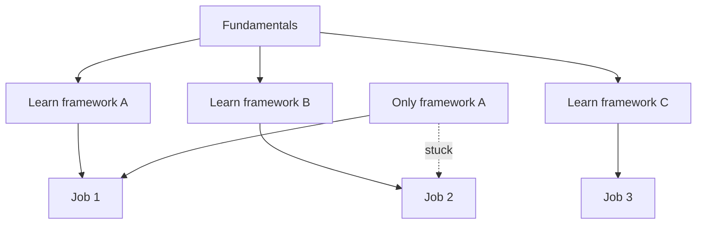

# R11: 適応力

IT業界は他のどの業界よりも速く動きます。フレームワークは数年で生まれては消えます。企業は再編され、方向転換し、買収されます。変化を脅威ではなく機会として捉える開発者が成功します。 {.lesson-intro}

## 変化が常にある理由

新しいツールが常に登場します。技術の進歩とともに仕事の要件も変わります。あなたを採用させたスキルが、5年後もあなたを有用にし続けるとは限りません。これは業界の欠陥ではなく、その本質です。

## 移転可能なスキルを築く

基礎はフレームワークより長持ちします。HTTPの仕組みを理解することは、Express.jsのメソッドを暗記するより重要です。データ構造で考えることを学ぶことは、特定のデータベースを知ることより重要です。基礎に投資すれば、フレームワークは簡単に習得できます。

## 実践的なアドバイス

- 将来の転職に備えて学習プロセスを記録する
- 一つの技術スタックだけでなく適応力を示すポートフォリオを作る
- 開発者コミュニティとつながりを保つ
- 変化を成長のチャンスとして受け入れる

<h2>まとめ</h2>
<ul>
<li>IT業界は一つのツールの深い専門性より適応力を評価する</li>
<li>基礎(HTTP、データ構造、アルゴリズム)はどのフレームワークより長持ちする</li>
<li>キャリアの中で職場、チーム、技術スタックを何度も変える準備をしておく</li>
<li>それぞれの変化はあなたをより多才にする学びの機会</li>
</ul>

