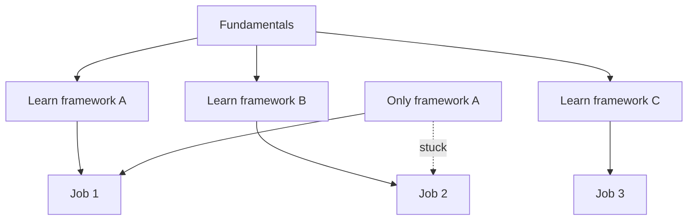

# R11: Adaptability

The tech industry moves faster than any other. Frameworks rise and fall in years. Companies reorganize, pivot, or get acquired. The developers who thrive are the ones who treat change as opportunity, not threat. {.lesson-intro}

## Why Change is Constant

New tools emerge constantly. Job requirements shift as technology advances. The skills that got you hired may not be the skills that keep you relevant in five years. This is not a flaw of the industry, it is its nature.

## Build Transferable Skills

Fundamentals outlast frameworks. Understanding how HTTP works matters more than memorizing Express.js methods. Learning to think in data structures matters more than knowing one specific database. Invest in foundations, and the frameworks become easy to pick up.

## Practical Advice

- Document your learning process for future transitions
- Build a portfolio that shows adaptability, not just one tech stack
- Network and stay connected with the developer community
- Embrace change as a chance to grow

<h2>Key Takeaways</h2>
<ul>
<li>The tech industry rewards adaptability over deep specialization in one tool</li>
<li>Fundamentals (HTTP, data structures, algorithms) outlast any framework</li>
<li>Be prepared to change jobs, teams, and tech stacks multiple times in your career</li>
<li>Each change is a learning opportunity that makes you more versatile</li>
</ul>

