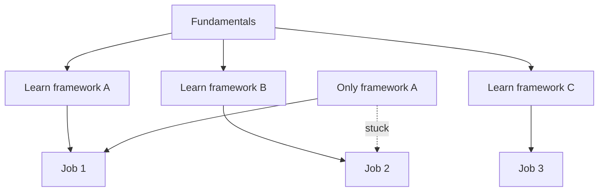

# R11: Adaptabilidade

A indústria de tecnologia muda mais rápido que qualquer outra. Frameworks surgem e somem em poucos anos. Empresas se reorganizam, mudam de rumo ou são adquiridas. Os desenvolvedores que prosperam são os que tratam mudança como oportunidade, não ameaça.
{: .lesson-intro }

## Por Que a Mudança é Constante

Novas ferramentas surgem o tempo todo. Requisitos de vaga mudam conforme a tecnologia avança. As habilidades que te contrataram podem não ser as que te mantêm relevante em cinco anos. Isso não é um defeito da indústria, é a natureza dela.

## Construa Habilidades Transferíveis

Fundamentos duram mais que frameworks. Entender como HTTP funciona importa mais que memorizar métodos do Express.js. Aprender a pensar em estruturas de dados importa mais que conhecer um banco específico. Invista nos fundamentos e os frameworks ficam fáceis de pegar.

## Conselho Prático

- Documente seu processo de aprendizado para futuras transições
- Construa um portfólio que mostre adaptabilidade, não uma única stack
- Faça networking e se mantenha ligado à comunidade de desenvolvedores
- Abrace a mudança como uma chance de crescer

<h2>Pontos-chave</h2>
<ul>
<li>A indústria de tecnologia recompensa adaptabilidade em vez de especialização profunda numa só ferramenta</li>
<li>Fundamentos (HTTP, estruturas de dados, algoritmos) duram mais que qualquer framework</li>
<li>Esteja preparado para trocar de emprego, time e stack várias vezes na carreira</li>
<li>Cada mudança é uma oportunidade de aprendizado que te torna mais versátil</li>
</ul>

