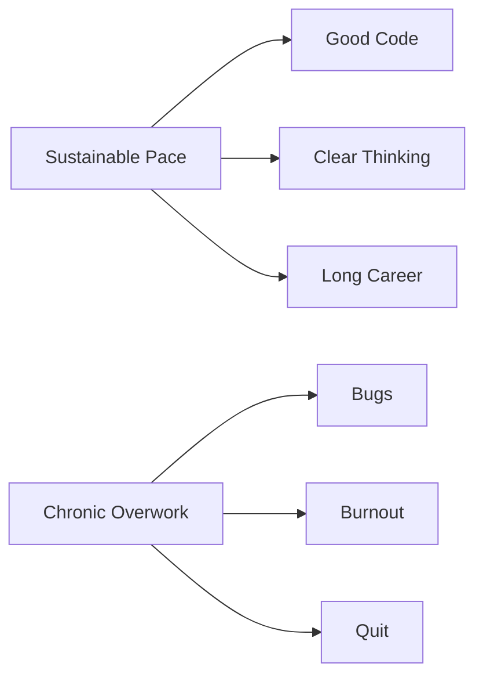

# R12: ワークライフバランス

ソフトウェア開発は知的に刺激的で、没頭しやすい仕事です。リモートワークはオフィスと家庭の境界を曖昧にします。しかしキャリアは40年以上続きます。マラソンを全力疾走することはできません。持続可能なペースが勝ちます。 {.lesson-intro}

## 頑張るべき時

余分な努力が正当化される時があります。製品リリース、本番環境の重大バグ、キャリアを決定する機会。修羅場は起こります。重要なのは、それが例外であって日常ではないことです。

## 引くべき時

通常の週は持続可能であるべきです。恒常的な週60時間以上の労働、毎週末の仕事、学習や趣味の時間がない。これらは警告サインです。休息を取った開発者はより良いコードを書きます。時間の量より質が勝ります。

## 自分の時間を守る

- 勤務時間を決めて守る
- 仕事と個人の空間を物理的に分離する
- 勤務時間外は仕事の通知をオフにする
- テクノロジーと関係ない趣味に投資する
- 睡眠、運動、人間関係はコードより優先

## バランスが崩れているサイン

- 月曜日や仕事全般が憂鬱
- 仕事以外の趣味や関心がない
- 仕事時間のせいで人間関係が悪化
- 身体的または精神的な健康の低下

<h2>まとめ</h2>
<ul>
<li>キャリアはマラソンであり短距離走ではない。持続可能なペースが勝つ</li>
<li>頑張るべき時(リリース、緊急事態)と引くべき時(それ以外の日)を知る</li>
<li>休息を取った開発者は、倍の時間働く疲れた開発者より良いコードを書く</li>
<li>コード以外の人生経験があなたをより良い開発者にする</li>
</ul>

