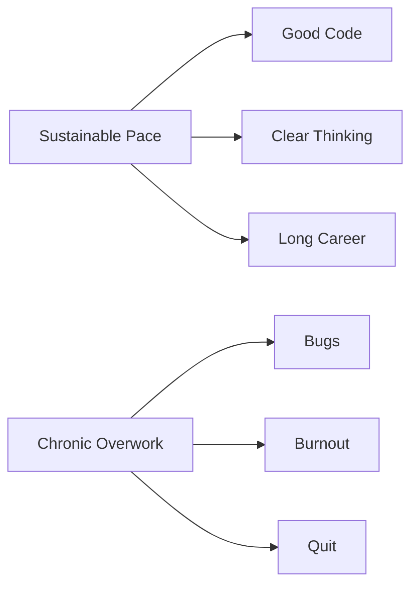

# R12: ワークライフバランス

ソフトウェアは知的に面白く、没入しやすい。リモートワークはオフィスと家の境界を曖昧にする。だがキャリアは40年以上続く。マラソンで全力疾走はできない。持続可能なペースが勝つ。
{: .lesson-intro }

## 押す時、引く時

追加の努力が正当化される時: 製品ローンチ、本番の重大バグ、キャリアを決める機会。クランチは起きる - それは例外であるべきで、常態ではない。継続的な週60時間超、毎週末勤務、学習や趣味の時間なし、これらは赤信号。休息のある開発者のほうが良いコードを書く。時間の量より質。

## 時間を守る

- 勤務時間を定義して守る
- 仕事と個人空間の物理的分離
- 時間外は仕事の通知をオフに
- 技術と無関係な趣味に投資する
- 睡眠、運動、人間関係はコードより先

仕事を恐れる、仕事以外に趣味がない、勤務時間で関係が壊れる、健康が衰える - これらはバランスが傾いた兆候。自分で直す前に、状況に直されてしまう。

<h2>まとめ</h2>
<ul>
<li>キャリアはマラソンであって短距離ではない。持続可能なペースが勝つ</li>
<li>押すべき時(ローンチ、緊急事態)と引くべき時(それ以外のすべて)を知る</li>
<li>休息した開発者のほうが、倍の時間働く疲弊した開発者より良いコードを書く</li>
<li>コード以外の人生経験が、より良い開発者にしてくれる</li>
</ul>

