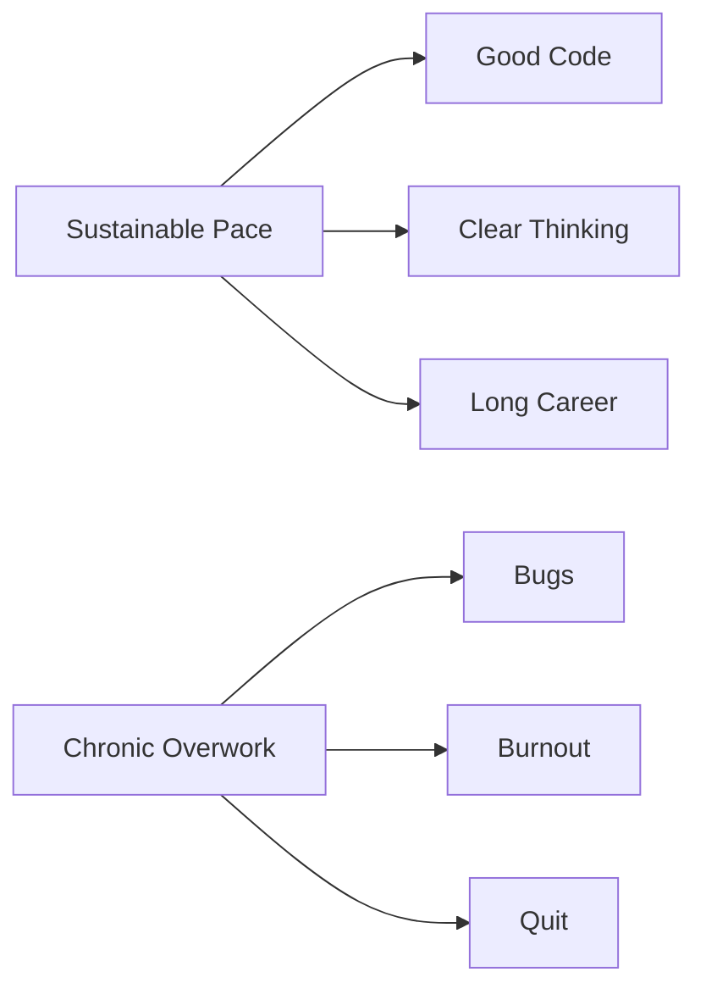

# R12: Work-Life Balance

Software is intellectually engaging and easy to lose yourself in. Remote work blurs office and home. But a career lasts 40+ years. Sustainable pace wins.
{: .lesson-intro }

## When to Push, When to Step Back

Extra effort is justified for launches, critical production bugs, career-defining opportunities. Crunch happens - it should be the exception. Consistent 60+ hour weeks, every weekend, no time for learning or hobbies are red flags. Rested developers write better code. Quality beats quantity of hours.

## Protect Your Time

- Define work hours and stick to them
- Physical separation between work and personal space
- Turn off work notifications after hours
- Invest in hobbies unrelated to technology
- Sleep, exercise, relationships come before code

Dreading work, no outside hobbies, strained relationships, declining health - these are signs the balance has tipped. Fix it before it fixes itself.

<h2>Key Takeaways</h2>
<ul>
<li>A career is a marathon, not a sprint. Sustainable pace wins</li>
<li>Know when to push (launches, emergencies) and when to step back (every other day)</li>
<li>Rested developers write better code than exhausted ones working double hours</li>
<li>Life experiences outside of code make you a better developer</li>
</ul>

