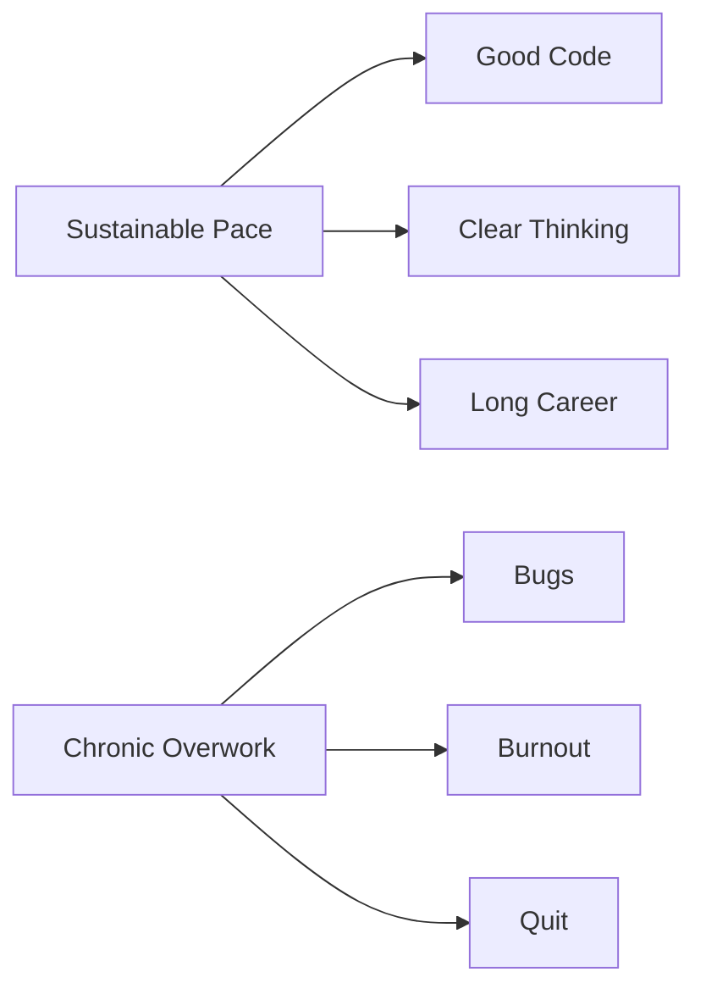

# R12: Equilíbrio Entre Trabalho e Vida

Software é intelectualmente envolvente e fácil de se perder nele. Trabalho remoto apaga a fronteira entre escritório e casa. Mas uma carreira dura 40+ anos. Não dá para correr maratona em ritmo de tiro. Ritmo sustentável vence.
{: .lesson-intro }

## Quando Acelerar, Quando Recuar

Esforço extra se justifica em lançamentos, bugs críticos em produção, oportunidades que definem carreira. Crunch acontece - deve ser exceção, não rotina. Semanas consistentes de 60+ horas, todo final de semana, sem tempo para estudar ou hobbies são sinais vermelhos. Pessoa descansada escreve código melhor. Qualidade bate quantidade de horas.

## Proteja Seu Tempo

- Defina horário de trabalho e cumpra
- Separação física entre trabalho e espaço pessoal
- Desligue notificações de trabalho fora do expediente
- Invista em hobbies sem relação com tecnologia
- Sono, exercício, relacionamentos vêm antes de código

Temer o trabalho, não ter hobbies, relacionamentos estressados por horas de trabalho, saúde em queda - são sinais de que o equilíbrio pendeu. Conserte antes que a situação conserte por você.

<h2>Pontos-chave</h2>
<ul>
<li>Carreira é maratona, não tiro. Ritmo sustentável vence</li>
<li>Saiba quando acelerar (lançamentos, emergências) e quando recuar (todo o resto)</li>
<li>Pessoa descansada escreve código melhor do que exausta trabalhando o dobro</li>
<li>Experiências fora do código fazem de você um desenvolvedor melhor</li>
</ul>

