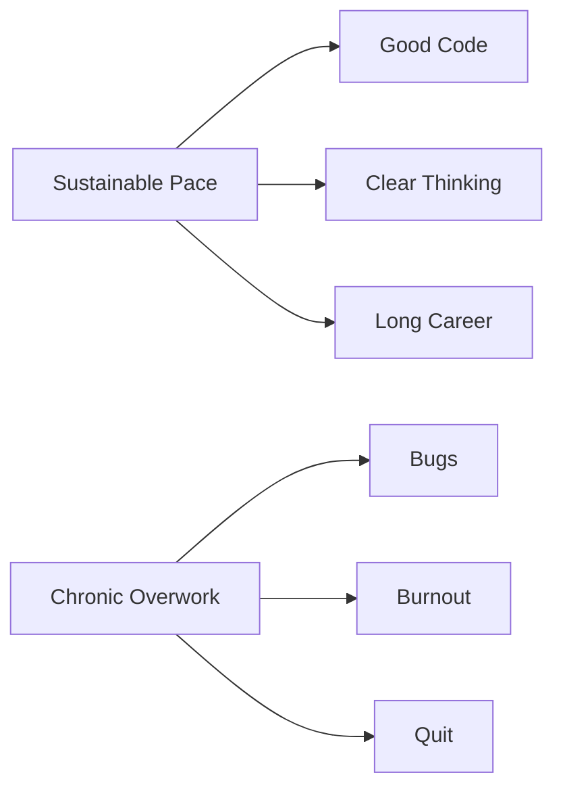

# R12: Equilíbrio Entre Trabalho e Vida

Desenvolvimento de software é intelectualmente envolvente e fácil de se perder. Trabalho remoto borra a linha entre escritório e casa. Mas uma carreira dura mais de 40 anos. Você não corre uma maratona em velocidade de tiro. Ritmo sustentável vence.
{: .lesson-intro }

## Quando Apertar o Passo

Existem momentos em que esforço extra é justificado: lançamentos de produto, bugs críticos em produção, oportunidades que definem carreira. Crunch acontece. O importante é que seja exceção, não regra.

## Quando Pisar no Freio

Semanas normais devem ser sustentáveis. Semanas de 60+ horas constantes, trabalhando todo fim de semana, sem tempo para aprender ou para hobbies - esses são sinais vermelhos. Desenvolvedores descansados escrevem código melhor. Qualidade vence quantidade de horas.

## Proteja Seu Tempo

- Defina horários de trabalho e cumpra
- Crie separação física entre trabalho e espaço pessoal
- Desligue notificações de trabalho depois do expediente
- Invista em hobbies não relacionados a tecnologia
- Sono, exercício, relacionamentos vêm antes do código

## Sinais de Desequilíbrio

- Temer segunda-feira ou o trabalho em geral
- Não ter hobbies ou interesses fora do trabalho
- Relacionamentos prejudicados pelas horas de trabalho
- Saúde física ou mental em declínio

<h2>Key Takeaways</h2>
<ul>
<li>Uma carreira é uma maratona, não um tiro. Ritmo sustentável vence</li>
<li>Saiba quando apertar o passo (lançamentos, emergências) e quando pisar no freio (nos outros dias)</li>
<li>Desenvolvedores descansados escrevem código melhor que exaustos trabalhando horas dobradas</li>
<li>Experiências de vida fora do código fazem de você um desenvolvedor melhor</li>
</ul>

