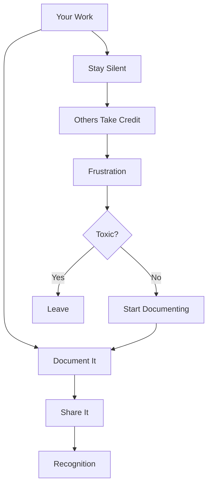

# R13: 職場の人間関係

職場の政治はあらゆる組織に存在します。無視できるものではありません。うまく対処する方法を理解することが、あなたの仕事、評判、そして心の健康を守ります。 {.lesson-intro}

## 自分を守る

- 自分の貢献を記録する: コミットメッセージ、メール、プロジェクトノート
- 重要なやり取りでは関係者をCCに入れる
- 成果の業務日誌をつける
- チームミーティングで自分の仕事を発表する

## 味方を作る

- 同僚と本物の関係を築く
- 他人の成功を助ける。互恵性が大切
- あなたを支持してくれるメンターを見つける
- 一貫した品質の仕事で評判を築く

## 危険信号

- 誰かがチームの仕事の手柄を一貫して横取りする
- あなたのアイデアが他人の提案として出てくる
- 共有した情報があなたに不利に使われる
- 実績ではなく政治力が評価される文化

## 去るべき時

文化が有害で、精神的に苦しく、努力しても前進の道がない場合、次に進む時かもしれません。あなたの価値観に合うより良い機会が存在します。

<h2>まとめ</h2>
<ul>
<li>仕事を記録する。Gitコミット、メール、議事録はあなたの証拠</li>
<li>本物の味方を作る。他人を助けることで互恵性が生まれる</li>
<li>陰口や裏工作に参加しない。結果に集中する</li>
<li>有害な環境は直す価値がない場合もある。去ることは有効な戦略</li>
</ul>

