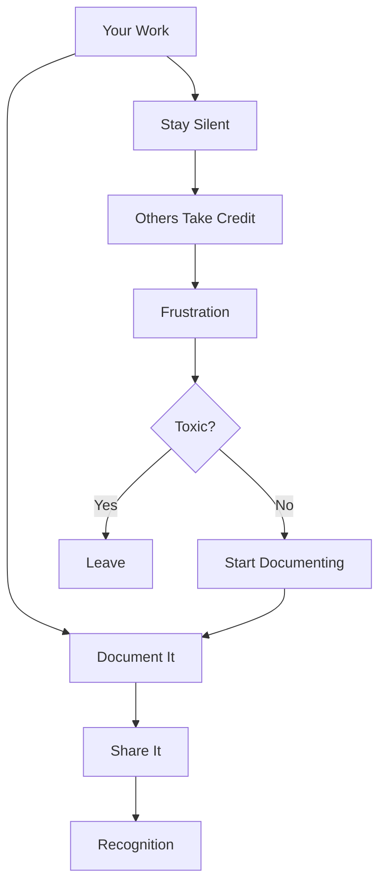

# R13: Workplace Politics

Workplace politics exists in every organization. It is not something you can ignore. Understanding how to navigate it protects your work, your reputation, and your mental health.
{: .lesson-intro }

## Protect Yourself

- Document your contributions: commit messages, emails, project notes
- CC relevant people on important communications
- Keep a work journal of accomplishments
- Present your work in team meetings

## Build Alliances

- Form genuine relationships with colleagues
- Help others succeed. Reciprocity matters
- Find mentors who advocate for you
- Build reputation through consistent quality work

## Red Flags

- Someone consistently takes credit for team work
- Your ideas appear as others' proposals
- Information you share is used against you
- Culture rewards politics over performance

## When to Leave

If the culture is toxic, your mental health is suffering, and there is no path forward despite your efforts, it may be time to move on. Better opportunities exist that align with your values.

<h2>Key Takeaways</h2>
<ul>
<li>Document your work. Git commits, emails, and meeting notes are your proof</li>
<li>Build genuine alliances. Helping others creates reciprocity</li>
<li>Do not engage in gossip or backstabbing. Focus on results</li>
<li>Know when a toxic environment is not worth fixing. Leaving is a valid strategy</li>
</ul>

