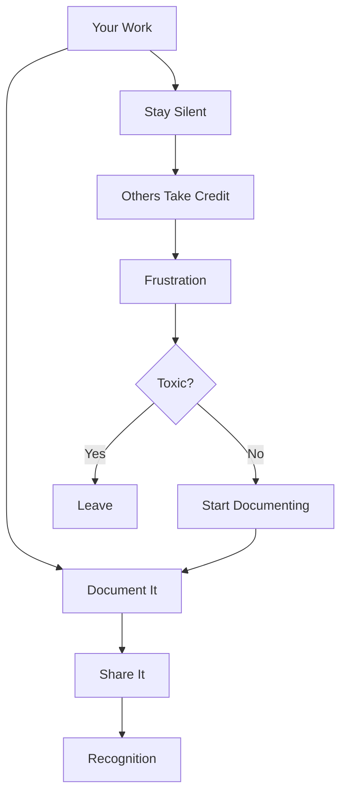

# R13: Política no Trabalho

Política existe em toda organização. Não é algo que você possa ignorar. Entender como navegá-la protege seu trabalho, sua reputação e sua saúde mental.
{: .lesson-intro }

## Proteja-se

- Documente suas contribuições: mensagens de commit, emails, anotações de projeto
- Coloque as pessoas relevantes em CC nas comunicações importantes
- Mantenha um diário de trabalho com suas conquistas
- Apresente seu trabalho nas reuniões do time

## Construa Alianças

- Forme relacionamentos genuínos com colegas
- Ajude os outros a terem sucesso. Reciprocidade importa
- Encontre mentores que advoguem por você
- Construa reputação com trabalho de qualidade consistente

## Sinais Vermelhos

- Alguém leva crédito pelo trabalho do time com frequência
- Suas ideias aparecem como proposta de outras pessoas
- Informação que você compartilha é usada contra você
- A cultura recompensa política em vez de desempenho

## Quando Sair

Se a cultura é tóxica, sua saúde mental está sofrendo e não há caminho à frente apesar dos seus esforços, pode ser hora de seguir em frente. Existem oportunidades melhores que combinam com os seus valores.

<h2>Pontos-chave</h2>
<ul>
<li>Documente seu trabalho. Commits de git, emails e notas de reunião são sua prova</li>
<li>Construa alianças genuínas. Ajudar os outros cria reciprocidade</li>
<li>Não entre em fofoca ou traição. Foque em resultados</li>
<li>Saiba quando um ambiente tóxico não vale a pena consertar. Sair é uma estratégia válida</li>
</ul>

