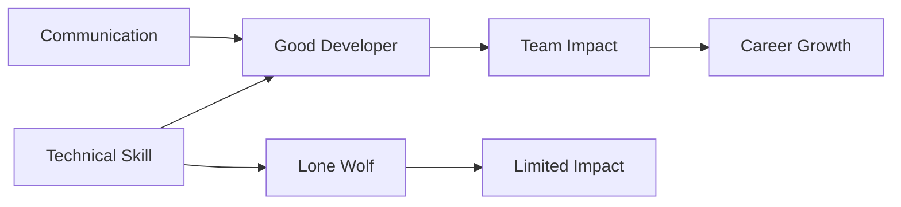

# R14: コミュニケーションとチームワーク

世界最高のコーダーでも、明確なコミュニケーションなしではプロジェクトは失敗します。誰にも理解できない優れたコードは無意味です。キャリアの成長には技術力だけでなく影響力が必要です。
{: .lesson-intro }

## コミュニケーションスキル

- **書く**: ドキュメント、コミットメッセージ、コードコメント、メール
- **話す**: 非技術者に技術的な概念を説明する
- **聞く**: 要件とユーザーのニーズを理解する
- **発表する**: デモ、技術トーク、アーキテクチャレビュー

## チームワークスキル

- **コードレビュー**: 建設的なフィードバックをし、批判を素直に受け入れる
- **協力**: ペアプログラミング、知識共有
- **メンタリング**: ジュニア開発者の成長を助ける
- **対立解決**: 意見の相違を生産的に乗り越える

## スキルがあっても失敗する理由

- コミュニケーション不足が誤解とやり直しを生む
- 「一匹狼」の思考があなたのインパクトを制限する
- 決定を説明できないと信頼を失う
- ユーザーのフィードバックを聞かないと間違ったものを作る

<h2>まとめ</h2>
<ul>
<li>技術力で採用される。コミュニケーション力で昇進する</li>
<li>非プログラマーにコードを説明する練習をする</li>
<li>明確なドキュメントを書く。未来の自分とチームメイトが感謝する</li>
<li>コードレビューは審判ではなく学びの場</li>
</ul>

