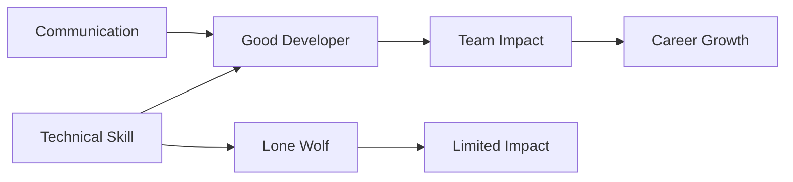

# R14: Communication & Teamwork

You can be the best coder in the world, but projects fail without clear communication. Brilliant code nobody understands is useless. Career growth requires influence, not just technical skill. {.lesson-intro}

## Communication Skills

- **Writing**: documentation, commit messages, code comments, emails
- **Speaking**: explaining technical concepts to non-technical people
- **Listening**: understanding requirements and user needs
- **Presenting**: demos, technical talks, architecture reviews

## Teamwork Skills

- **Code reviews**: give constructive feedback, accept criticism gracefully
- **Collaboration**: pair programming, knowledge sharing
- **Mentorship**: help junior developers grow
- **Conflict resolution**: navigate disagreements productively

## Why Developers Fail Despite Skills

- Poor communication creates misunderstandings and rework
- "Lone wolf" mentality limits your impact
- Inability to explain decisions loses trust
- Not listening to user feedback builds the wrong thing

<h2>Key Takeaways</h2>
<ul>
<li>Technical skills get you hired. Communication skills get you promoted</li>
<li>Practice explaining code to non-programmers</li>
<li>Write clear documentation. Your future self and teammates will thank you</li>
<li>Code reviews are about learning, not judging</li>
</ul>

