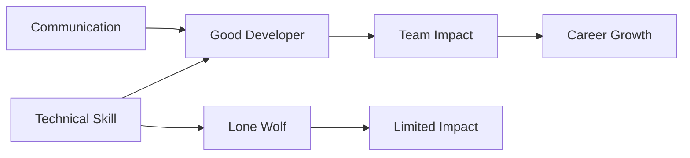

# R14: Comunicação e Trabalho em Equipe

Você pode ser o melhor programador do mundo, mas projetos falham sem comunicação clara. Código brilhante que ninguém entende não serve para nada. Crescimento de carreira exige influência, não só habilidade técnica.
{: .lesson-intro }

## Habilidades de Comunicação

- **Escrita**: documentação, mensagens de commit, comentários de código, emails
- **Fala**: explicar conceitos técnicos para pessoas não técnicas
- **Escuta**: entender requisitos e necessidades do usuário
- **Apresentação**: demos, talks técnicas, revisões de arquitetura

## Habilidades de Trabalho em Equipe

- **Code reviews**: dar feedback construtivo, aceitar críticas com elegância
- **Colaboração**: pair programming, compartilhamento de conhecimento
- **Mentoria**: ajudar desenvolvedores juniores a crescerem
- **Resolução de conflito**: navegar desentendimentos de forma produtiva

## Por Que Devs Falham Apesar das Skills

- Comunicação ruim cria mal-entendidos e retrabalho
- Mentalidade de "lobo solitário" limita seu impacto
- Incapacidade de explicar decisões perde confiança
- Não escutar o feedback do usuário leva a construir a coisa errada

<h2>Pontos-chave</h2>
<ul>
<li>Habilidade técnica te contrata. Habilidade de comunicação te promove</li>
<li>Pratique explicar código para quem não programa</li>
<li>Escreva documentação clara. Seu eu futuro e seus colegas vão agradecer</li>
<li>Code reviews são sobre aprender, não julgar</li>
</ul>

