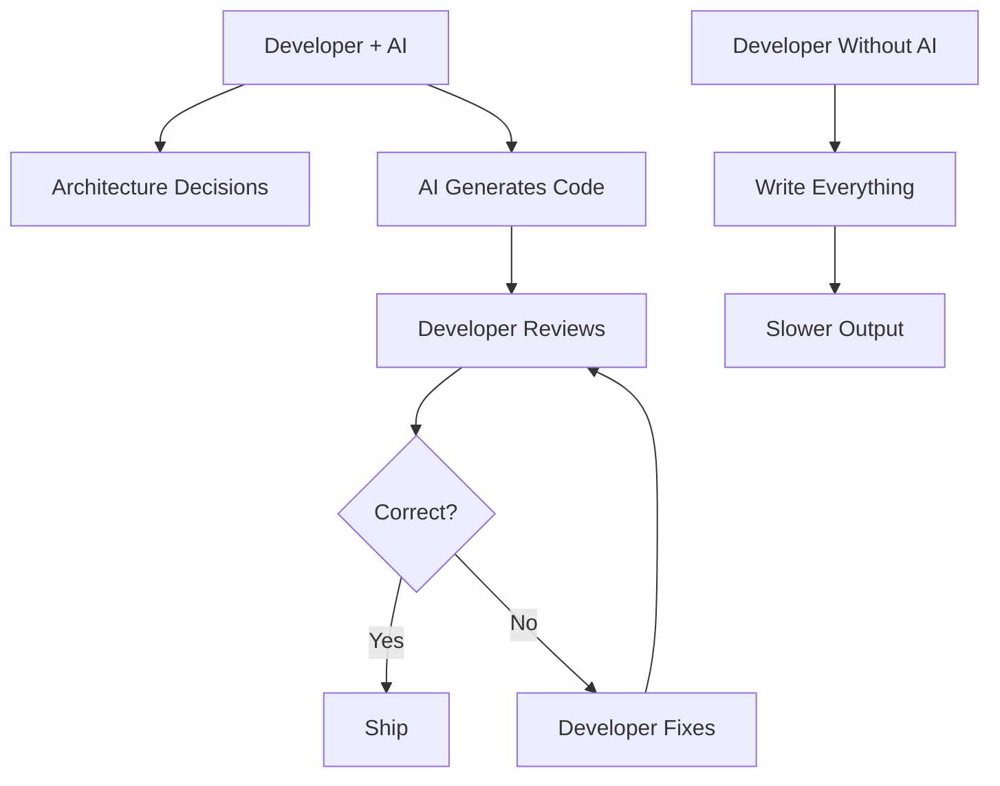

# R15: AIとの協働

AIはソフトウェア開発を根本的に変えています。AIコーディングアシスタントは今や標準ツールです。多くのルーティン作業が自動化されています。開発者の役割は進化しています。AIへの抵抗はキャリアを制限します。受け入れることでキャリアが加速します。
{: .lesson-intro }

## ツールとしてのAI

- 定型的で反復的なコードにAIコーディングアシスタントを使う
- 人間のエネルギーはアーキテクチャ、設計、複雑な問題に集中する
- AIを使ってより速く学び、新しい技術を探索する
- 詳細はAIに任せ、判断はあなたが行う

## 今より重要になるスキル

- **批判的思考**: AIの提案の正しさを評価する
- **アーキテクチャ**: AIが実装を助けられるシステムを設計する
- **コミュニケーション**: 要件を明確なプロンプトに変換する
- **ドメイン知識**: 問題空間を深く理解する
- **コードレビュー**: AI生成コードを検証し改善する

## AIが代替できないもの

- ビジネス要件とユーザーニーズの理解
- アーキテクチャのトレードオフの判断
- 複雑なシステム間の問題のデバッグ
- チームの協力とメンタリング
- 倫理的配慮とセキュリティ意識

<h2>まとめ</h2>
<ul>
<li>AIは代替ではなく力の倍増器。アウトプットを10倍にするために使う</li>
<li>プロンプトエンジニアリングを学ぶ。良いプロンプトが良い結果を生む</li>
<li>AIが代替できないスキルに集中する: 判断力、共感力、アーキテクチャ</li>
<li>成功する開発者はAIに抵抗せず、AIと共に働く人</li>
</ul>

