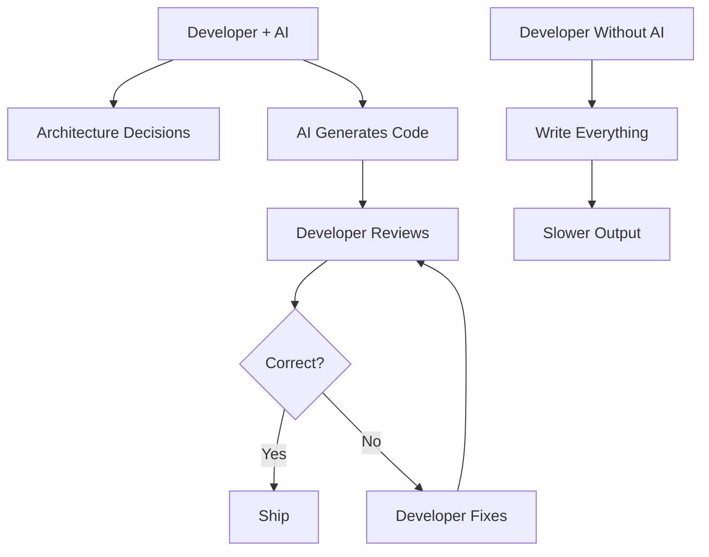

# R15: Working with AI

AI is fundamentally changing software development. AI coding assistants are now standard tools. Many routine tasks are automated. The role of developers is evolving. Resistance to AI will limit your career. Embracing it will accelerate it.
{: .lesson-intro }

## AI as a Tool

- Use AI coding assistants for boilerplate and repetitive code
- Focus your human energy on architecture, design, and complex problems
- Use AI to learn faster and explore new technologies
- Let AI handle the details while you handle the decisions

## Skills That Matter More Now

- **Critical thinking**: evaluate AI suggestions for correctness
- **Architecture**: design systems AI can help implement
- **Communication**: translate requirements into clear prompts
- **Domain knowledge**: understand the problem space deeply
- **Code review**: verify and improve AI-generated code

## What AI Cannot Replace

- Understanding business requirements and user needs
- Making architectural trade-off decisions
- Debugging complex cross-system issues
- Team collaboration and mentorship
- Ethical considerations and security awareness

<h2>Key Takeaways</h2>
<ul>
<li>AI is a force multiplier, not a replacement. Use it to 10x your output</li>
<li>Learn prompt engineering. Better prompts produce better results</li>
<li>Focus on skills AI cannot replace: judgment, empathy, architecture</li>
<li>The developers who thrive will be those who work with AI, not against it</li>
</ul>

