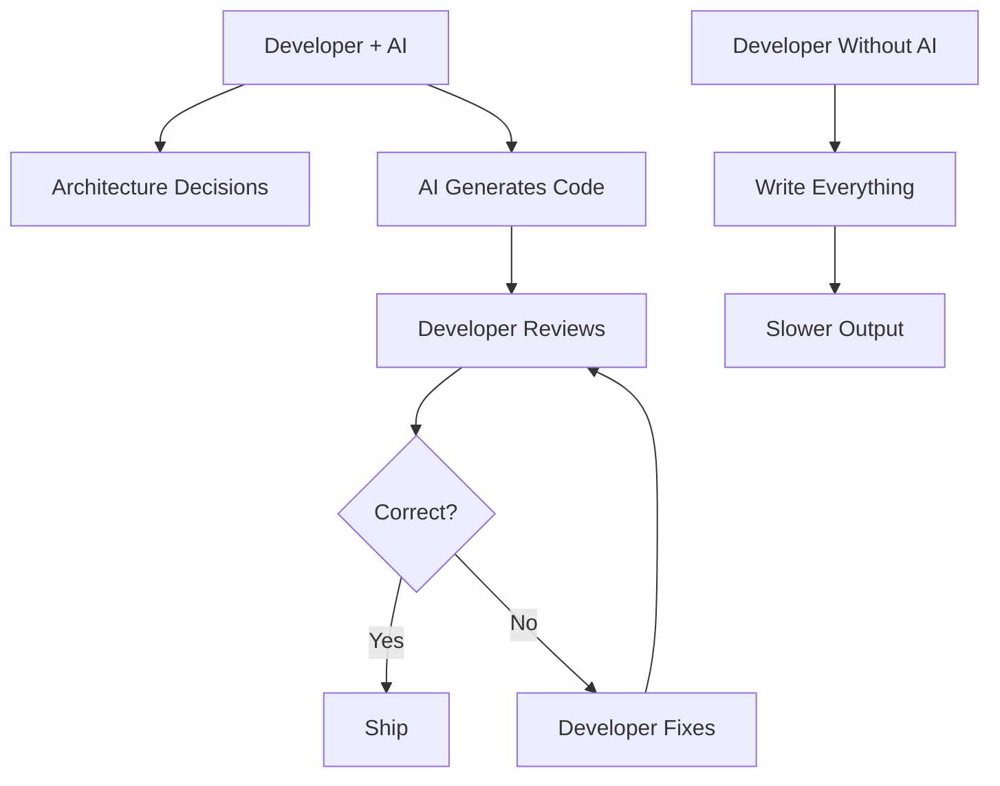

# R15: Trabalhando com IA

IA está mudando fundamentalmente o desenvolvimento de software. Assistentes de código com IA já são ferramentas padrão. Muitas tarefas rotineiras estão automatizadas. O papel do desenvolvedor está evoluindo. Resistir à IA vai limitar sua carreira. Abraçá-la vai acelerá-la.
{: .lesson-intro }

## IA como Ferramenta

- Use assistentes de código com IA para boilerplate e código repetitivo
- Foque sua energia humana em arquitetura, design e problemas complexos
- Use IA para aprender mais rápido e explorar novas tecnologias
- Deixe a IA cuidar dos detalhes enquanto você cuida das decisões

## Habilidades Que Importam Mais Agora

- **Pensamento crítico**: avaliar se as sugestões da IA estão corretas
- **Arquitetura**: projetar sistemas que a IA pode ajudar a implementar
- **Comunicação**: traduzir requisitos em prompts claros
- **Conhecimento de domínio**: entender o espaço do problema profundamente
- **Code review**: verificar e melhorar código gerado por IA

## O Que a IA Não Pode Substituir

- Entender requisitos de negócio e necessidades do usuário
- Tomar decisões de trade-off de arquitetura
- Depurar problemas complexos entre sistemas
- Colaboração em equipe e mentoria
- Considerações éticas e consciência de segurança

<h2>Key Takeaways</h2>
<ul>
<li>IA é um multiplicador de força, não um substituto. Use para 10x sua produção</li>
<li>Aprenda engenharia de prompt. Prompts melhores produzem resultados melhores</li>
<li>Foque em habilidades que a IA não pode substituir: julgamento, empatia, arquitetura</li>
<li>Os desenvolvedores que vão prosperar são os que trabalham com IA, não contra</li>
</ul>

