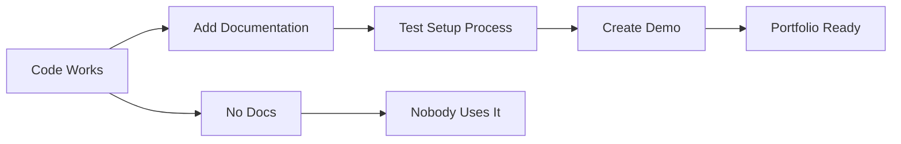

# R16: 完成させる力

多くの開発者はコードを書けますが、完成させられる人は少ないです。プロジェクトを仕上げ、磨き、ドキュメントを書き、プロフェッショナルに発表すること。これはコードを書くこととは別のスキルです。趣味のプロジェクトとポートフォリオ作品を分けるものです。 {.lesson-intro}

## 完成させるとは

完成させるとはコードをプッシュするだけではありません。プロジェクトが動き、ドキュメントがあり、他の人がセットアップでき、何をするものか、なぜ作ったかの明確なストーリーがあることです。

## チェックリスト

- 明確なセットアップ手順のあるREADME
- アプリケーションが実際にエラーなく動作する
- 動作するデモ環境またはスクリーンショット
- アーキテクチャの決定が文書化されている
- 既知の制限が認識されている

## 仕事の発表

非技術者に技術的な概念を説明する練習をしましょう。ポートフォリオはあなたの成長の物語を伝えるべきです。各プロジェクトで、どんな問題を解決し、どう作り、何を学んだかを示しましょう。

<h2>まとめ</h2>
<ul>
<li>ドキュメント付きの完成したプロジェクトは、印象的だが未完成のものに勝る</li>
<li>必ずREADMEを含める。セットアップできなければカウントされない</li>
<li>完成させるスキルを練習する。ほとんどの人は80%でプロジェクトを放棄する</li>
<li>ポートフォリオはあなたの物語。各プロジェクトでそれをうまく伝える</li>
</ul>

