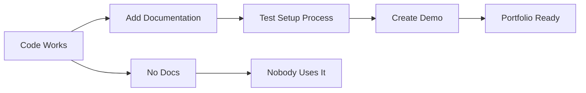

# R16: Shipping is a Skill

Many developers can code, but fewer can ship. Finishing a project, polishing it, documenting it, and presenting it professionally is a separate skill from writing code. It is what separates hobby projects from portfolio pieces.
{: .lesson-intro }

## What Shipping Means

Shipping is not just pushing code. It means the project works, is documented, can be set up by someone else, and tells a clear story of what it does and why.

## The Checklist

- README with clear setup instructions
- The application actually runs without errors
- Demo environment or screenshots that work
- Architecture decisions documented
- Known limitations acknowledged

## Presenting Your Work

Practice explaining technical concepts to non-technical audiences. Your portfolio should tell the story of your growth. Each project should show what problem it solves, how you built it, and what you learned.

<h2>Key Takeaways</h2>
<ul>
<li>A finished project with documentation beats an impressive unfinished one</li>
<li>Always include a README. If someone cannot set it up, it does not count</li>
<li>Practice the skill of finishing. Most people abandon projects at 80%</li>
<li>Your portfolio tells your story. Make each project tell it well</li>
</ul>

