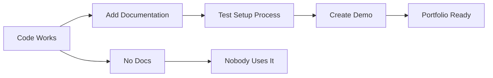

# R16: Entregar é uma Habilidade

Muitos desenvolvedores sabem programar, mas poucos sabem entregar. Terminar um projeto, lapidá-lo, documentá-lo e apresentá-lo profissionalmente é uma habilidade separada de escrever código. É o que separa projetos de hobby de peças de portfólio.
{: .lesson-intro }

## O Que Significa Entregar

Entregar não é só fazer push do código. Significa que o projeto funciona, está documentado, pode ser configurado por outra pessoa e conta uma história clara do que faz e por quê.

## O Checklist

- README com instruções claras de configuração
- A aplicação realmente roda sem erros
- Ambiente de demo ou screenshots que funcionam
- Decisões de arquitetura documentadas
- Limitações conhecidas reconhecidas

## Apresentando Seu Trabalho

Pratique explicar conceitos técnicos para públicos não técnicos. Seu portfólio deve contar a história do seu crescimento. Cada projeto deve mostrar que problema resolve, como você construiu e o que você aprendeu.

<h2>Key Takeaways</h2>
<ul>
<li>Um projeto terminado com documentação vence um impressionante inacabado</li>
<li>Sempre inclua um README. Se alguém não consegue configurar, não conta</li>
<li>Pratique a habilidade de terminar. A maioria abandona projetos em 80%</li>
<li>Seu portfólio conta sua história. Faça cada projeto contá-la bem</li>
</ul>

