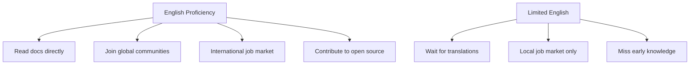

# R17: The Importance of English

English is the lingua franca of tech. You do not need it perfect, but working mastery is one of the highest-leverage skills you can build. Docs, tutorials, forums, job postings, and open source all default to English.
{: .lesson-intro }

## Why It Matters

Programming languages themselves are in English: `function`, `return`, `class`, `import`. Error messages are in English. The official docs for React, Node.js, Python, and nearly every major tool are written in English first. Translations come weeks or months later, if at all. Without English, you are always waiting for someone else to translate for you.

International teams communicate in English. Remote jobs often require it. Code reviews, PR descriptions, commit messages, specs - all in English at most companies. Being able to express technical ideas in English opens doors that technical skill alone cannot.

## How to Improve

- Read documentation in English, not translated versions
- Watch tech talks in English (subtitles are fine)
- Write commit messages, comments, and READMEs in English
- Participate in English-speaking communities (GitHub, Discord, forums)
- Aim for clear communication, not perfection

<h2>Key Takeaways</h2>
<ul>
<li>English is the common language of tech. Working proficiency beats perfect fluency</li>
<li>Most docs and tutorials are published in English first - translations are delayed or skipped</li>
<li>English proficiency expands your job market from local to global</li>
<li>Practice daily: read docs, write commits, engage in communities - in English</li>
</ul>

