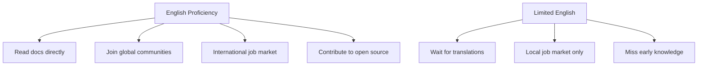

# R17: The Importance of English

English is the lingua franca of the technology world. You do not need to speak it perfectly, but having a good working mastery of it is one of the highest-leverage skills you can develop as a developer. It is the language that most documentation, tutorials, forums, job postings, and open source projects use.
{: .lesson-intro }

## Why English Matters in Tech

Programming languages themselves are written in English: function, return, class, import, export. Error messages are in English. Stack Overflow answers are in English. The official documentation for React, Node.js, Python, and nearly every major technology is written first in English. If you cannot read it, you are always waiting for someone else to translate it for you.

## Access to Resources

The vast majority of learning material is in English. Tutorials, blog posts, conference talks, podcasts, books. When a new framework is released, the documentation comes in English first. Translations may follow weeks or months later, if at all. English proficiency means you learn from the source, not from a delayed copy.

## Communication and Career

International teams communicate in English. Remote jobs often require it. Code reviews, pull request descriptions, commit messages, technical specifications - all written in English in most companies. Being able to express technical ideas clearly in English opens doors that technical skill alone cannot.

## How to Improve

- Read documentation in English instead of translated versions
- Watch tech talks and tutorials in English (subtitles are fine)
- Write your commit messages, comments, and READMEs in English
- Participate in English-speaking communities (GitHub, Discord, forums)
- Do not aim for perfection. Aim for clear communication

<h2>Key Takeaways</h2>
<ul>
<li>English is the common language of the tech industry. Fluency is not required, but working proficiency is</li>
<li>Most documentation, tutorials, and resources are published in English first</li>
<li>English proficiency expands your job market from local to global</li>
<li>Practice daily by reading docs, writing commits, and engaging in communities in English</li>
</ul>

