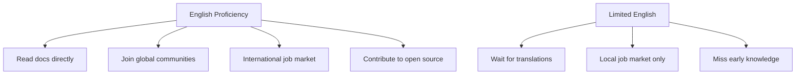

# R17: A Importância do Inglês

Inglês é a língua franca da tecnologia. Você não precisa perfeito, mas domínio funcional é uma das habilidades de maior alavanca que você pode construir. Docs, tutoriais, fóruns, vagas e open source tudo vem por padrão em inglês.
{: .lesson-intro }

## Por Que Importa

As próprias linguagens de programação estão em inglês: `function`, `return`, `class`, `import`. Mensagens de erro em inglês. Docs oficiais de React, Node.js, Python e praticamente toda ferramenta grande são escritas em inglês primeiro. Traduções vêm semanas ou meses depois, quando vêm. Sem inglês, você está sempre esperando alguém traduzir por você.

Times internacionais se comunicam em inglês. Vagas remotas frequentemente exigem. Revisões de código, descrições de PR, mensagens de commit, specs - tudo em inglês na maioria das empresas. Expressar ideias técnicas com clareza em inglês abre portas que habilidade técnica sozinha não abre.

## Como Melhorar

- Leia documentação em inglês, não em versões traduzidas
- Assista tech talks em inglês (legenda vale)
- Escreva mensagens de commit, comentários e READMEs em inglês
- Participe de comunidades em inglês (GitHub, Discord, fóruns)
- Mire em comunicação clara, não perfeição

<h2>Pontos-chave</h2>
<ul>
<li>Inglês é a língua comum da tecnologia. Domínio funcional bate fluência perfeita</li>
<li>Maioria das docs e tutoriais é publicada em inglês primeiro - traduções atrasam ou não saem</li>
<li>Proficiência em inglês amplia seu mercado de trabalho de local para global</li>
<li>Pratique diariamente: leia docs, escreva commits, participe de comunidades - em inglês</li>
</ul>

