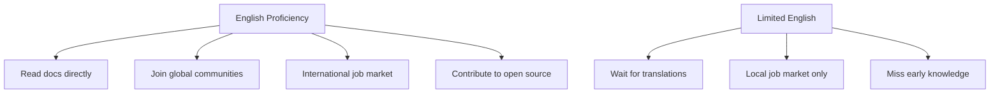

# R17: A Importância do Inglês

Inglês é a língua franca do mundo da tecnologia. Você não precisa falar perfeitamente, mas ter um domínio funcional é uma das habilidades de maior alavancagem que você pode desenvolver como desenvolvedor. É a língua que a maioria da documentação, tutoriais, fóruns, vagas e projetos open source usa.
{: .lesson-intro }

## Por Que Inglês Importa em Tech

As próprias linguagens de programação são escritas em inglês: function, return, class, import, export. Mensagens de erro estão em inglês. Respostas do Stack Overflow estão em inglês. A documentação oficial de React, Node.js, Python e quase toda tecnologia importante é escrita primeiro em inglês. Se você não consegue ler, fica sempre esperando alguém traduzir para você.

## Acesso a Recursos

A grande maioria do material de aprendizado está em inglês. Tutoriais, posts de blog, talks de conferência, podcasts, livros. Quando um framework novo é lançado, a documentação vem em inglês primeiro. Traduções podem vir semanas ou meses depois, se vierem. Proficiência em inglês significa aprender da fonte, não de uma cópia atrasada.

## Comunicação e Carreira

Times internacionais se comunicam em inglês. Vagas remotas frequentemente exigem. Code reviews, descrições de pull request, mensagens de commit, especificações técnicas - todas escritas em inglês na maioria das empresas. Conseguir expressar ideias técnicas com clareza em inglês abre portas que habilidade técnica sozinha não abre.

## Como Melhorar

- Leia documentação em inglês em vez de versões traduzidas
- Assista talks e tutoriais em inglês (legendas estão OK)
- Escreva suas mensagens de commit, comentários e READMEs em inglês
- Participe de comunidades em inglês (GitHub, Discord, fóruns)
- Não mire perfeição. Mire comunicação clara

<h2>Pontos-chave</h2>
<ul>
<li>Inglês é a língua comum da indústria de tecnologia. Fluência não é obrigatória, mas proficiência funcional sim</li>
<li>A maior parte da documentação, tutoriais e recursos é publicada primeiro em inglês</li>
<li>Proficiência em inglês expande seu mercado de trabalho de local para global</li>
<li>Pratique todo dia lendo docs, escrevendo commits e participando de comunidades em inglês</li>
</ul>

