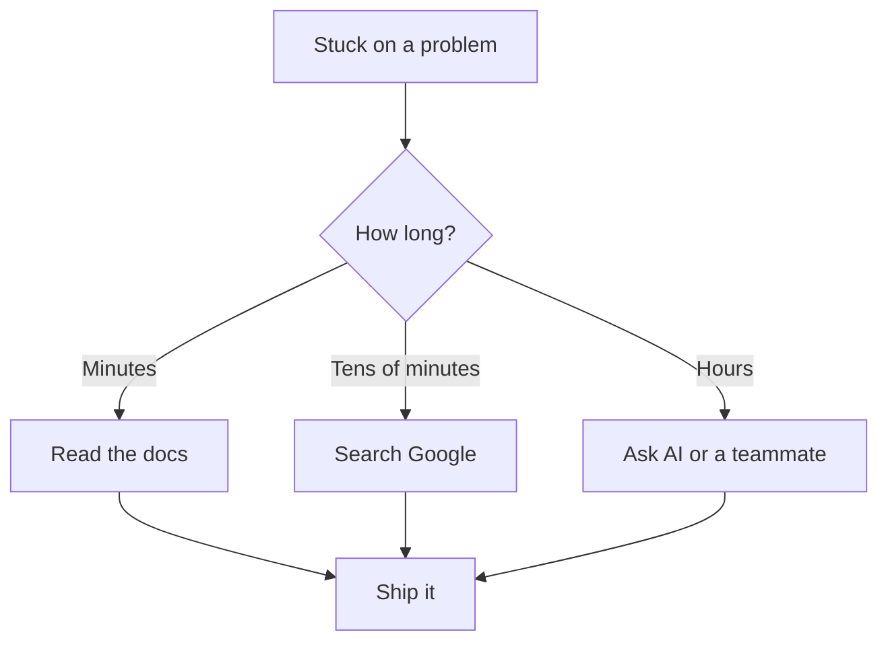

# R18: ドキュメントは最良の友

全てを覚えている人はいません。シニア開発者もそうです。フレームワークの作者もそうです。Googleのプリンシパルエンジニアもそうです。優れた開発者と行き詰まる開発者の違いは、どれだけ暗記しているかではなく、必要な情報をどれだけ速く見つけられるかです。ドキュメント、検索エンジン、AIはズルの道具ではありません。それらを使うことが仕事なのです。 {.lesson-intro}

## 全てを知る必要はない

この分野は広すぎます。新しいツールは毎週リリースされます。フレームワークのAPIは変わります。ベストプラクティスも進化します。全部頭に入れようとするのは勝てない勝負です。外科医は薬の相互作用を全て暗記しません、処方前に確認します。パイロットはチェックリストを暗記しません、毎回読み上げます。良い仕事をするとは、仕事を助けるツールを使うことです。

## 仕事は問題を解決すること

関数の引数を暗記から言えるように給料が払われているわけではありません。動くソフトウェアを納品することに給料が払われています。行き詰まったとき、問うべきは「自分は賢いか」ではなく「動く解決策への最短ルートは何か」です。そのルートはほとんどの場合、ドキュメント、検索エンジン、AIアシスタント、ソースコード、またはチームメイトを通ります。

## プロの道具

- **公式ドキュメント。**まずここから。作った人が書いています。
- **検索エンジン。**Stack Overflow、ブログ記事、GitHub Issuesがほとんどの問題を解決済みです。
- **AIアシスタント。**問題を普通の言葉で説明する。例を求める。繰り返す。
- **ソースコード。**ドキュメントが役立たないとき、実装を読む。コードは嘘をつきません。
- **チーム。**5分の会話が5時間の検索を節約します。

## プライドは敵

「知ってるはず」と言って検索を拒む開発者は時間を無駄にします。「見栄えが悪い」と言って質問を拒む開発者は納品が遅れます。「ズルだ」と言ってAIを拒む開発者は取り残されます。調べるのは弱さではありません。助けを求めるのは失敗ではありません。大事なのは最終成果だけです。納期通りに動くソフトウェアを納品すること。

## マインドセットの転換

「知らない」を個人的な失敗として扱うのをやめましょう。全てのタスクの出発点として扱います。シニア開発者は全てを知っている人ではありません。シニア開発者は答えを速く見つけ、適切に評価し、前に進む人です。発見のツールの熟練こそが本当のスキルです。

<h2>まとめ</h2>
<ul>
<li>全てを知っている人はいない。この分野は暗記するには広すぎる</li>
<li>仕事は動くソフトウェアを納品すること。暗記の披露ではない</li>
<li>ドキュメント、検索、AI、ソースコード、チームメイト。全て正当なツール</li>
<li>プライドは邪魔。調べることは弱さではなく、それが仕事</li>
<li>最終成果こそが全て</li>
</ul>

