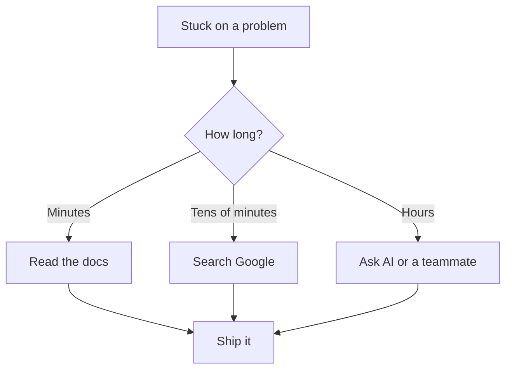

# R18: ドキュメントはあなたの親友

誰もすべてを覚えていません。シニア開発者も、フレームワークの作者も、Googleのプリンシパルエンジニアも。有能な開発者と詰まった開発者を分けるのは、暗記量ではなく必要なものを見つける速さです。ドキュメント、検索、AIはカンニングペーパーではありません。使うことが仕事です。
{: .lesson-intro }

## あなたの仕事は問題を解くこと

あなたは関数シグネチャを暗記から暗唱するために給料をもらっているのではありません。動くソフトウェアを出荷するために給料をもらっている。詰まったときの問いは「自分は賢いか」ではなく「動く解決策への最速経路は何か」。その経路はほぼ常にドキュメント、検索、AI、ソースコード、チームメイトを通ります。

## 仕事の道具

- **公式ドキュメント。**ここから始める。それを作った人たちが書いている。
- **検索エンジン。**Stack Overflow、ブログ、GitHub Issuesにはすでに解決された問題が多い。
- **AIアシスタント。**問題を平易な言葉で説明する。例を求める。反復する。
- **ソースコード。**ドキュメントが駄目なら実装を読む。嘘をつかない。
- **チーム。**5分の会話が5時間の検索を救う。

## プライドが敵

「これは知っているべき」と検索を拒む開発者は何時間も無駄にする。「見た目が悪い」と質問を拒む開発者は出荷が遅い。調べることは弱さではありません。シニアとは事前に全てを知っていることではなく、答えを見つけるのが速いことです。

<h2>まとめ</h2>
<ul>
<li>誰もすべてを知らない。分野は暗記には広すぎる</li>
<li>あなたの仕事は動くソフトウェアであって、暗記からの暗唱ではない</li>
<li>ドキュメント、検索、AI、ソースコード、チームメイトはすべて正当な道具</li>
<li>プライドは足を引っ張る。シニア = 答えを見つけるのが速い、初めからすべてを知っているわけではない</li>
</ul>

