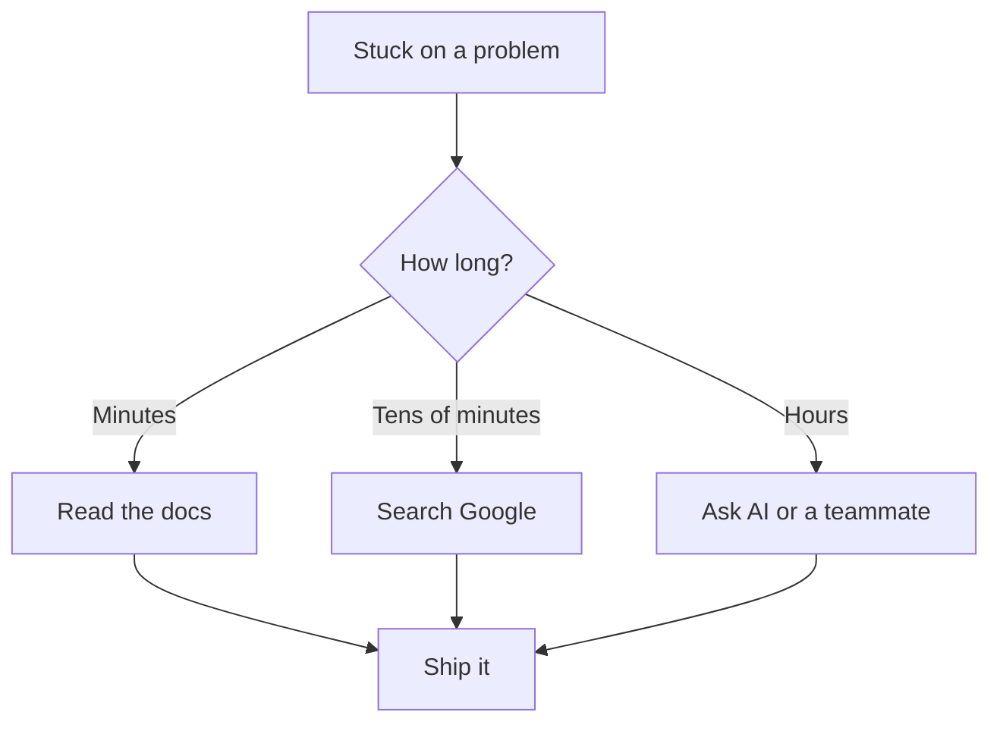

# R18: Documentation is Your Best Friend

Nobody remembers everything. Not seniors, not framework authors, not principal engineers at Google. What separates effective developers from stuck ones is not how much they memorize but how fast they find what they need. Docs, search, and AI are not cheat sheets. Using them is the job.
{: .lesson-intro }

## Your Job is to Fix Problems

You are not paid to recite function signatures. You are paid to ship working software. When stuck, the question is not "am I smart enough" but "what is the fastest path to a working solution?" That path almost always goes through docs, search, AI, source code, or a teammate.

## The Tools of the Trade

- **Official documentation.** Start here. Written by the people who built the thing.
- **Search engines.** Stack Overflow, blog posts, and GitHub issues have solved most problems already.
- **AI assistants.** Explain the problem in plain words. Ask for examples. Iterate.
- **Source code.** When docs fail, read the implementation. It never lies.
- **Your team.** A five-minute conversation can save five hours of searching.

## Pride is the Enemy

The developer who refuses to search because "I should know this" wastes hours. The one who refuses to ask because "it looks bad" ships slower. Looking things up is not weakness. Senior means fast at finding answers, not knowing everything upfront.

<h2>Key Takeaways</h2>
<ul>
<li>Nobody knows everything. The field is too large to memorize</li>
<li>Your job is working software, not reciting from memory</li>
<li>Docs, search, AI, source code, and teammates are all legitimate tools</li>
<li>Pride slows you down. Senior = fast at finding answers, not knowing everything</li>
</ul>

