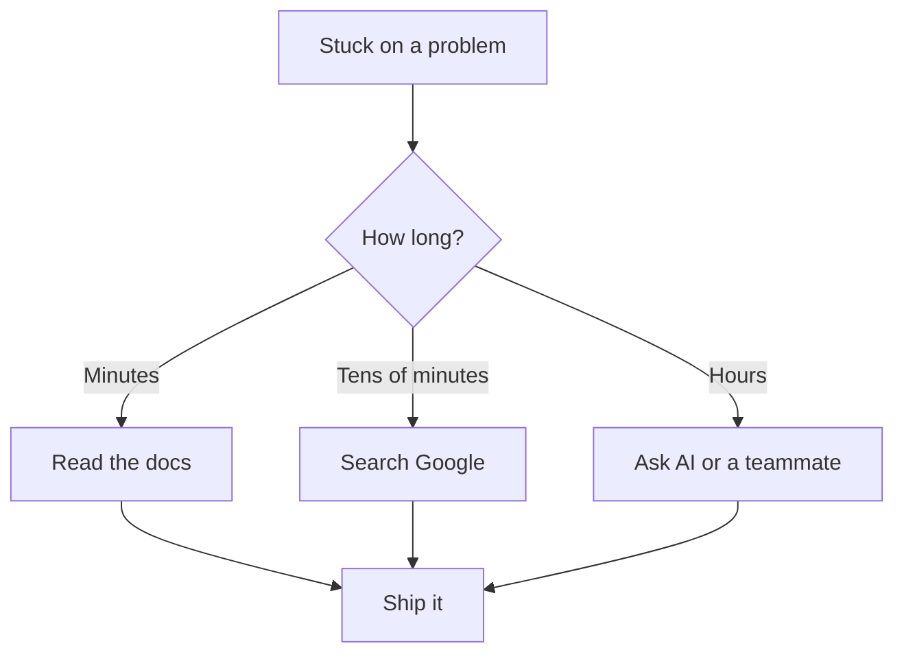

# R18: Documentation is Your Best Friend

Nobody remembers everything. Not senior developers. Not framework authors. Not principal engineers at Google. What separates effective developers from stuck ones is not how much they memorize, but how fast they find what they need. Documentation, search engines, and AI are not cheat sheets. Using them is the job. {.lesson-intro}

## It is OK to Not Know Everything

The field is too large. New tools ship every week. Frameworks change APIs. Best practices evolve. Trying to hold it all in your head is a losing game. A surgeon does not memorize every drug interaction, she looks them up before prescribing. A pilot does not memorize every checklist, he reads it on each flight. Doing the job well means using the tools that help you do the job well.

## Your Job is to Fix Problems

You are not paid to recite function signatures from memory. You are paid to ship working software. When you are stuck, the question is not "am I smart enough" but "what is the fastest path to a working solution?" That path almost always goes through documentation, search engines, AI assistants, source code, or a teammate.

## The Tools of the Trade

- **Official documentation.** Start here. It is written by the people who built the thing.
- **Search engines.** Stack Overflow, blog posts, and GitHub issues have solved most problems already.
- **AI assistants.** Explain the problem in plain words. Ask for examples. Iterate.
- **Source code.** When docs fail, read the implementation. It never lies.
- **Your team.** A five-minute conversation can save five hours of searching.

## Pride is the Enemy

The developer who refuses to search because "I should know this" wastes hours. The developer who refuses to ask because "it looks bad" ships slower. The developer who refuses AI because "it is cheating" falls behind. Looking things up is not weakness. Asking for help is not failure. The only thing that matters is the final result: working software, delivered on time.

## The Mindset Shift

Stop treating "I do not know" as a personal failure. Treat it as the starting point of every task. The senior developer is not the one who knows everything. The senior developer is the one who finds answers fast, evaluates them well, and moves on. Fluency with the tools of discovery is the real skill.

<h2>Key Takeaways</h2>
<ul>
<li>Nobody knows everything. The field is too large to memorize</li>
<li>Your job is to deliver working software, not to recite from memory</li>
<li>Documentation, search, AI, source code, and teammates are all legitimate tools</li>
<li>Pride slows you down. Looking things up is not weakness, it is the job</li>
<li>The final result is what matters</li>
</ul>

