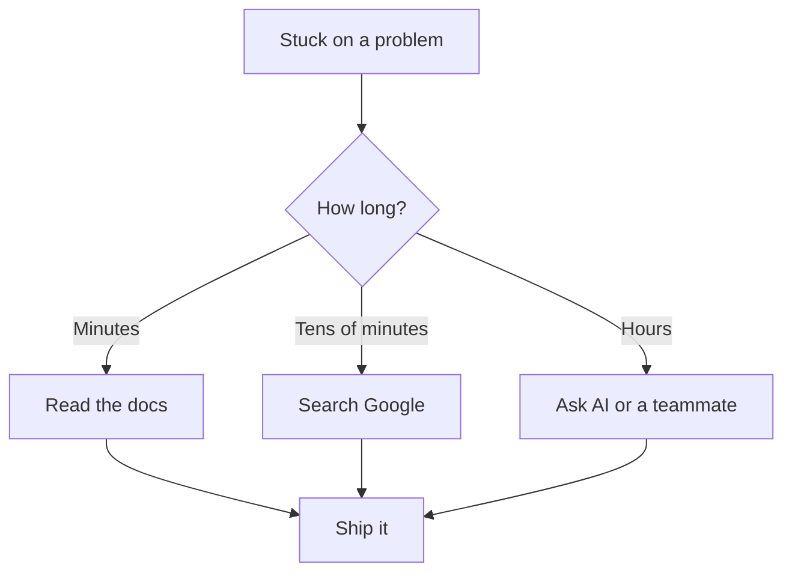

# R18: A Documentação é Sua Melhor Amiga

Ninguém lembra de tudo. Nem sêniores, nem autores de framework, nem principal engineers no Google. O que separa pessoa efetiva de pessoa travada não é quanto memoriza, é a velocidade com que encontra o que precisa. Docs, busca e IA não são cola. Usar é o trabalho.
{: .lesson-intro }

## Seu Trabalho é Resolver Problemas

Você não é pago para recitar assinaturas de função. É pago para entregar software funcionando. Quando empaca, a pergunta não é "sou inteligente o bastante" e sim "qual o caminho mais rápido para uma solução que funciona?". Esse caminho quase sempre passa por docs, busca, IA, código fonte ou um colega.

## As Ferramentas do Ofício

- **Documentação oficial.** Comece aqui. Escrita por quem construiu a coisa.
- **Buscadores.** Stack Overflow, posts de blog e issues no GitHub já resolveram a maioria dos problemas.
- **Assistentes de IA.** Explique o problema em palavras simples. Peça exemplos. Itere.
- **Código fonte.** Quando a doc falha, leia a implementação. Ela não mente.
- **Seu time.** Uma conversa de cinco minutos pode salvar cinco horas de busca.

## Orgulho é o Inimigo

Quem recusa buscar porque "eu deveria saber isso" desperdiça horas. Quem recusa perguntar porque "fica mal" entrega mais devagar. Procurar coisas não é fraqueza. Sênior significa rapidez em achar respostas, não saber tudo de antemão.

<h2>Pontos-chave</h2>
<ul>
<li>Ninguém sabe de tudo. O campo é grande demais para memorizar</li>
<li>Seu trabalho é software funcionando, não recitar de memória</li>
<li>Docs, busca, IA, código fonte e colegas são todas ferramentas legítimas</li>
<li>Orgulho atrasa. Sênior = rápido em achar respostas, não saber tudo</li>
</ul>

