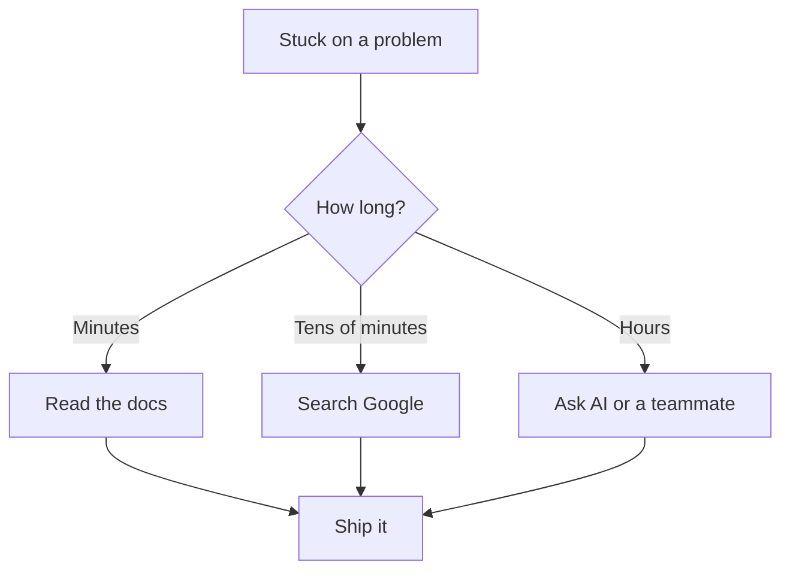

# R18: Documentação é Sua Melhor Amiga

Ninguém lembra de tudo. Nem desenvolvedores seniores. Nem autores de framework. Nem engenheiros principais do Google. O que separa desenvolvedores eficazes dos travados não é quanto memorizam, é quão rápido encontram o que precisam. Documentação, motores de busca e IA não são cola. Usá-los é o trabalho.
{: .lesson-intro }

## Está Tudo Bem Não Saber Tudo

A área é grande demais. Ferramentas novas saem toda semana. Frameworks mudam APIs. Boas práticas evoluem. Tentar manter tudo na cabeça é um jogo perdido. Um cirurgião não memoriza toda interação entre remédios, ele consulta antes de prescrever. Um piloto não memoriza cada checklist, ele lê a cada voo. Fazer o trabalho bem é usar as ferramentas que ajudam a fazer o trabalho bem.

## Seu Trabalho é Resolver Problemas

Você não é pago para recitar assinaturas de função de memória. Você é pago para entregar software que funciona. Quando você trava, a pergunta não é "sou esperto o suficiente" mas "qual o caminho mais rápido para uma solução que funcione?" Esse caminho quase sempre passa por documentação, motores de busca, assistentes de IA, código-fonte ou um colega.

## As Ferramentas do Ofício

- **Documentação oficial.** Comece aqui. Foi escrita pelas pessoas que construíram.
- **Motores de busca.** Stack Overflow, posts de blog e issues do GitHub já resolveram a maioria dos problemas.
- **Assistentes de IA.** Explique o problema em palavras simples. Peça exemplos. Itere.
- **Código-fonte.** Quando a doc falha, leia a implementação. Ela nunca mente.
- **Seu time.** Uma conversa de cinco minutos economiza cinco horas de busca.

## Orgulho é o Inimigo

O desenvolvedor que se recusa a buscar porque "eu deveria saber isso" perde horas. O que se recusa a perguntar porque "pega mal" entrega mais devagar. O que se recusa a usar IA porque "é trapaça" fica para trás. Consultar coisas não é fraqueza. Pedir ajuda não é falha. O que importa é o resultado final: software funcionando, entregue no prazo.

## A Mudança de Mentalidade

Pare de tratar "eu não sei" como falha pessoal. Trate como o ponto de partida de toda tarefa. O desenvolvedor sênior não é o que sabe tudo. O desenvolvedor sênior é o que acha respostas rápido, avalia bem e segue em frente. Fluência com as ferramentas da descoberta é a habilidade real.

<h2>Key Takeaways</h2>
<ul>
<li>Ninguém sabe tudo. A área é grande demais para memorizar</li>
<li>Seu trabalho é entregar software funcionando, não recitar de memória</li>
<li>Documentação, busca, IA, código-fonte e colegas são todas ferramentas legítimas</li>
<li>Orgulho atrapalha. Consultar não é fraqueza, é o trabalho</li>
<li>O resultado final é o que importa</li>
</ul>

