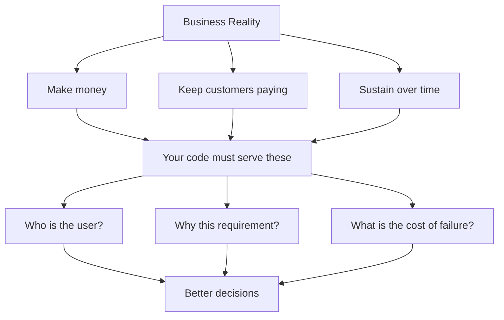

# R19: ビジネスはお金で動く

ビジネスは、入ってくるお金が出ていくお金より速いことで生き延びます。給料、家賃、サーバー、税金。何一つ勝手に支払われません。お金を稼ぐのを止めた会社は存在するのを止めます。これは皮肉ではありません。重力です。そうでないフリをするのは、綺麗に出荷されるが静かに死ぬものを作る最速の道。
{: .lesson-intro }

## 3つの厳しい真実

- **お金を稼ぐ。**収益はコストをカバーしなければならない。フラットラインはない - 上がるか下がるか。
- **顧客に払い続けてもらう。**「完璧な製品を作る」ではない。顧客が繰り返し払う価値があると思うものを作る。
- **自分を維持する。**ベンチャーキャピタルは尽きる、技術的負債は複利、複雑さは増える。適応するまで生き続ける。

ミッションステートメントやビジョンは顔です - マーケティングが機械に人間の形を与えるために書いた一文。間違いでも悪でもない。人間は目的を必要とし、目的は顧客と従業員を引き寄せる。ただし顔とエンジンを混同するな。エンジンはお金。

## なぜこれがあなたに関係するか

チェックボックスとして扱われたチケットは、要件を技術的に満たすが、静かにビジネスを失敗させるコードを生みます。顧客がInternet Explorerの銀行であることを見逃す。ユーザーの60%がモバイルなのにモバイルのブレイクポイントがデザインに指定されていないことを見逃す。「スコープ外: 自動保存」が実際のユーザーに聞かなかった誰かの推測だったことを見逃す。ビジネスに資さないコードはコストになる - 会社が修正、リファクタリング、書き直しのために払うコスト。

ビジネスを念頭に置く開発者は、作る前に異なる質問をします: 顧客は誰か? どのブラウザとデバイス? なぜこれがスコープ外で、誰が決めたのか? 似た機能が既にあって再利用できるか? ユーザーがクリックした瞬間にサーバーが落ちていたらどうなるか? モバイルで動くか? 答えはチケットをまるごと変えるか、肯定する。どちらにせよ、出荷する仕事はビジネスにフィットする。

## 証拠は感情に勝つ

決定に反対する時、データを持ってこい。「これは間違っていると思う」はどこにも行かない。「ユーザーの60%がモバイルで、これがブロックしている」は議論に勝つ。逆も真: 理由なしのトップダウン命令は無気力なチームを生む。「上司がそう言った、間違っていると思うがもうどうでもいい」は防げたバグが出荷される道。双方に証拠の尊重を負っている。

<h2>まとめ</h2>
<ul>
<li>ビジネスはお金で生き延びる。稼ぎ、保ち、持続する。それ以外は二次的</li>
<li>ミッションステートメントは顔であってエンジンではない。混同するな</li>
<li>チケットをチェックボックスとして扱うとコストになる。顧客とWhyを理解する</li>
<li>感情ではなく証拠で反対する。上からも同じものを要求せよ</li>
</ul>

