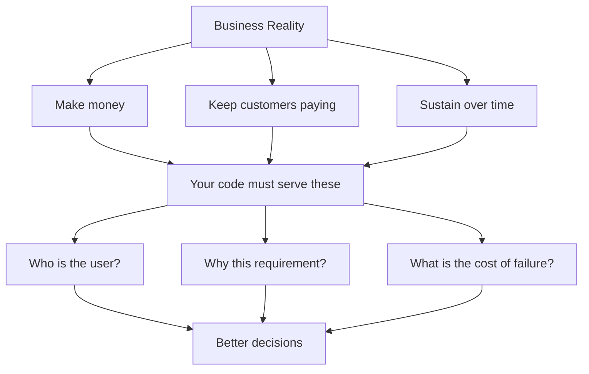

# R19: ビジネスはお金で動く

ミッションステートメントやマーケティングコピーを剥がしましょう。会社を実際に生かしているのは、出ていくお金より入ってくるお金の方が多いという事実です。給料、家賃、サーバー、税金。どれも自動では払われません。お金を作れなくなった会社は存在を終えます。これは冷笑ではなく、重力と同じ事実です。目を背けるほど、美しく出荷して静かに死ぬ製品を作るのが早くなります。 {.lesson-intro}

## 三つの厳しい真実

2人のスタートアップから上場大企業まで、全てのビジネスは変わらない3つの目標の上に成り立っています:

- **お金を作る。**売上が家賃、給料、経費を賄う必要がある。横ばいはない。上がるか、下がるか。
- **顧客に払い続けてもらう。**「完璧な製品を作る」ではない。顧客が何度でも払う価値があると感じる製品を作ること。
- **持続する。**ベンチャーキャピタルは尽きる。技術的負債は積もる。複雑さは増す。目標は、適応できる期間だけ生き延びること。

## ミッションステートメントは顔

多くの企業は「ビジョン」や「ミッション」を持っています。マーケティングが書き上げた一文で、機械に人間の顔を与えるためのものです。これは悪いことではありません。人は目的を必要とし、目的は顧客と従業員を引きつけます。しかし、顔とエンジンを混同してはいけません。エンジンはお金です。ミッションはアルバムのジャケットです。

## なぜこれがあなたに関係するか

チケットをただのチェックボックスとして扱えば、要件は技術的に満たすが、ビジネスには静かに失敗するコードを生みます。顧客がInternet Explorerを使い続ける銀行であることを見落とす。ユーザーの60%がモバイルで、デザインにモバイル対応がないことを見落とす。「オートセーブは対象外」が、本当のユーザーに一度も聞かなかった誰かの推測だったことを見落とす。ビジネスに貢献しないコードはコストになります。会社が修正、リファクタ、書き直しで払うコストです。

## 根拠は感情に勝つ

決定に反対するときは、データを持ってきましょう。「間違っていると思います」は何も動かしません。「ユーザーの60%はモバイルで、これは彼らをブロックします」は議論に勝ちます。逆も真なりです。根拠のないトップダウンの命令は、無関心なチームを生みます。「上司が言ったからやる。間違っていると思うが、もう気にしない」が、防げたバグが出荷される瞬間です。両方の側が、根拠という敬意をお互いに払うべきです。

## 例: 保存ボタン

「保存ボタンを追加」というチケットが来ます。カラムを追加し、エンドポイントを作り、ボタンを配線し、テストを書き、チケットを閉じる。完了です。そして盲目的に出荷しました。

ビジネスを念頭に置く開発者は、別の質問をします:

- 顧客は誰か?どのブラウザとデバイスを使っているか?
- なぜオートセーブは「対象外」なのか?誰が、何を根拠に決めたか?
- 似た機能は既に存在し、再利用できるか?
- ユーザーが保存を押したときにサーバーが落ちていたら?
- デザインはモバイルで機能するか?ユーザーの大半はそこにいる

答え次第で、チケットが根本から変わるかもしれません。あるいは正しいと確認するかもしれません。どちらにせよ、出荷する仕事はチケットではなくビジネスに合っています。

## 敬意は双方向

固い階層はスケールします。スタートアップは多才な個人で動きます。どちらも間違いではありません。両方のモデルを壊すのは、決める人と作る人の間の率直なやりとりの欠如です。スーツと開発者が根拠を持って互いに押し返せるチームは、一方が命令し他方が従うチームより良い製品を作ります。全員にとって何が長期的に最善かを考えることが、敬意を得る道です。

<h2>まとめ</h2>
<ul>
<li>ビジネスはお金で生き延びる。作り、保ち、持続させる。他はすべて二次的</li>
<li>ミッションステートメントは顔であり、エンジンではない。混同しない</li>
<li>チケットをチェックボックスとして扱うとコストを生む。顧客と理由を理解する</li>
<li>感情ではなく根拠で反対する。上にも同じことを要求する</li>
<li>リーダーと作り手の間の敬意と対話が、トップダウンの命令よりも良い製品を生む</li>
</ul>

