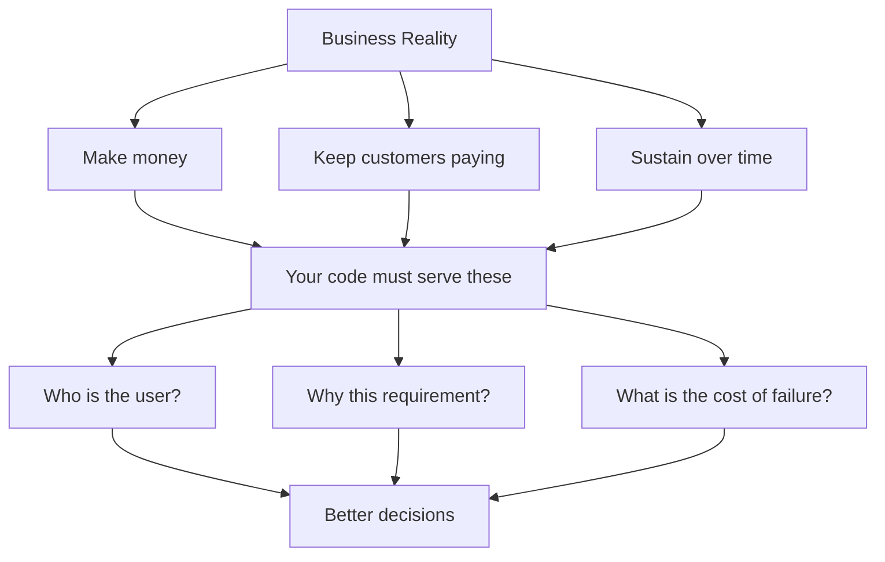

# R19: A Business Runs on Money

Strip away the mission statements and the marketing copy. What actually keeps a business alive is cash flowing in faster than cash flowing out. Salaries, rent, servers, taxes. None of it pays itself. A company that stops making money stops existing. This is not cynical. This is gravity. Pretending otherwise is the fastest way to build something that ships beautifully and dies quietly.
{: .lesson-intro }

## The Three Hard Truths

Every business, from a two-person startup to a public giant, is built on three goals that do not change:

- **Make money.** Revenue must cover rent, salaries, and expenses. There is no flat line. You go up or you go down.
- **Keep customers paying.** Not "build the perfect product." Build one that customers find worth paying for, over and over.
- **Sustain itself.** Venture capital runs out. Technical debt compounds. Complexity grows. The goal is staying alive long enough to adapt.

## The Mission Statement is a Face

Most companies have a "vision" or "mission." A curated sentence written by marketing to give a human face to the machine. This is not wrong or evil. People need purpose, and purpose attracts customers and employees. But do not confuse the face with the engine. The engine is money. The mission is the cover art on the album.

## Why This Matters to You

If you treat a ticket as a box to check, you produce code that technically satisfies the requirements and quietly fails the business. You miss that the customer is a bank still on Internet Explorer. You miss that 60% of users are on mobile and the design never specified a mobile breakpoint. You miss that "out of scope: auto-save" was a guess by someone who never asked the real user. Code that does not serve the business becomes cost. Cost the company pays to fix, refactor, or rewrite.

## Evidence Beats Feelings

When you push back on a decision, bring data. "I think this is wrong" goes nowhere. "Our users are 60% mobile and this blocks them" wins the argument. The flip side is also true. Overbearing top-down orders with no reasoning produce apathetic teams. "The boss said so, I think he is wrong, but I do not care anymore" is how preventable bugs ship. Both sides owe each other the respect of evidence.

## Example: The Save Button

A ticket lands on your desk: add a save button. You could add a column, create an endpoint, wire the button, write a test, and close the ticket. You would be done. You would also have shipped something blind.

A developer who holds the business in mind asks different questions:

- Who is the customer? What browser and device do they use?
- Why is auto-save "out of scope"? Who decided, and based on what?
- Does a similar feature already exist that we could reuse?
- What happens if the server is down when the user clicks save?
- Does the design work on mobile, where most users are?

The answers might change the ticket entirely. Or confirm it. Either way, the work you ship fits the business, not just the ticket.

## Respect Goes Both Ways

Rigid hierarchies scale. Startups run on multidisciplinary individuals. Neither is wrong. What breaks either model is a lack of open exchange between the people deciding and the people building. Suits and developers who can push back on each other, with evidence, produce better products than teams where one side dictates and the other obeys. Thinking long-term about what is best for everyone is what earns respect.

<h2>Key Takeaways</h2>
<ul>
<li>A business survives on money. Make it, keep it, sustain it. Everything else is secondary</li>
<li>Mission statements are a face, not the engine. Do not confuse the two</li>
<li>Treating tickets as checkboxes produces cost. Understand the customer and the why</li>
<li>Push back with evidence, not feelings. Demand the same from above</li>
<li>Respect and open dialogue between leadership and builders produce better products than top-down orders</li>
</ul>

