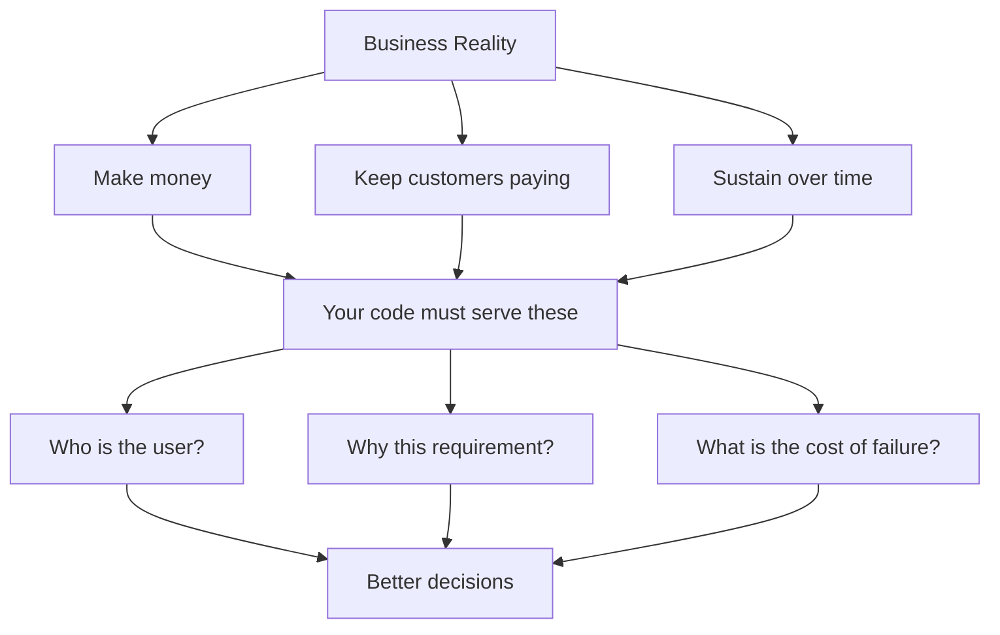

# R19: A Business Runs on Money

A business survives on cash flowing in faster than cash flowing out. Salaries, rent, servers, taxes. None of it pays itself. A company that stops making money stops existing. This is not cynical, it is gravity. Pretending otherwise is the fastest way to build something that ships beautifully and dies quietly.
{: .lesson-intro }

## The Three Hard Truths

- **Make money.** Revenue must cover costs. No flat line - you go up or down.
- **Keep customers paying.** Not "build the perfect product". Build one customers find worth paying for, repeatedly.
- **Sustain itself.** VC runs out, tech debt compounds, complexity grows. Stay alive long enough to adapt.

Mission statements and vision taglines are a face - a sentence written by marketing to give a human shape to the machine. Not wrong, not evil. People need purpose, purpose attracts customers and employees. Just do not confuse the face with the engine. The engine is money.

## Why This Matters to You

A ticket treated as a box to check produces code that technically satisfies the requirements and quietly fails the business. You miss that the customer is a bank on Internet Explorer. You miss that 60% of users are on mobile and the design never specified a mobile breakpoint. You miss that "out of scope: auto-save" was a guess by someone who never asked the real user. Code that does not serve the business becomes cost - cost the company pays to fix, refactor, or rewrite.

A developer who holds the business in mind asks different questions before building: Who is the customer? What browser and device? Why is this out of scope, who decided? Does a similar feature already exist? What happens if the server is down when the user clicks? Does it work on mobile? The answers might change the ticket entirely or confirm it. Either way, the work fits the business.

## Evidence Beats Feelings

When you push back on a decision, bring data. "I think this is wrong" goes nowhere. "Our users are 60% mobile and this blocks them" wins the argument. The flip side is also true: overbearing top-down orders with no reasoning produce apathetic teams. "The boss said so, I think he is wrong, but I do not care anymore" is how preventable bugs ship. Both sides owe each other the respect of evidence.

<h2>Key Takeaways</h2>
<ul>
<li>A business survives on money. Make it, keep it, sustain it. Everything else is secondary</li>
<li>Mission statements are a face, not the engine. Do not confuse the two</li>
<li>Treating tickets as checkboxes produces cost. Understand the customer and the why</li>
<li>Push back with evidence, not feelings. Demand the same from above</li>
</ul>

