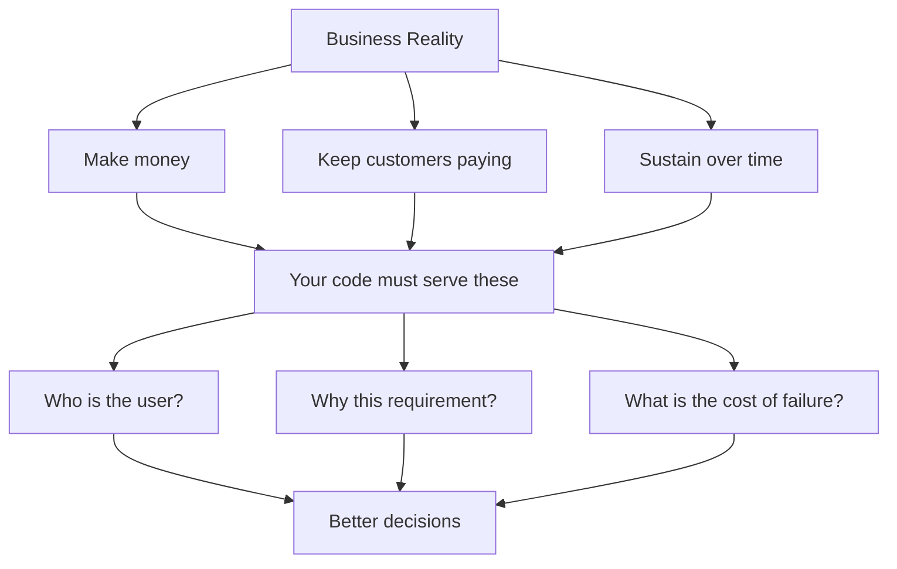

# R19: Uma Empresa Funciona com Dinheiro

Tire as declarações de missão e o marketing. O que mantém uma empresa viva é caixa entrando mais rápido do que caixa saindo. Salários, aluguel, servidores, impostos. Nada disso se paga sozinho. Uma empresa que para de ganhar dinheiro para de existir. Isso não é cinismo. É gravidade. Fingir o contrário é o jeito mais rápido de construir algo que entrega lindo e morre em silêncio.
{: .lesson-intro }

## As Três Verdades Duras

Toda empresa, de uma startup de duas pessoas a um gigante listado, é construída sobre três objetivos que não mudam:

- **Ganhar dinheiro.** Receita precisa cobrir aluguel, salários e despesas. Não existe linha reta. Ou sobe ou desce.
- **Manter clientes pagando.** Não "construir o produto perfeito." Construir um que os clientes achem que vale a pena pagar, repetidamente.
- **Se sustentar.** Capital de risco acaba. Dívida técnica se acumula. Complexidade cresce. O objetivo é ficar viva tempo o suficiente para se adaptar.

## Missão é Fachada

A maioria das empresas tem uma "visão" ou "missão". Uma frase polida escrita pelo marketing para dar cara humana à máquina. Isso não é errado nem mal. Pessoas precisam de propósito, e propósito atrai clientes e funcionários. Mas não confunda a fachada com o motor. O motor é dinheiro. A missão é a capa do álbum.

## Por Que Isso Importa para Você

Se você trata um ticket como uma caixa pra marcar, produz código que tecnicamente satisfaz os requisitos e silenciosamente falha com o negócio. Você não percebe que o cliente é um banco ainda no Internet Explorer. Não percebe que 60% dos usuários estão no mobile e o design nunca especificou um breakpoint móvel. Não percebe que "fora de escopo: auto-save" foi um chute de alguém que nunca perguntou ao usuário real. Código que não serve o negócio vira custo. Custo que a empresa paga para corrigir, refatorar ou reescrever.

## Evidência Vence Sentimento

Quando for contra uma decisão, traga dados. "Acho que isso está errado" não leva a nada. "Nossos usuários são 60% mobile e isso os bloqueia" vence o argumento. O oposto também vale. Ordens top-down sem justificativa produzem times apáticos. "O chefe mandou, acho que ele está errado, mas tanto faz" é como bugs evitáveis chegam à produção. Os dois lados devem uns aos outros o respeito de trazer evidência.

## Exemplo: O Botão de Salvar

Um ticket cai na sua mesa: adicionar um botão de salvar. Você poderia adicionar uma coluna, criar um endpoint, ligar o botão, escrever um teste e fechar o ticket. Estaria feito. Teria também entregado algo cego.

Um desenvolvedor que pensa no negócio faz outras perguntas:

- Quem é o cliente? Que navegador e dispositivo ele usa?
- Por que auto-save está "fora de escopo"? Quem decidiu, baseado em quê?
- Existe feature parecida que poderíamos reutilizar?
- O que acontece se o servidor estiver fora quando o usuário clicar em salvar?
- O design funciona em mobile, onde a maioria dos usuários está?

As respostas podem mudar o ticket inteiro. Ou confirmá-lo. Em qualquer caso, o que você entrega serve o negócio, não só o ticket.

## Respeito Vai nos Dois Sentidos

Hierarquias rígidas escalam. Startups rodam com indivíduos multidisciplinares. Nenhum está errado. O que quebra os dois modelos é a falta de troca aberta entre quem decide e quem constrói. Executivos e devs que conseguem se contestar mutuamente, com evidência, produzem produtos melhores que times onde um lado dita e o outro obedece. Pensar no longo prazo sobre o que é melhor para todos é o que ganha respeito.

<h2>Key Takeaways</h2>
<ul>
<li>Uma empresa sobrevive com dinheiro. Ganhe, retenha, sustente. Todo o resto é secundário</li>
<li>Declarações de missão são fachada, não motor. Não confunda os dois</li>
<li>Tratar tickets como caixas de marcar produz custo. Entenda o cliente e o porquê</li>
<li>Conteste com evidência, não com sentimento. Exija o mesmo de cima</li>
<li>Respeito e diálogo aberto entre liderança e construtores produzem produtos melhores que ordens top-down</li>
</ul>

