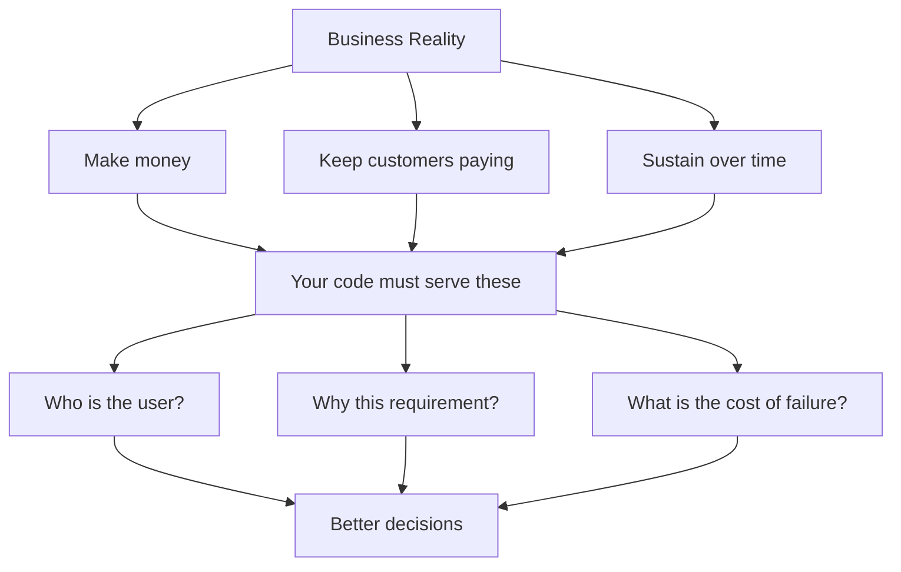

# R19: Uma Empresa Roda com Dinheiro

Uma empresa sobrevive de dinheiro entrando mais rápido do que saindo. Salário, aluguel, servidor, imposto. Nada disso se paga sozinho. Uma empresa que para de fazer dinheiro para de existir. Isso não é cinismo, é gravidade. Fingir o contrário é a forma mais rápida de construir algo que lança lindo e morre em silêncio.
{: .lesson-intro }

## As Três Verdades Duras

- **Faça dinheiro.** Receita precisa cobrir custos. Sem linha reta - sobe ou desce.
- **Mantenha clientes pagando.** Não "construa o produto perfeito". Construa um que cliente acha que vale pagar de novo.
- **Sustente-se.** VC acaba, dívida técnica rende juros, complexidade cresce. Fique vivo até conseguir se adaptar.

Missão e visão são uma cara - uma frase escrita pelo marketing para dar forma humana à máquina. Não é errado nem maligno. Pessoas precisam de propósito, propósito atrai clientes e funcionários. Só não confunda a cara com o motor. O motor é dinheiro.

## Por Que Isso Te Afeta

Um ticket tratado como caixinha a marcar produz código que cumpre os requisitos tecnicamente e falha com o negócio silenciosamente. Você perde que o cliente é um banco no Internet Explorer. Perde que 60% dos usuários são mobile e o design não especificou um breakpoint mobile. Perde que "fora de escopo: auto-save" foi chute de alguém que nunca perguntou ao usuário real. Código que não serve o negócio vira custo - custo que a empresa paga para consertar, refatorar ou reescrever.

Um desenvolvedor com o negócio na cabeça faz perguntas diferentes antes de construir: Quem é o cliente? Qual navegador e dispositivo? Por que isso está fora de escopo, quem decidiu? Existe algo parecido que dê para reusar? O que acontece se o servidor cair quando o usuário clicar? Funciona no mobile? As respostas podem mudar o ticket inteiro ou confirmá-lo. De qualquer jeito, o trabalho encaixa no negócio.

## Evidência Vence Sentimento

Quando você contesta uma decisão, leve dado. "Acho que está errado" não chega em lugar nenhum. "Nossos usuários são 60% mobile e isso os bloqueia" ganha a discussão. O oposto também vale: ordem de cima sem justificativa produz time apático. "O chefe mandou, acho que ele está errado, mas já desisti" é o caminho pelo qual bugs preveníveis são entregues. Os dois lados devem respeito pela evidência um ao outro.

<h2>Pontos-chave</h2>
<ul>
<li>Uma empresa sobrevive de dinheiro. Faça, mantenha, sustente. O resto é secundário</li>
<li>Missão é cara, não motor. Não confunda</li>
<li>Tratar ticket como checkbox vira custo. Entenda o cliente e o porquê</li>
<li>Contest com evidência, não sentimento. Exija o mesmo de cima</li>
</ul>

