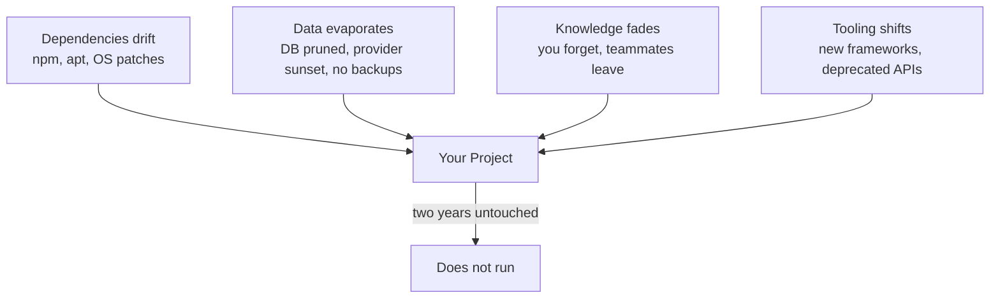

# R21: 技術的エントロピー

稼働中のプロジェクトは静的なものではありません。庭です。草取りをやめた瞬間、雑草が伸びます。2年放置すれば植えた植物は枯れます。ディスク上のコードのテキストは無事です。腐るのはコードと世界の間の「適合」です。Nodeのバージョンが上がり、依存関係が破壊的リリースを出し、データベースプロバイダがあなたのインスタンスを廃止し、ビルドツールは非推奨になる。誰も触っていなくても、静止しているものは何もありません。
{: .lesson-intro }

## 2年でプロジェクトが死ぬ様子

典型的なモダンWebアプリを出荷したと想像してください。Reactフロントエンド、Nodeバックエンド、Postgresデータベース、どこかのPaaSにデプロイ。出荷し、動き、触るのをやめた。2年後に戻ってきてこう見つけます:

- **依存関係が壊れている。**`npm install`が失敗する。推移的な依存がunpublishされたか、yankされたか、新しいNodeを要求するようになったから。1つのパッケージをアップグレードすると、20個の連鎖が始まる。
- **データベースが消えたか劣化している。**プロバイダが料金を変え、クラスターを移行し、プランを廃止し、無料枠が失効してデータが削除された。設定していなかったバックアップがあれば救えた。
- **スタックを忘れた。**どの環境変数が必要か、どのNodeバージョンでビルドしたか、認証フローがどう動くか、なぜそのORMを選んだか、覚えていない。
- **ツールチェーンが非推奨になった。**WebpackはViteになり、Viteは設定形式を変え、CSS-in-JSライブラリはメンテされておらず、状態マネージャーは流行遅れ。

単一の失敗で死ぬわけではありません。組み合わさる。復旧コストが書き直しコストを超えるので、書き直す。そして同じサイクルが始まる。

## 4つの腐朽ベクター

全てのプロジェクトは、同時に4つのベクター全てから押されます。表面積が大きいほど、腐朽は速い。200依存のReactアプリは5依存のGoバイナリより速く腐り、それはHTMLとMarkdownのフォルダより速く腐る。

## 直し方: シンプルに保つ

システムを生かしておくコストは、その複雑さに比例してスケールします。全ての依存は維持すべき関係。全ての巧妙な抽象は未来の自分が学び直すべきもの。全ての可動部品は独立に壊れうる。

- **依存を減らす。**100パッケージ = 100破壊ベクター。組み込みの答えが本当に劣るときだけライブラリに手を伸ばす。
- **最先端より退屈な技術。**5年後も動かすつもりのものには、まだサポートされているツールを選ぶ。
- **ビルドなしで済むならビルドなし。**ビルドステップは腐りうるもの。小規模サイトなら静的ファイルがバンドラーに勝つ。
- **エレガントより読みやすさ。**不透明な抽象は火曜の夜に逆工学する未来の自分。冷え切った状態で読み返せるコードを書く。

## プレーンテキストという脱出口

小さなビルドシステムを伴うMarkdownファイルは驚くほど耐久性があります。Markdownファイルはただのテキストです。どのマシンのどのエディタでも開ける。どのOSでも読める。英語を読める人間ならプログラムを走らせずに理解できる。`npm install`も、特定のNodeバージョンも、データベースも、インターネット接続も要らない。

**ファイルはアプリより長生きする。**アプリは来ては去る。独自形式はベンダーと共に死ぬ。プレーンテキストは生き残る。Markdownは2004年に設計され、当時書かれた文書は今日でも、どのレンダラーでも、変更ゼロでレンダリングされます。2004年のFlashアプリで同じことをやってみてください。

あなたが今読んでいるサイトは、あえてこの方式で作られています。レッスンはフォルダ内のMarkdownファイル。ビルドは小さなPythonスクリプトで、それらをHTMLに変換する。明日そのスクリプトが消えても、全てのレッスンはどのテキストエディタでも読める。ホスティングが死んでも、コンテンツはUSBメモリにコピーできるファイルとして生き残る。チェーンに派手なものがないから何も腐らない。

## 3つの実践ルール

- **仕事ができる最もシンプルなツールを選べ。**ブログには静的サイト。設定にはフラットファイル。ドキュメントにはMarkdownメモ。フレームワークに手を伸ばすのは、シンプルなものが本当に足りない時だけ。
- **データはアプリとは別にバックアップせよ。**コードは書き直せる。データは再生できない。定期的にエクスポートし、アプリなしで読める形式で保存し、プロバイダと無関係な場所にコピーを保管する。
- **覚えているうちにスタックを書き留めよ。**ツール、バージョン、環境変数、「これをどう動かすか」をリストしたREADMEは、2年後の自分への贈り物。未来の自分は覚えていない。過去の自分がメモを残すべき。

あなたが作るもので、触らずに永遠に動くものは一つもありません。問題は「戻ってきた時に復旧コストがいくらか」だけです。再構築が安いは保守が高いに勝る。エントロピーに噛ませる表面を減らせ。

<h2>まとめ</h2>
<ul>
<li>2年の放置で、大抵のモダンWebアプリは死ぬ。コードではなく、周りの全てが動いたから</li>
<li>4つの腐朽ベクター: 依存、データ、知識、ツーリング。全てのプロジェクトが同時に4つ全てから押される</li>
<li>直し方はシンプルさ。依存を減らし、退屈な技術、ビルドなしで済むならビルドなし、エレガントより読みやすさ</li>
<li>プレーンテキストとMarkdownは我々が持つ最も耐久性のある形式。どのエディタ、どのOS、どの未来でも</li>
<li>データはアプリとは別にバックアップ。スタックを書き留めよ。READMEは未来の自分への贈り物</li>
</ul>

