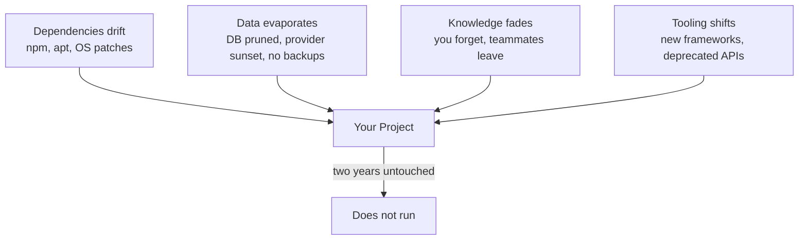

# R21: 技術的エントロピー

稼働中のプロジェクトは静的なものではありません。庭です。草取りをやめた瞬間、雑草が伸びます。2年放置すれば植えた植物は枯れ、雑草は腰の高さまで伸び、花がどこにあったかも忘れます。ソフトウェアも同じです。コードは変わっていないのに、周りの世界が変わる。Nodeのバージョンが上がり、依存関係が破壊的リリースを出し、データベースプロバイダがあなたのインスタンスを廃止し、ビルドツールは非推奨になる。誰も触っていなくても、静止しているものは何もありません。
{: .lesson-intro }

## これには名前がある

1974年、Manny Lehmanはこれを**ソフトウェアエントロピー**と名付けました。熱力学から借りたのです。第二法則は「閉じた系は無秩序に向かう」と言う。ソフトウェアも同じ。放置すれば残したままの状態に留まりません。ずれていきます。業界はこの症状を**software rot(ソフトウェア腐朽)**、**bit rot(ビット腐敗)**、**code rot(コード腐朽)**と呼びます。同じ考え、違う棚。

ディスク上のコードのテキストは無事です。腐るのはコードと世界の間の「適合」です。OSが変わる、APIが壊れる、セキュリティパッチがアップグレードを強制する、チームメイトが去り知識を持っていく、ユーザーが新しい挙動を要求する。エントロピーとは、あなたが書いたものと世界が今期待するものの間で広がる溝のことです。

## 2年でプロジェクトが死ぬ様子

2024年に出荷された典型的なモダンWebアプリを想像してください。Reactフロントエンド、Nodeバックエンド、Postgresデータベース、どこかのPaaSにデプロイ。出荷し、動き、触るのをやめた。2年後に戻ってきてこう見つけます:

- **依存関係が壊れている。**`npm install`が失敗する。推移的な依存がunpublishされたか、yankされたか、新しいNodeを要求するようになったから。1つのパッケージをアップグレードすると、20個の連鎖が始まる。
- **データベースが消えたか劣化している。**プロバイダが料金を変え、クラスターを移行し、加入していたプランを廃止し、無料枠が失効してデータが削除された。設定していなかったバックアップがあれば救えた。
- **スタックを忘れた。**どの環境変数が必要か、どのNodeバージョンでビルドしたか、認証フローがどう動くか、なぜそのORMを選んだか、覚えていない。未来の自分はオンボーディングのない新人です。
- **ツールチェーンが非推奨になった。**WebpackはViteになり、Viteは設定形式を変え、使っていたCSS-in-JSライブラリはメンテされておらず、選んだ状態マネージャーは流行遅れでサポートされていない。

単一の失敗で死ぬわけではありません。組み合わさる。復旧コストが書き直しコストを超えるので、書き直す。そして同じサイクルが始まる。

## 4つの腐朽ベクター

全てのプロジェクトは、同時に4つのベクター全てから押されます。表面積が大きいほど、腐朽は速い。200依存のReactアプリは5依存のGoバイナリより速く腐り、それはHTMLとMarkdownのフォルダより速く腐る。

## シンプルさは保守戦略である

システムを生かしておくコストは、その複雑さに比例してスケールします。全ての依存は維持すべき関係。全ての巧妙な抽象は未来の自分が学び直すべきもの。全ての可動部品は独立に壊れうる部品。

最も保守コストが安いシステムは、部品が最も少ないシステムです。「フレームワーク禁止」という意味ではありません。複雑さが元を取るときだけ、その複雑さを支払うという意味です。全ての依存、全てのビルドステップ、全ての抽象について問え。「これが2年後に壊れたら、修理コストはいくらか。そのコストは今日得ているものに見合うか?」

- 100個の依存は100個の破壊ベクター。リストは短く保て。
- 5年後も動かすつもりのものには、最先端よりも退屈な技術が勝る。
- ビルドステップは腐りうるもの。ビルドなしで済むならビルドなし。
- 不透明な抽象は未来の自分が逆工学すべきもの。エレガントより読みやすさ。

## プレーンテキストという脱出口

だからこそ、小さなビルドシステムを伴うMarkdownファイルは驚くほど耐久性があります。Markdownファイルはただのテキストです。どのマシンのどのエディタでも開ける。どのOSでも読める。英語を読める人間ならプログラムを走らせずに理解できる。`npm install`も、特定のNodeバージョンも、データベースも、インターネット接続も要らない。

「File Over App(アプリより先にファイル)」の哲学がこれを捉えています。**ファイルはアプリより長生きする**。アプリは来ては去る。独自形式はベンダーと共に死ぬ。プレーンテキストは生き残る。Markdownは2004年に設計され、当時書かれた文書は今日でも、どのレンダラーでも、変更なしでレンダリングされます。2004年のFlashアプリで同じことをやってみてください。

あなたが今読んでいるサイトは、あえてこの方式で作られています。レッスンはフォルダ内のMarkdownファイル。ビルドは小さなPythonスクリプトで、それらをHTMLに変換する。明日そのPythonスクリプトが消えても、全てのレッスンはどのテキストエディタでも読める。ホスティングが死んでも、コンテンツはUSBメモリにコピーできるファイルとして生き残る。チェーンに派手なものがないから何も腐らない。

## これが構築方法に意味すること

エントロピーと戦う3つの実践ルール:

- **仕事ができる最もシンプルなツールを選べ。**ブログには静的サイト。設定にはフラットファイル。ドキュメントにはMarkdownメモ。データベースやフレームワークに手を伸ばすのは、シンプルなものが本当に不足する時だけ。
- **データはアプリとは別にバックアップせよ。**コードは書き直せる。データは再生できない。定期的にエクスポートし、アプリなしで読める形式で保存し、プロバイダと無関係な場所にコピーを保管する。
- **覚えているうちにスタックを書き留めよ。**ツール、バージョン、環境変数、「これをどう動かすか」コマンドをリストしたREADMEは、2年後の自分への贈り物。未来の自分は覚えていない。過去の自分がメモを残すべき。

## 不快な真実

あなたが作るもので、触らずに永遠に動くものは一つもありません。問題は「戻ってきた時に復旧コストがいくらか」だけです。「再構築が安い」は「保守が高い」に勝る。Markdownファイルの山と20行のビルドスクリプトは、独自ORMを持つ12サービスのマイクロサービスアーキテクチャより耐久性があり、ポータブルで、将来性がある。技術的エントロピーに対する最良の防御は、噛ませる表面を減らすことです。

<h2>まとめ</h2>
<ul>
<li>ソフトウェアエントロピーは実在し名前がある。Lehman 1974。放置すれば、コードは世界との適合から外れていく</li>
<li>4つの腐朽ベクター: 依存、データ、知識、ツーリング。全てのプロジェクトが同時に4つ全てから押される</li>
<li>2年の放置で、大抵のモダンWebアプリは死ぬ。コードが腐ったからではなく、周りの全てが動いたから</li>
<li>シンプルさは保守戦略。依存を減らし、退屈な技術、ビルドなしで済むならビルドなし、エレガントより読みやすさ</li>
<li>プレーンテキストとMarkdownは我々が持つ最も耐久性のある形式。どのエディタ、どのOS、どの未来でも。File Over App</li>
<li>データはアプリとは別にバックアップ。スタックを書き留めよ。READMEは未来の自分への贈り物</li>
</ul>

