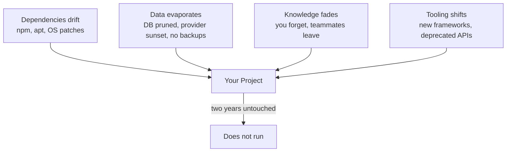

# R21: Tech Entropy

A running project is not a static thing. It is a garden. The moment you stop weeding, the weeds grow. Leave it alone for two years and the plants you planted are dead, the weeds are waist-high, and you have forgotten where the flowers used to be. Software is the same. The code did not change, but the world around it did: the Node version upgraded, a dependency published a breaking release, the database provider sunset your instance, the build tool is now deprecated. Nothing is still, even when nothing is touched.
{: .lesson-intro }

## The Name For It

Manny Lehman named this in 1974: **software entropy**. He borrowed from thermodynamics. The second law says that closed systems tend toward disorder. Software is the same. Left alone it does not stay the way you left it. It drifts. The industry calls the symptoms **software rot**, **bit rot**, or **code rot**. Same idea, different shelf.

The code text on disk is fine. What rots is the fit between the code and the world: operating systems change, APIs break, security patches force upgrades, teammates leave and take the knowledge with them, users demand new behavior. Entropy is the gap growing between what you wrote and what the world now expects.

## How A Project Dies In Two Years

Picture a typical modern web app shipped in 2024. A React front end, a Node back end, a Postgres database, deployed on some platform-as-a-service. You shipped, it worked, you stopped touching it. Come back two years later and you find:

- **Dependencies are broken.** The `npm install` fails because a transitive dep was unpublished, yanked, or needs a newer Node. Upgrading one package cascades into twenty more.
- **The database is gone or degraded.** The provider changed pricing, migrated your cluster, sunset the plan you were on, or your free tier lapsed and the data was deleted. The backups you never set up would have saved you.
- **The stack is forgotten.** You do not remember which env vars the app needs, which version of Node you built it with, how the auth flow works, or why you chose that ORM. Your future self is a new hire with no onboarding.
- **The toolchain is deprecated.** Webpack became Vite, Vite changed its config format, the CSS-in-JS library you used is unmaintained, the state manager you picked is out of fashion and unsupported.

No single failure kills it. They combine. The cost to bring it back up exceeds the cost of rewriting, so you rewrite, so the same cycle starts again.

## The Four Vectors Of Decay

Every project is pushed on by all four vectors at once. The bigger the surface area, the faster the decay. A 200-dependency React app decays faster than a 5-dependency Go binary, which decays faster than a folder of HTML and markdown.

## Simplicity Is A Maintenance Strategy

The cost of keeping a system alive scales with its complexity. Every dependency is a relationship you have to maintain. Every clever abstraction is a thing your future self has to re-learn. Every moving part is a part that can break independently.

The cheapest system to maintain is the one with the fewest parts. This does not mean "no frameworks ever". It means pay the complexity only when it earns its keep. Ask of every dependency, every build step, every abstraction: if this breaks in two years, what does it cost me to fix it, and is that cost worth what it buys me today?

- One hundred dependencies means one hundred breakage vectors. Keep the list short.
- Boring tech beats cutting-edge tech for anything you intend to still run in five years.
- A build step is a thing that can rot. Prefer no build when no build works.
- An opaque abstraction is a thing future-you will have to reverse-engineer. Prefer readable over elegant.

## The Plain-Text Escape Hatch

This is why markdown files with a tiny build system are shockingly durable. A markdown file is just text. Any editor on any machine can open it. Any operating system can read it. Any human who can read English can understand it without running any program at all. It does not require `npm install`, a specific Node version, a database, or an internet connection.

The "File Over App" philosophy captures this: **the file outlives the app**. Apps come and go. Proprietary formats die with the vendor. Plain text survives. Markdown was designed in 2004 and a document written then still renders today, in any renderer, with no changes required. Try that with a 2004 Flash app.

The site you are reading this on is built this way on purpose. Lessons are markdown files in a folder. The build is a small Python script that turns them into HTML. If the Python script disappears tomorrow, every lesson is still readable in any text editor. If the hosting dies, the content survives as files you can copy to a USB stick. Nothing rots because nothing fancy is in the chain.

## What This Means For How You Build

Three working rules for fighting entropy:

- **Pick the simplest tool that does the job.** A static site for a blog. A flat file for a config. A markdown note for documentation. Reach for a database or a framework only when the simple thing actually cannot do what you need.
- **Back up the data separately from the app.** The code can be rewritten. The data cannot be regenerated. Export regularly, store in a format that does not need your app to read, keep copies somewhere unrelated to the provider.
- **Write the stack down while you remember it.** A README that lists the tools, versions, env vars, and "how to run this" commands is a gift to the you of two years from now. Future-you does not remember. Past-you should leave a note.

## The Uncomfortable Truth

Nothing you build will run forever untouched. The question is only how much it costs to bring back when you return. Cheap to rebuild beats expensive to maintain. A pile of markdown files and a twenty-line build script is more durable, more portable, and more future-proof than a twelve-service microservice architecture with a custom ORM. The best defense against tech entropy is to give it less surface to chew on.

<h2>Key Takeaways</h2>
<ul>
<li>Software entropy is real and named. Lehman 1974. Left alone, code drifts out of fit with the world</li>
<li>Four decay vectors: dependencies, data, knowledge, tooling. Every project is pushed on by all four at once</li>
<li>Two years of neglect is usually enough to kill a modern web app. Not because code rotted, but because everything around it moved</li>
<li>Simplicity is a maintenance strategy. Fewer dependencies, boring tech, no build when no build works, readable over clever</li>
<li>Plain text and markdown are the most durable format we have. Any editor, any OS, any future. File over app</li>
<li>Back up the data separately from the app. Write the stack down. The README is a gift to future-you</li>
</ul>

