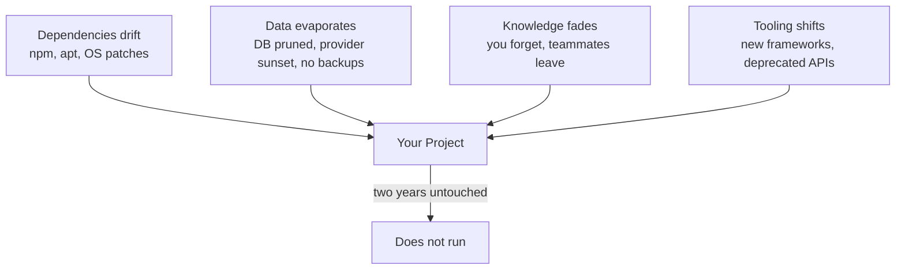

# R21: Tech Entropy

A running project is not a static thing. It is a garden. The moment you stop weeding, the weeds grow. Leave it alone for two years and the plants you planted are dead. The code text on disk is fine. What rots is the fit between your code and the world: Node versions upgrade, dependencies publish breaking releases, database providers sunset your instance, the build tool is now deprecated. Nothing is still, even when nothing is touched.
{: .lesson-intro }

## How A Project Dies In Two Years

Picture a typical modern web app shipped today. A React front end, a Node back end, a Postgres database, deployed on some platform-as-a-service. You shipped, it worked, you stopped touching it. Come back two years later and you find:

- **Dependencies are broken.** `npm install` fails because a transitive dep was unpublished, yanked, or needs a newer Node. Upgrading one package cascades into twenty more.
- **The database is gone or degraded.** The provider changed pricing, migrated your cluster, sunset the plan, or your free tier lapsed and the data was deleted. The backups you never set up would have saved you.
- **The stack is forgotten.** You do not remember which env vars the app needs, which version of Node you built it with, how the auth flow works, or why you chose that ORM.
- **The toolchain is deprecated.** Webpack became Vite, Vite changed its config format, the CSS-in-JS library is unmaintained, the state manager is out of fashion.

No single failure kills it. They combine. The cost to bring it back up exceeds the cost of rewriting, so you rewrite, so the same cycle starts again.

## The Four Vectors Of Decay

Every project is pushed on by all four at once. The bigger the surface area, the faster the decay. A 200-dependency React app decays faster than a 5-dependency Go binary, which decays faster than a folder of HTML and markdown.

## How To Fix It: Keep It Simple

The cost of keeping a system alive scales with its complexity. Every dependency is a relationship to maintain. Every clever abstraction is something your future self has to re-learn. Every moving part can break independently.

- **Fewer dependencies.** 100 packages = 100 breakage vectors. Reach for a lib only when the built-in answer is genuinely worse.
- **Boring tech over cutting edge.** For anything you want running in five years, pick the tool that will still be supported.
- **No build when no build works.** A build step is a thing that can rot. Static files beat bundlers for small sites.
- **Readable over elegant.** An opaque abstraction is future-you reverse-engineering on a Tuesday night. Write code you can re-read cold.

## Plain Text Is The Escape Hatch

Markdown files with a tiny build system are shockingly durable. A markdown file is just text. Any editor on any machine can open it. Any human who can read English can understand it without running any program at all. It does not require `npm install`, a specific Node version, a database, or an internet connection.

**The file outlives the app.** Apps come and go. Proprietary formats die with the vendor. Plain text survives. Markdown was designed in 2004 and a document written then still renders today in any renderer with zero changes. Try that with a 2004 Flash app.

The site you are reading is built this way on purpose. Lessons are markdown files in a folder. The build is a small Python script that turns them into HTML. If the script disappears tomorrow, every lesson is still readable in any text editor. If the hosting dies, the content survives as files you can copy to a USB stick. Nothing rots because nothing fancy is in the chain.

## Three Working Rules

- **Pick the simplest tool that does the job.** Static site for a blog. Flat file for a config. Markdown note for documentation. Reach for a framework only when the simple thing actually cannot do what you need.
- **Back up the data separately from the app.** Code can be rewritten. Data cannot be regenerated. Export regularly, store in a format that does not need your app to read, keep copies somewhere unrelated to the provider.
- **Write the stack down while you remember it.** A README listing tools, versions, env vars, and "how to run this" is a gift to the you of two years from now. Future-you does not remember. Past-you should leave a note.

Nothing you build will run forever untouched. The only question is how much it costs to bring back. Cheap to rebuild beats expensive to maintain. Give entropy less surface to chew on.

<h2>Key Takeaways</h2>
<ul>
<li>Two years of neglect is usually enough to kill a modern web app. Not the code, everything around it moved</li>
<li>Four decay vectors: dependencies, data, knowledge, tooling. Every project is pushed on by all four at once</li>
<li>Simplicity is the fix. Fewer dependencies, boring tech, no build when no build works, readable over clever</li>
<li>Plain text and markdown are the most durable format we have. Any editor, any OS, any future</li>
<li>Back up the data separately from the app. Write the stack down. The README is a gift to future-you</li>
</ul>

