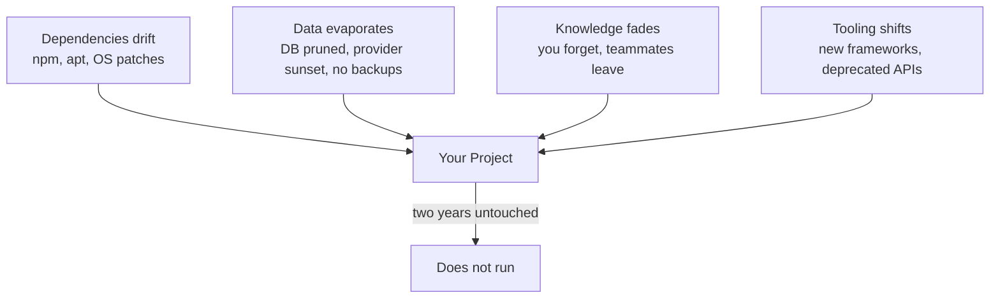

# R21: Entropia Técnica

Um projeto em operação não é estático. É um jardim. No instante em que você para de capinar, o mato cresce. Deixe-o por dois anos e as plantas que você plantou morreram. O texto do código no disco está intacto. O que apodrece é o encaixe entre código e mundo: versões de Node sobem, dependências lançam versões quebradoras, provedores de banco descontinuam sua instância, a ferramenta de build agora está depreciada. Nada está parado, mesmo quando ninguém toca.
{: .lesson-intro }

## Como Um Projeto Morre Em Dois Anos

Imagine um web app moderno típico lançado hoje. Front-end React, back-end Node, banco Postgres, deploy em alguma plataforma-como-serviço. Você lançou, funcionou, parou de mexer. Volte dois anos depois e encontra:

- **Dependências quebradas.** O `npm install` falha porque uma dependência transitiva foi removida, puxada para trás ou passou a exigir um Node mais novo. Atualizar um pacote dispara cascata de outros vinte.
- **O banco sumiu ou degradou.** O provedor mudou o preço, migrou seu cluster, encerrou o plano, ou o tier grátis expirou e os dados foram apagados. Os backups que você nunca configurou teriam salvado.
- **A stack foi esquecida.** Você não lembra quais variáveis de ambiente o app precisa, qual versão do Node compilou, como funciona o fluxo de auth, ou por que escolheu aquele ORM.
- **O toolchain está depreciado.** Webpack virou Vite, Vite mudou o formato de config, a lib de CSS-in-JS está sem manutenção, o gerenciador de estado saiu de moda.

Nenhuma falha sozinha mata. Elas combinam. O custo de recolocar de pé passa do custo de reescrever, então você reescreve, então o ciclo recomeça.

## Os Quatro Vetores De Decaimento

Cada projeto é empurrado pelos quatro vetores ao mesmo tempo. Quanto maior a área de superfície, mais rápido o decaimento. Um app React com 200 dependências apodrece mais rápido que um binário Go com 5, que apodrece mais rápido que uma pasta de HTML e Markdown.

## Como Consertar: Mantenha Simples

O custo de manter um sistema vivo escala com a complexidade. Cada dependência é uma relação que você tem que manter. Cada abstração esperta é algo que seu eu futuro vai ter que reaprender. Cada peça móvel pode quebrar sozinha.

- **Menos dependências.** 100 pacotes = 100 vetores de quebra. Alcance uma biblioteca só quando a resposta nativa for genuinamente pior.
- **Tecnologia chata acima da de ponta.** Para qualquer coisa que você quer rodando em cinco anos, escolha a ferramenta que ainda vai ter suporte.
- **Sem build quando sem build funciona.** Um passo de build é uma coisa que pode apodrecer. Arquivos estáticos vencem bundlers para sites pequenos.
- **Legível acima de elegante.** Uma abstração opaca é o eu-futuro engenhando reverso numa terça à noite. Escreva código que você consiga reler frio.

## Texto Puro É A Saída

Arquivos Markdown com um buildzinho são chocantemente duráveis. Um arquivo Markdown é só texto. Qualquer editor em qualquer máquina abre. Qualquer sistema operacional lê. Qualquer humano que leia inglês entende sem rodar programa nenhum. Não precisa de `npm install`, nem de uma versão específica de Node, nem de banco, nem de internet.

**O arquivo sobrevive ao app.** Apps vêm e vão. Formatos proprietários morrem junto com o fornecedor. Texto puro sobrevive. Markdown foi desenhado em 2004 e um documento escrito naquele ano ainda renderiza hoje, em qualquer renderizador, com zero mudanças. Tente isso com um app Flash de 2004.

O site onde você está lendo isto é construído assim de propósito. As aulas são arquivos Markdown numa pasta. O build é um scriptzinho Python que converte em HTML. Se o script sumir amanhã, cada aula continua legível em qualquer editor de texto. Se a hospedagem morrer, o conteúdo sobrevive como arquivos que você copia para um pendrive. Nada apodrece porque nada chique está na cadeia.

## Três Regras Práticas

- **Escolha a ferramenta mais simples que dá conta.** Um site estático para um blog. Um arquivo plano para config. Uma nota em Markdown para documentação. Alcance framework só quando o simples realmente não resolver.
- **Faça backup dos dados separado do app.** Código pode ser reescrito. Dado não pode ser regerado. Exporte regularmente, guarde em formato que não dependa do seu app para ler, mantenha cópias em lugar sem relação com o provedor.
- **Anote a stack enquanto lembra.** Um README listando ferramentas, versões, variáveis de ambiente e "como rodar isto" é presente para o você de dois anos à frente. Você-futuro não lembra. Você-passado deveria deixar o recado.

Nada que você construir vai rodar para sempre sem ser tocado. A pergunta é só quanto custa recolocar no ar. Barato para reconstruir vence caro para manter. Dê à entropia menos superfície para roer.

<h2>Pontos-chave</h2>
<ul>
<li>Dois anos de abandono geralmente bastam para matar um web app moderno. Não o código, tudo ao redor se mexeu</li>
<li>Quatro vetores de decaimento: dependências, dados, conhecimento, ferramentas. Todo projeto é empurrado pelos quatro ao mesmo tempo</li>
<li>O conserto é simplicidade. Menos dependências, tecnologia chata, sem build quando dá, legível acima de esperto</li>
<li>Texto puro e Markdown são o formato mais durável que temos. Qualquer editor, qualquer SO, qualquer futuro</li>
<li>Faça backup dos dados separado do app. Anote a stack. O README é presente para o você-futuro</li>
</ul>

