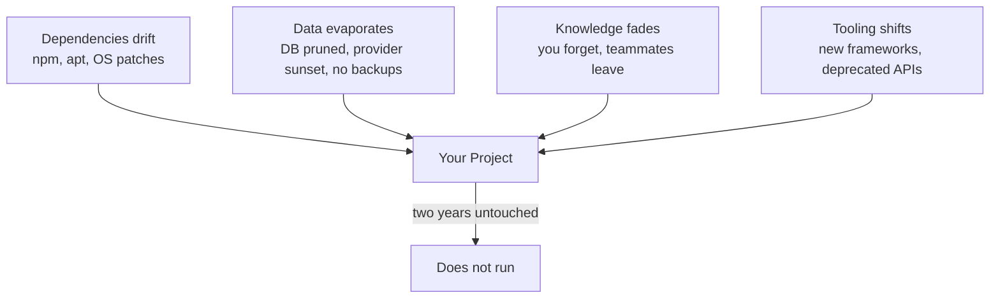

# R21: Entropia Técnica

Um projeto em operação não é estático. É um jardim. No instante em que você para de capinar, o mato cresce. Deixe-o por dois anos e as plantas que você plantou morreram, o mato está na altura da cintura, e você esqueceu onde ficavam as flores. Software é a mesma coisa. O código não mudou, mas o mundo ao redor sim: a versão do Node subiu, uma dependência publicou um lançamento quebrador, o provedor de banco descontinuou sua instância, a ferramenta de build agora está depreciada. Nada está parado, mesmo quando ninguém toca.
{: .lesson-intro }

## Isso Tem Nome

Manny Lehman batizou isso em 1974: **entropia de software**. Emprestou da termodinâmica. A segunda lei diz que sistemas fechados tendem à desordem. Software é igual. Deixado sozinho, não permanece como você deixou. Desvia. A indústria chama os sintomas de **software rot**, **bit rot** ou **code rot**. Mesma ideia, prateleira diferente.

O texto do código no disco está intacto. O que apodrece é o encaixe entre código e mundo: sistemas operacionais mudam, APIs quebram, patches de segurança forçam upgrades, colegas vão embora e levam o conhecimento, usuários exigem novos comportamentos. Entropia é o abismo crescendo entre o que você escreveu e o que o mundo agora espera.

## Como Um Projeto Morre Em Dois Anos

Imagine um web app moderno típico lançado em 2024. Front-end React, back-end Node, banco Postgres, deploy em alguma plataforma-como-serviço. Você lançou, funcionou, parou de mexer. Volte dois anos depois e encontra:

- **Dependências quebradas.** O `npm install` falha porque uma dependência transitiva foi removida, puxada para trás ou passou a exigir um Node mais novo. Atualizar um pacote dispara cascata de outros vinte.
- **O banco sumiu ou degradou.** O provedor mudou o preço, migrou seu cluster, encerrou o plano em que você estava, ou o tier grátis expirou e os dados foram apagados. Os backups que você nunca configurou teriam salvado.
- **A stack foi esquecida.** Você não lembra quais variáveis de ambiente o app precisa, qual versão do Node compilou, como funciona o fluxo de auth, ou por que escolheu aquele ORM. Seu eu futuro é um contratado novo sem onboarding.
- **O toolchain está depreciado.** Webpack virou Vite, Vite mudou o formato de config, a lib de CSS-in-JS que você usou está sem manutenção, o gerenciador de estado que você escolheu saiu de moda e sem suporte.

Nenhuma falha sozinha mata. Elas combinam. O custo de recolocar de pé passa do custo de reescrever, então você reescreve, então o ciclo recomeça.

## Os Quatro Vetores De Decaimento

Cada projeto é empurrado pelos quatro vetores ao mesmo tempo. Quanto maior a área de superfície, mais rápido o decaimento. Um app React com 200 dependências apodrece mais rápido que um binário Go com 5, que apodrece mais rápido que uma pasta de HTML e Markdown.

## Simplicidade É Estratégia De Manutenção

O custo de manter um sistema vivo escala com a complexidade. Cada dependência é uma relação que você tem que manter. Cada abstração esperta é algo que seu eu futuro vai ter que reaprender. Cada peça móvel é uma peça que pode quebrar sozinha.

O sistema mais barato de manter é o com menos peças. Isso não quer dizer "nenhum framework, nunca". Quer dizer pagar a complexidade só quando ela se paga. Pergunte de toda dependência, todo passo de build, toda abstração: se isto quebrar em dois anos, quanto me custa consertar, e esse custo compensa o que me dá hoje?

- Cem dependências significa cem vetores de quebra. Mantenha a lista curta.
- Tecnologia chata vence tecnologia de ponta para qualquer coisa que você pretende rodar em cinco anos.
- Um passo de build é uma coisa que pode apodrecer. Prefira sem build quando sem build funciona.
- Uma abstração opaca é uma coisa que o eu-futuro vai ter que engenhar reverso. Prefira legível a elegante.

## A Saída Em Texto Puro

Por isso arquivos Markdown com um buildzinho são chocantemente duráveis. Um arquivo Markdown é só texto. Qualquer editor em qualquer máquina abre. Qualquer sistema operacional lê. Qualquer humano que leia inglês entende sem rodar programa nenhum. Não precisa de `npm install`, nem de uma versão específica de Node, nem de banco, nem de internet.

A filosofia "File Over App" captura isso: **o arquivo sobrevive ao app**. Apps vêm e vão. Formatos proprietários morrem junto com o fornecedor. Texto puro sobrevive. Markdown foi desenhado em 2004 e um documento escrito naquele ano ainda renderiza hoje, em qualquer renderizador, sem mudança alguma. Tente isso com um app Flash de 2004.

O site onde você está lendo isto é construído assim de propósito. As aulas são arquivos Markdown numa pasta. O build é um scriptzinho Python que converte em HTML. Se o script Python sumir amanhã, cada aula continua legível em qualquer editor de texto. Se a hospedagem morrer, o conteúdo sobrevive como arquivos que você copia para um pendrive. Nada apodrece porque nada chique está na cadeia.

## O Que Isso Significa Para Como Construir

Três regras práticas para combater entropia:

- **Escolha a ferramenta mais simples que dá conta.** Um site estático para um blog. Um arquivo plano para config. Uma nota em Markdown para documentação. Alcance banco ou framework só quando o simples realmente não resolver.
- **Faça backup dos dados separado do app.** Código pode ser reescrito. Dado não pode ser regerado. Exporte regularmente, guarde em formato que não dependa do seu app para ler, mantenha cópias em lugar sem relação com o provedor.
- **Anote a stack enquanto lembra.** Um README listando ferramentas, versões, variáveis de ambiente e comandos "como rodar isto" é presente para o você de dois anos à frente. Você-futuro não lembra. Você-passado deveria deixar o recado.

## A Verdade Desconfortável

Nada que você construir vai rodar para sempre sem ser tocado. A pergunta é só quanto custa recolocar no ar quando você voltar. Barato para reconstruir vence caro para manter. Uma pilha de arquivos Markdown e vinte linhas de build é mais durável, mais portátil e mais à prova do futuro do que uma arquitetura de doze microsserviços com ORM customizado. A melhor defesa contra entropia técnica é dar a ela menos superfície para roer.

<h2>Pontos-chave</h2>
<ul>
<li>Entropia de software existe e tem nome. Lehman 1974. Deixado sozinho, código desvia do encaixe com o mundo</li>
<li>Quatro vetores de decaimento: dependências, dados, conhecimento, ferramentas. Todo projeto é empurrado pelos quatro ao mesmo tempo</li>
<li>Dois anos de abandono geralmente bastam para matar um web app moderno. Não porque o código apodreceu, mas porque tudo ao redor se mexeu</li>
<li>Simplicidade é estratégia de manutenção. Menos dependências, tecnologia chata, sem build quando dá, legível acima de esperto</li>
<li>Texto puro e Markdown são o formato mais durável que temos. Qualquer editor, qualquer SO, qualquer futuro. File over app</li>
<li>Faça backup dos dados separado do app. Anote a stack. O README é presente para o você-futuro</li>
</ul>

