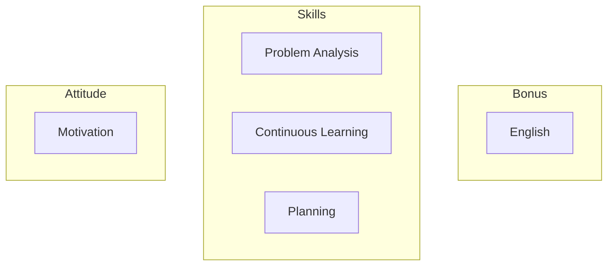
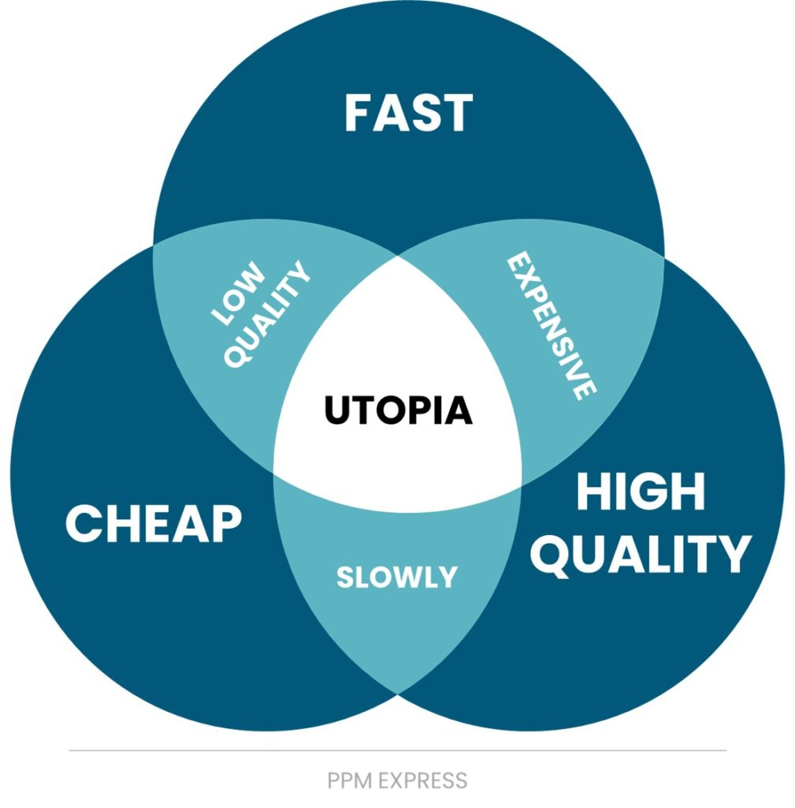

# 何事においても一流になる方法

免責事項：私自身が何事においても一流であると主張しているわけではありません。このトピックに関する私個人の経験と見解を共有するだけです。皆さんの旅路に役立つものが見つかることを願っています。

私の意見では、何事においても一流になるには、良い姿勢と適切なスキルの両方が必要です。

## 姿勢

### モチベーション

これは教えられるものではなく、あなた自身がその火を点ける必要があります。

嵐の中でもその火があなたの中で燃え続け、熱く保たれるなら、毎日時間を割いて自分の技術を磨き、何年経ってもそれを楽しみ続けられるなら、あなたは最終的にその道の達人となるでしょう。

偉業は多大な努力と多くの涙を伴います。完璧は決して達成されません。オリンピックチャンピオンでさえトレーニングを続けています。野心に飲み込まれないように注意してください。地に足をつけているために、死の床についたときに本当に重要となるのは何かを考えてみてください。

## スキル

情熱を持つことと、物事の進め方や結果を出す上で効率的であることとは別物です。それはナイフを使うことに似ています。ナイフが鋭ければ、簡単に物を切ることができます。ナイフが鈍ければ、同じ物を切るのにより多くの労力が必要です。あなたの刃を鋭く保つのは知恵です。ここではこのトピックについて深く掘り下げませんが、あなたに大いに役立つ3つのスキルについてお話します。

### 問題分析

問題は私たちの道を塞ぐ壁のようなものです。それらを解決する方法はたくさんありますが（飛び越える、下に掘る、回り込む、貫通する…）、しばしばある解決策は他のものより優れています。

#### 問題を理解する

問題に直面したとき、まずそれを理解する必要があります。
- 問題は何ですか？
- 誰に影響しますか？
- その範囲はどこまでですか？
- 緊急ですか？
- どのくらい複雑に見えますか？
- …

目的は、痛みの点と取り組むべき制約を明確にし、それを解決するソリューションを考えることです。

**例：** クライアントが売上を増やしたいと考えています。

ここはプログラミングを学ぶ場なので、「Eコマースプラットフォームを作りましょう！」と考えたくなるかもしれません。

しかし、少し立ち止まって、顧客のニーズが何であるかを考えてみましょう。
- 彼は卵を売っている
- 小さな町で
- 先週始めたばかり

これは完全に架空の例ですが、しばしば人々は「それが私たちのやり方だから」という理由だけで、特定の解決策を提案したり、ある特定の考え方をしたりするように感じられます。
広告代理店は広告を提案し、デジタルエージェンシーはウェブサイトを提案します。などなど…
しかし、この例では、私たちのクライアントが本当に必要としていたのは、卵を割らずに市場に運ぶためのスクーターでした。それによって彼が売れる卵の数が増え、結果として売上が増加するのです。

> 「手に金槌しかないと、すべての問題が釘に見える」

問題を理解することの一部には、取り組むべき制約を理解することが含まれます。制約は3つのカテゴリーに分類できます。
- コスト（どれくらいの資金/リソースが利用可能か？）
- 時間（問題の解決は緊急か、それとも待てるか？）
- 品質（ご存知の通り、最終製品はどれくらい良いものであるべきか）

<figure>
    
    <figcaption>Image taken from <a href="https://www.ppm.express/glossary/quality-triangle">PPM Express</a>より引用</figcaption>
</figure>

あなたは2つしか選べません。時間も予算も少ない場合、品質を諦めなければなりません。高品質な製品を迅速に届けたい場合、コストが上がります。などなど…

要するに、問題に遭遇したとき、まずそれを理解する必要があります。その範囲（規模、複雑さ）を評価しなければなりません。取り組むべき制約も。そして、常に問題を正しく理解しているか再確認してください。

#### 潜在的な解決策を見つける

問題を理解したら、解決策を探し始めることができます。

もしこれが新しい問題であれば、ブレインストーミングを行い、実験する必要があります。まず、問題の修正方法の最小限の例である概念実証（POC）を作成することから始めます。POCが成功すれば、それを洗練させることができます。そうでなければ、すぐに別のアイデアに移ることができます。

もしこれがすでに解決済みの問題であれば、他の人々がこの問題を解決するために何を試したかを確認してください。

自分のアイデアに執着しすぎないでください。あなたのアイデアが特定のプロジェクトで採用されなかったとしても心配しないでください。重要なのは、問題が可能な限り最善の方法で解決されたことです。喜び、そこから学びましょう！

常に解決策をシンプルに保つように努めてください。シンプルな解決策は、作成コストが安く、保守/アップグレードが容易な場合が多いです。

> 本当に賢い人は、複雑な問題に対するシンプルな解決策を見つけます。

#### 解決策が信頼できることを確認する

1) 壁に絵を掛けたい場合、テープを使うことができます。素早く安価ですが、絵を長く壁に固定できないかもしれません。別の解決策として、釘で固定する方法があります。より多くの道具が必要ですが、はるかに耐久性があります。

あなたの解決策がすぐに壊れないように確認してください。ソフトウェアエンジニアリングの世界では、それは将来にわたって保守され続けると知られている、確立されたライブラリを使用することかもしれません。

2) 子供にペンを渡すと、それで書こうとするかもしれませんが、友達と剣の戦いをしたり、キャップを口に入れたりすることもあります…まあ、あなたも自分がどうだったか覚えているでしょう…

完璧なシステムを構築したとしても、ユーザーは常に予期せぬ方法でそれを使用するでしょう。柔軟に対応しましょう。たくさんテストしてください。

3) ハトに餌をやったことはありますか？一羽にパンくずをいくつか投げると、あっという間に群れが押し寄せてきて、素早く食事をします。

何をするにしても、それがスケールできることを確認してください。あなたのアプリケーションは10人のユーザーにサービスを提供する際にはうまく機能しますが、もし100人が一度にアクセスしてきたらどうなるでしょうか？遅くなりますか？クラッシュしますか？データが失われますか？適切に設計されたソリューションは、効率的でスケーラブルであるべきです。製品のニーズが成長するにつれて進化できるように、シンプルに。

### 継続的な学習

何かを始めるとき、私たちはそれについて何も知りません。自分が何を知らないのかさえ知りません。
進むにつれて、私たちは自分たちが何に取り組んでいるのかをよりよく理解します。問題を解決し始めます。
少しずつ、私たちが探求している領域のどこにいるのか、次に何を学ぶべきかを知ります。
ついに私たちは頂点に達し、そして…新しいフロンティアを探求し、私たちの分野をさらに押し進めます。

ソフトウェアエンジニアリングの世界は急速に動いており、もし取り残されたくないなら、毎日最新の情報を把握しておく必要があります。
ニュースレターや、あなたの専門分野のトップの頭脳によるブログを読み、時折新しいことを学ぶことをお勧めします。

### 計画

解決しようとしている問題に対する解決策が見つかったら、それを実装する必要があります。

それはすべてのプロジェクトを成功させるか、失敗させるかの部分です。そして、ソフトウェアエンジニアリングにおいて時間の評価は非常に難しいことで知られています。なぜなら、解決策を探求し実装する中で、しばしば新しい問題を発見するからです。

私は小さな増分で進めることをお勧めします。そして、各フェーズの終わりには安定した製品があることを確認してください。チームで作業している場合は、他の人々と計画を検証することも重要です。彼らはあなたが見落としたことを見つけるかもしれません。

最後に、物事がうまくいかなかった場合に製品の以前の状態にロールバックできることを確認してください！データベースのデータをバックアップし、`git`を使って以前のコミットに戻すなど…

## ボーナス

### 英語

英語を追加したのは、ほとんどの学習資料や人々が世界中で仕事をする際に使用する言語だからです。ビジネスレベルの流暢さは大いに推奨されます。

偉大さへの道に幸あれ！