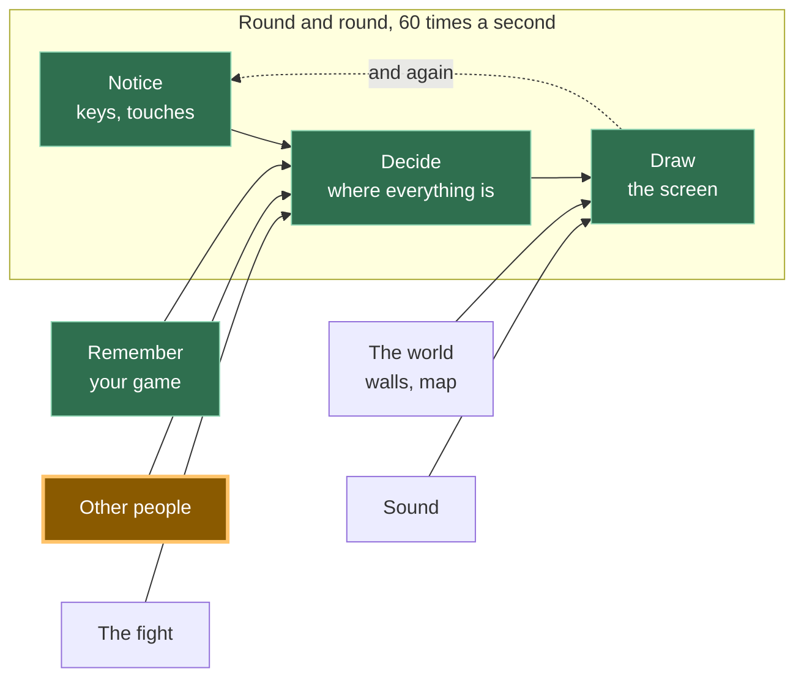
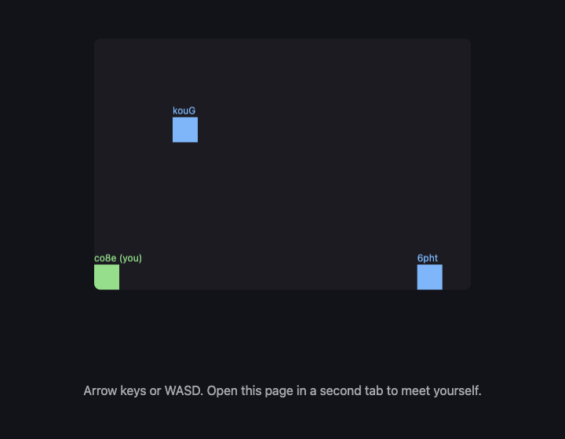

```
---
id: "A12"
phase: 2
title: "他の人"
desc: "画面上の2つ目の四角は、別のコンピューターの別の人物によって操作され、中央にサーバーはありません。"
---
# A12: 他の人

他の誰かが自分のコンピューターであなたのゲームを開きます。彼らの四角があなたの画面に表示され、彼らが動かすと移動します。これこそ、トラック全体が目指してきたステップです。
{: .lesson-intro }

**必要なもの:** [A11](a11.html)。**得られるもの:** 他のすべてのプレイヤーの四角が、あなたのキャンバス上でライブで動きます。

## ゲーム全体と今日の部分



今日は「他の人」のボックスを構築します。その矢印が指す方向を見てください。あなたのキーボードと全く同じように、**決定**に入っています。ゲームの残りの部分にとって、別のプレイヤーはただの別の数字のセットが変更されたに過ぎません。

## サーバーはない、というのは半分の真実です

**サーバー**とは、常に稼働しているコンピューターで、すべてのゲームがそれに接続します。ほとんどのオンラインゲームにはサーバーがあります。サーバーは世界を保持し、停止すればゲームも停止します。

あなたのゲームにはサーバーがありません。あなたのブラウザは、他の人のブラウザと直接通信します。あなたの画面上の画像は、途中の誰のコンピューターも経由しません。

ここが正直な部分です。2つのブラウザは、何もないところから互いを見つけることはできません。彼らは「*私はここにいます。これが私に連絡する方法です*」というメモを残す場所が必要です。そこであなたのゲームは**掲示板**を使用します。これは、他の人々によって運営される公開メッセージサービスで、誰でも小さなメモを投稿できます。両方のブラウザがメモを投稿し、互いのメモを読み取り、直接接続します。その後、掲示板は関与しません。

したがって、「サーバーレス」は半分しか真実ではありません。あなたのゲームを保持するサーバーはありません。紹介のために使用される**掲示板**はあります。人々がゲームをサーバーレスと呼ぶとき、これはほとんどの場合彼らが意味することで、今あなたは質問すべきことを知っています。

**もう一つの真実。**一部の家庭、モバイル、オフィス、学校のネットワークでは、2つのブラウザが直接WebRTC接続を行うことを許可しません。このレッスンでは**p2p-core**を使用しており、その公開リレーが応答しているかどうかを教えてくれるので、推測する代わりに問題を調査できます。リレーが応答しているのに2つの異なるネットワークがまだ接続できない場合、不足しているのはゲームのバグではなく、TURNリレーである可能性があります。p2p-coreは同じブラウザのタブを直接接続するため、2つのタブでA12をテストすることは可能です。また、[A14](a14.html)以降のすべてはリモートマルチプレイヤーなしで動作します。

## ブロックに分割する

「他の人が現れる」は3つのことです。

1.  **接続** — ルームに参加し、誰かが到着または出発したときに通知される
2.  **送信** — 毎秒10回、全員に自分の四角の位置を伝える
3.  **描画** — 他の全員の四角を描く

**なぜ分割する手間をかけるのか？** もしそれが1つの塊で、うまくいかなかった場合、どの部分が悪いのかを判断できないからです。ルームに誰もいないのは接続の問題です。ルームに誰かいるが四角が動かないのは送信の問題です。数字は届いているが画面に何も表示されないのは描画の問題です。3つのブロック、3つの別々の質問 — そして、他の2つに触れることなく、コンソールからそれぞれに答えることができます。

最初の試行でこれを動作させる人はほとんどいません。これはこのトラックのどこよりも、ここでは普通のことです。

## ブロック1：接続

接続は、このコースで使用される唯一のマルチプレイヤーライブラリである**[p2p-core](https://github.com/KakkoiDev/p2p-core)**によって行われます。**ライブラリ**とは、あなたが自分で書く代わりに、他の誰かが書いたコードのことです。p2p-coreは、厄介な部分（ピアの検索、共有の公開掲示板の選択、WebRTCリンクの開設、同じブラウザでのテスト、接続診断）を処理してくれるので、このレッスンでは、あなたのゲームに属する3つのアイデアに時間を費やすことができます。

以下の正確に固定されたバージョンを使用してください。リレーリストを作成したり、自分で`RTCPeerConnection`を作成したり、アシスタントがたまたま知っているからといって別のマルチプレイヤーパッケージに切り替えたり**しないでください**。

```
import { joinRoom, selfId } from 'https://cdn.jsdelivr.net/gh/KakkoiDev/p2p-core@v0.1.0/p2p-core.js';

const room = joinRoom({
  app: 'kakkoi-online',
  room: 'demo',
  kinds: ['move'],
});

const others = {};

room.onMessage('move', (where, id) => {
  if (!Number.isFinite(where?.x) || !Number.isFinite(where?.y)) return;
  others[id] = { x: where.x, y: where.y };
});

room.onPeerJoin((id) => {
  room.send('move', { x: player.x, y: player.y }, id);
});

room.onPeerLeave((id) => {
  delete others[id];
});

window.room = room;
```

`app`は、あなたがどのゲームをプレイしているかを示します。`room`は、そのゲーム内のどのルームかを示します。同じペアを使用する全員が互いに出会います。`kinds: ['move']`は、このページがどのような種類のメッセージを期待するかをp2p-coreに事前に伝えます。メッセージの種類を早期に登録することで、ハンドラが存在する前に最初のネットワークメッセージが到着するという競合状態を回避します。

`selfId`は、このページに与えられるランダムな名前で、読み込まれるたびに新しく作成されます。他のプレイヤーは、あなたの実際のIDではなく、そのランダムなIDを受け取ります。

`others`は、このブロックが保持する唯一のゲーム状態です。他のプレイヤーごとに1つの位置があります。`onPeerLeave`はプレイヤーを削除するので、タブを閉じると、幽霊を残すのではなく、その四角が削除されます。

`onPeerJoin`内の行は、新しい参加者に即座にあなたの現在の位置を送信します。その後、ブロック2のタイマーが全員を更新し続けます。

### 接続が機能しない場合

アシスタントにネットワークを書き換えさせないでください。まずコンソールに以下を入力してください。

```
room.status()
```

`transports.relays`を見てください。`open`が`0`の場合、現在のネットワークが公開掲示板をブロックしています。1つ以上のリレーが開いているのに別のコンピューターがまだ表示されない場合、2つのネットワークが直接WebRTCパスをブロックしている可能性があります。その場合、TURNが必要になることがあります。p2p-coreはこの情報を公開しているため、次のステップは証拠に基づき、推測されたネットワークコードの新しい山ではありません。

インポートはjsDelivrを通じて**バージョン管理された**GitHubリリースから直接行われます。バンドラーもビルドステップもありません。ブラウザは通常のESモジュールを読み込みます。`v0.1.0`を固定することで、すべての学生とすべてのアシスタントが同じAPIで作業できます。

## ブロック2：送信

```
setInterval(() => room.send('move', { x: player.x, y: player.y }), 100);
```

`setInterval(f, 100)`は、`f`を100ミリ秒ごと、つまり**毎秒10回**実行します。これは指でタップできる頻度とほぼ同じです。

あなたの四角は毎秒60回動きます。毎秒60回送信することもできます。しかし、そうしないでください。すべてのメッセージはすべてのプレイヤーに送信されるため、6人の部屋では、60回ではなく毎秒360メッセージがあなたのコンピューターから送信され、見た目は同じ四角を描画します。毎秒10回で十分に生き生きと見えます。

これは、[A11](a11.html)で毎秒2回セーブするのと同じ考え方です。高価な処理は、できるだけ少ない頻度で行いましょう。

## ブロック3：描画

```
function draw() {
  ctx.fillStyle = '#1b1b22';
  ctx.fillRect(0, 0, canvas.width, canvas.height);

  ctx.font = '12px system-ui, sans-serif';
  for (const id in others) {
    ctx.fillStyle = '#6bb8ff';
    ctx.fillRect(others[id].x, others[id].y, SIZE, SIZE);
    ctx.fillText(id.slice(0, 4), others[id].x, others[id].y - 4);
  }

  ctx.fillStyle = '#7ee081';
  ctx.fillRect(player.x, player.y, SIZE, SIZE);
}
```

他のプレイヤーは青、あなたは緑で、各プレイヤーのIDの最初の4文字が四角の上に表示されるので、2人を区別できます。

このブロックが**しないこと**を見てください。誰かがどこにいるのか尋ねません。`player`を読み取るのと全く同じように、`others`リストを読み取ります。これが[A10](a10.html)が通知、決定、描画を分割した理由です。あなたの描画コードは数字がどこから来たのか気にしないので、他の人の四角は3行追加するだけで済みます。

## なぜこの方法を選んだのか

全体の構造は一つの決定から導かれています。サーバーなし。なぜならサーバーは毎月お金がかかり、誰かが稼働させ続けなければならないからです。12歳の子供がこのゲームを公開し、友人にリンクを送り、誰にもお金を払うことなく1年後も動作するべきです。それはゲームを保持するサーバーを排除します。そのためブラウザは互いに通信し、無料の公開掲示板が紹介の役割を果たします。

## 代わりにできたこと

| これの代わりに | 費用 |
|---|---|
| 世界を保持する実際のサーバー | 厳格な学校のネットワークでも常に動作し、不正行為を防ぐことができます。しかし、毎月費用がかかり、稼働させ続けなければならず、停止するとすべてのプレイヤーのゲームが停止します。 |
| 各フレームで位置を送信する | 誰も区別できない絵のためにメッセージが6倍になります。電話では、無駄にバッテリーを消費することになります。 |
| 「私はx、yにいる」の代わりに「右を押した」を送信する | メッセージは少なくなります。しかし、すべてのコンピューターが全員がどこにたどり着いたかを計算する必要があり、メッセージが1つ欠落すると、2人のプレイヤーは永遠に異なる世界を見ることになります。 |
| 生のWebRTC、生のTrystero、または別のマルチプレイヤーパッケージ | ディスカバリ、リレー選択、ブラウザ接続の詳細を再び解決することになります。p2p-coreはすでにこのコースのその役割を担っているため、ライブラリを変更すると、今日のアイデアを教えることなく失敗モードが増えるだけです。 |

## プロンプト

このプロンプトを正確にコピーしてください。ライブラリ名、バージョン、インポートURL、APIはタスクの一部なので、アシスタントが独自のネットワークスタックを発明しないようにするためです。

```
I have a canvas game in plain JavaScript. main.js keeps the player in
{x, y}, moves it in update(dt), and paints it in draw().

Use KakkoiDev/p2p-core v0.1.0 directly for multiplayer. Import EXACTLY:
import { joinRoom, selfId } from 'https://cdn.jsdelivr.net/gh/KakkoiDev/p2p-core@v0.1.0/p2p-core.js';

Do not use raw WebRTC, raw Trystero, PeerJS, Socket.IO, Firebase, or a
hand-written relay list. Do not add npm, a build step, or a server.

Create exactly one room:
const room = joinRoom({
  app: 'kakkoi-online',
  room: 'demo',
  kinds: ['move'],
});

Add multiplayer in three separate blocks with a comment above each:
CONNECT (an others object, room.onMessage('move'), room.onPeerJoin,
room.onPeerLeave, and expose window.room = room for room.status()),
SEND (room.send('move', {x, y}) on a setInterval at 10 per second),
DRAW (paint the other squares).

Reject a move unless x and y are finite numbers. Do not change update().
Plain JavaScript, no build step.
```

**出力で5つのことを確認してください。**インポートURLが上記の固定されたp2p-core URLと完全に一致していること。`joinRoom`が1つだけであること。リレーリストや手書きのWebRTCコードがないこと。送信が`requestAnimationFrame`ではなく100ミリ秒のタイマーで行われていること。そして`onPeerLeave`が四角を削除すること。もしアシスタントがライブラリを変更したり、ネットワーキングを考案したりした場合は、そこで停止し、その考案をデバッグするのではなく、正確なプロンプトに戻るように指示してください。

## 動作を確認する



ページを2つのブラウザタブで2回開き、数秒待ってください。

1.  各タブに青い四角が現れ、その上に4文字が表示されます。それがもう一方のタブです。
2.  一方のタブで矢印キーを使って緑色の四角を操作します。もう一方のタブの青い四角も同じように動きます。
3.  2番目のタブでコンソールを開き、`others`と入力します。`{6phtXPzeOsFqgp95188x: {x: 411.696, y: 288}}`のようなオブジェクトが表示されます。これらの2つの数字は、1番目のタブの`player`と同じ数字です。これが証拠です。画像は偶然かもしれませんが、3桁の小数まで一致する数字は偶然ではありません。
4.  1番目のタブを閉じます。数秒以内に2番目のタブの青い四角が消え、`others`は`{}`になります。
5.  3番目のタブを開きます。2つ目の青い四角が現れます — 上の画像はルームに3人のプレイヤーがいるときに撮影されたものです。

ステップ1が2つのタブで全く発生しない場合は、コードを変更する前に`room.status()`と入力してください。p2p-coreを使用すると、2つのタブはブラウザ自体を通じて出会うことができるため、このテストは公開リレーに依存しません。後で2つの異なるコンピューターをテストするとき、同じステータスオブジェクトがリレーディスカバリが利用可能かどうかを教えてくれます。

## これを実行したときに何がうまくいかなかったか

3つのブロックをゲームに組み込んだ**後**にこれを読んでください。なぜなら、問題はそのときに発生するからです。

2つのタブは、このステップをテストする方法であり、上記のデモでは完璧に機能しました。その後、[A11](a11.html)から名前と位置を保存する実際のゲームにそれを追加し、2つのタブを開きました。

**私たち2人がいました。**同じ名前、同じモンスター、両方が歩き回り、両方が本物でした。2番目のタブを閉じても解決せず、最初のタブがまだ動いていたからです。

何も壊れていませんでした。両方のタブが同じセーブデータを読み込みました。なぜなら、セーブデータはタブではなく**ブラウザ**に属するからです。そのため、両方のタブは正しく、正直に「あなた」でした。ゲームは、一度に1人しかプレイすべきではないということを全く知らなかっただけです。

修正は、**最も新しいウィンドウが勝つ**と決定することです。

1.  開かれたウィンドウは、同じゲームの他のウィンドウに自己をアナウンスします。
2.  これを聞いた古いウィンドウは、現在いる場所を保存し、それを渡し、**ルームを退室し**、ゲームを元に戻すボタン付きの静かなメッセージを表示します。
3.  新しいウィンドウは、その引き渡しを少し（私たちは400ミリ秒を許可します）待ち、受け取った位置から開始します。何も応答がない場合、他のウィンドウはなかったため、通常通りセーブデータを読み込みます。

そこに2つの詳細があり、どちらも間違いやすく、私たちに時間を要しました。

**古いウィンドウは本当に退出する必要があります**、ただ描画を停止するだけではいけません。一時停止するだけだと、まだ接続されているため、他の全員はまだあなたを2人見てしまい、バグが修正されていないように見えます。

**新しいウィンドウは、セーブされた位置ではなく、引き渡された位置を使用する必要があります。** ゲームは頻繁にセーブされますが、毎フレームではありません。セーブされたコピーを使用すると、最後にセーブされた場所にジャンプしてしまい、ゲームがあなたの場所を忘れたように感じられます。

*同じサイトのウィンドウは互いに直接通信できます — 熟練したプログラマはそれを `BroadcastChannel` と呼びます。これであなたもその名前を知りました。これは同じサイトのウィンドウ間でしか機能せず、まさにここでの問題です。*

## ゲームに組み込む

[A11](a11.html)のゲームを取り、上記と全く同じようにp2p-coreを使用して3つのブロックを追加します。既存のものは何も変更されません。`update`とループは全く同じままで、最初のものを書き換えるのではなく、2番目の数値ソースを追加するだけです。

<div class="takeaways">
<h2>重要なポイント</h2>
<ul>
<li>p2p-coreをコースのネットワーク境界として使用します。あなたのゲームはメッセージを送信し、ライブラリが発見とブラウザ間接続を処理します。</li>
<li>他のプレイヤーは、キーボードと同じように、ただ変化する数字に過ぎません — これがA10の分割がここで報われる理由です。</li>
<li>送信は毎フレームではなく、タイマーを使って稀に行います。画像は同じで、コストははるかに低くなります。</li>
<li>プレイヤーが退出したら削除しないと、その四角は永遠にあなたの画面に取り憑きます。</li>
<li>リモート接続が失敗した場合、コードを変更する前に<code>room.status()</code>を検査してください。厳格なネットワークでは、あなたのゲームが正しくてもTURNが必要な場合があります。</li>
<li>セーブデータはタブではなくブラウザに属します — したがって、どちらがプレイしているかを決定するまで、2つのタブは2人のあなたになります。</li>
</ul>
</div>

## あなたの番です

現在、フリーズしたプレイヤー（ラップトップの蓋を閉じた、接続が切れたなど）は、ルームが彼らの退出に気づくまで、あなたの画面に四角が静止したまま残ります。これはステップを構築中に私たちに起こりました。タブが閉じられたのではなく強制終了されたため、「さようなら」が送信されず、青い四角が`{x: 100, y: 100}`に数分間駐車されたままでした。各メッセージが到着した時間を保存し、3秒間音沙汰のない四角はフェードアウトするか隠してください。*熟練したプログラマは、そのようなメッセージをハートビートと呼びます。これであなたもその言葉を知りました。*
```