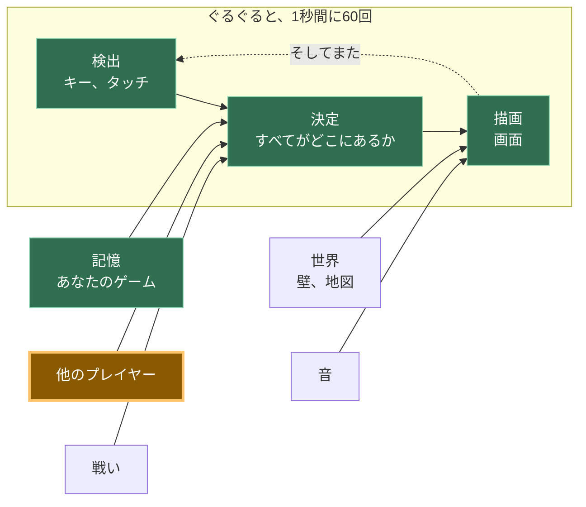

```
---
id: "A12"
phase: 2
title: "他のプレイヤー"
desc: "画面上の2番目の四角。別のコンピューター上の別の人が操作し、間にサーバーは存在しません。"
---
# A12: 他のプレイヤー

誰かがあなたのゲームを自分のコンピューターで開きます。彼らの四角があなたの画面に現れ、彼らが動くと動きます。これこそが、このトラック全体が目指してきたステップです。
{: .lesson-intro }

**必要なもの:** [A11](a11.html)。 **得られるもの:** 他のすべてのプレイヤーの四角が、あなたのキャンバス上でリアルタイムに動きます。

## ゲーム全体と今日の要素



今日は「他のプレイヤー」のボックスを構築します。矢印がどこを指しているかに注目してください：**決定**へと向かっています。あなたのキーボードと全く同じです。ゲームの他の部分にとって、他のプレイヤーは単に変化した一連の数字に過ぎません。

## サーバーは存在しない、というのは半分本当

**サーバー**とは、常に稼働しているコンピューターで、全員のゲームがそこに接続します。ほとんどのオンラインゲームにはサーバーがあります。サーバーは世界を保持し、サーバーが停止するとゲームも停止します。

あなたのゲームにはサーバーがありません。あなたのブラウザは、他の人のブラウザと直接通信します。あなたの画面上の画像は、途中のどのコンピューターも通過しません。

正直な部分を説明しましょう。2つのブラウザは何もない状態から互いを見つけることはできません。彼らは「私はここにいる、これが私に連絡する方法だ」というメモを残す場所が必要です。そこであなたのゲームは**掲示板**を使用します。これは、他の人々が運営する公開メッセージサービスで、誰でも小さなメモを投稿できます。両方のブラウザがメモを投稿し、互いのメモを読み、直接接続します。その後、掲示板は関与しません。

したがって、「サーバーレス」は半分しか真実ではありません。あなたのゲームを保持するサーバーはありません。紹介のために使用される**掲示板**は存在します。人々がゲームをサーバーレスだと言うとき、ほとんどの場合この意味であり、今あなたは尋ねるべきことを知っています。

**もう一つの真実。**一部の家庭、モバイル、オフィス、学校のネットワークでは、2つのブラウザが直接WebRTC接続を確立することを許可していません。このレッスンでは**p2p-core**を使用しており、その公開リレーが応答しているかどうかを教えてくれるので、推測する代わりに問題を調査できます。リレーが応答しているのに2つの異なるネットワークがまだ接続できない場合、問題はゲームのバグではなくTURNリレーである可能性があります。p2p-coreは同じブラウザのタブを直接接続するため、2つのタブでA12をテストすることは可能です。また、[A14](a14.html)以降のすべてはリモートマルチプレイヤーなしで動作します。

## ブロックに分割する

「他のプレイヤーが現れる」は3つの要素です。

1. **接続** — ルームに参加し、誰かが到着または退出したときに通知を受ける
2. **送信** — 1秒間に10回、自分の四角がどこにあるかを全員に伝える
3. **描画** — 他の全員の四角を描く

**なぜ分割する必要があるのか？** もしそれが一つの塊で、うまくいかなかった場合、どの部分が悪いのか判断できないからです。ルームに誰もいないのは接続の問題。ルームに誰かいるのに四角が動かないのは送信の問題。数字は届いているのに画面に表示されないのは描画の問題。3つのブロック、3つの別々の質問 — そして他の2つに触れることなく、コンソールからそれぞれに答えることができます。

最初の試行でこれがうまくいく人はほとんどいません。このトラックの他のどこよりも、ここではそれが普通です。

## ブロック 1: 接続

接続は、このコースで使用されている唯一のマルチプレイヤーライブラリである**[p2p-core](https://github.com/KakkoiDev/p2p-core)**によって行われます。**ライブラリ**とは、あなたが自分で書く代わりに、他の誰かが書いたコードのことです。p2p-coreは、厄介な部分—ピアの発見、共有公開掲示板の選択、WebRTCリンクの開設、同じブラウザでのテスト、接続診断—を処理するので、あなたはこのレッスンをゲームに属する3つのアイデアに費やすことができます。

以下の正確な固定バージョンを使用してください。リレーリストを作成したり、`RTCPeerConnection`を自分で作成したり、アシスタントがたまたま知っているからといって別のマルチプレイヤーパッケージに切り替えたり**しないでください**。

```
import { joinRoom, selfId } from 'https://cdn.jsdelivr.net/gh/KakkoiDev/p2p-core@v0.1.0/p2p-core.js';

const room = joinRoom({
  app: 'kakkoi-online',
  room: 'demo',
  kinds: ['move'],
});

const others = {};

room.onMessage('move', (where, id) => {
  if (!Number.isFinite(where?.x) || !Number.isFinite(where?.y)) return;
  others[id] = { x: where.x, y: where.y };
});

room.onPeerJoin((id) => {
  room.send('move', { x: player.x, y: player.y }, id);
});

room.onPeerLeave((id) => {
  delete others[id];
});

window.room = room;
```

`app`はあなたがプレイしているゲームを示します。`room`はそのゲーム内のどの部屋かを示します。同じペアを使用している全員がお互いに出会います。`kinds: ['move']`は、このページがどの種類のメッセージを期待するかをp2p-coreに事前に伝えます。メッセージの種類を早期に登録することで、最初のネットワークメッセージがハンドラーが存在する前に到着する競合状態を回避します。

`selfId`は、このページに与えられたランダムな名前で、読み込むたびに新しく生成されます。他のプレイヤーはそのランダムなIDを取得し、あなたの本当のIDではありません。

`others`は、このブロックが保持する唯一のゲーム状態です。他のプレイヤーごとに1つの位置を保持します。`onPeerLeave`はプレイヤーを削除するため、タブを閉じると、そのプレイヤーの四角は残像を残さずに消えます。

`onPeerJoin`内の行は、あなたの現在の位置をすぐに新参者に送信します。その後、ブロック2のタイマーが全員を最新の状態に保ちます。

### 接続が機能しない場合

アシスタントにネットワークを書き換えさせるのはやめてください。まず、コンソールに次のように入力します。

```
room.status()
```

`transports.relays`を見てください。`open`が`0`の場合、現在のネットワークが公開掲示板をブロックしています。1つ以上のリレーがオープンしているのに、別のコンピューターがまだ現れない場合、2つのネットワークが直接WebRTCパスをブロックしている可能性があります。その場合、TURNが必要になることがあります。p2p-coreはこの情報を公開しているので、次のステップは証拠に基づいており、推測による新しいネットワークコードの山ではありません。

インポートは、jsDelivrを介して**バージョン管理された**GitHubリリースから直接行われます。バンドラーもビルドステップもありません。ブラウザは通常のESモジュールをロードします。`v0.1.0`を固定することで、すべての生徒とすべてのアシスタントが同じAPIで作業することになります。

## ブロック 2: 送信

```
setInterval(() => room.send('move', { x: player.x, y: player.y }), 100);
```

`setInterval(f, 100)`は、100ミリ秒ごとに`f`を実行します — **1秒間に10回**、指をタップできる頻度とほぼ同じです。

あなたの四角は1秒間に60回動きます。1秒間に60回送ることもできます。やめてください。すべてのメッセージがすべてのプレイヤーに送られるため、6人の部屋では、同じように見える四角を描くために、あなたのコンピューターから1秒間に60回ではなく360回のメッセージが送信されてしまいます。1秒間に10回で十分生き生きと見えます。

これは、[A11](a11.html)で1秒間に2回保存するのと同じ考え方です。高価な処理は、できるだけ少ない頻度で行いましょう。

## ブロック 3: 描画

```
function draw() {
  ctx.fillStyle = '#1b1b22';
  ctx.fillRect(0, 0, canvas.width, canvas.height);

  ctx.font = '12px system-ui, sans-serif';
  for (const id in others) {
    ctx.fillStyle = '#6bb8ff';
    ctx.fillRect(others[id].x, others[id].y, SIZE, SIZE);
    ctx.fillText(id.slice(0, 4), others[id].x, others[id].y - 4);
  }

  ctx.fillStyle = '#7ee081';
  ctx.fillRect(player.x, player.y, SIZE, SIZE);
}
```

他のプレイヤーは青、あなたは緑で、各プレイヤーのIDの最初の4文字が彼らの四角の上に表示されるので、2人を区別できます。

このブロックが**しない**ことに注目してください。誰がどこにいるかを尋ねません。`player`を読み取るのと全く同じ方法で、`others`リストを読み取ります。これが[A10](a10.html)が「検出」「決定」「描画」を分割した理由です。あなたの描画コードは数字がどこから来たか気にしないので、他の人の四角は3行追加するだけで済みます。

## なぜこの方法を選んだのか

この全体の構成は、一つの決定から来ています。サーバーなし。なぜなら、サーバーは毎月お金がかかり、誰かがそれを稼働させ続ける必要があるからです。12歳の子供がこのゲームを公開し、友人にリンクを送り、誰にもお金を払うことなく1年後にそれがまだ機能するべきだと考えました。それはゲームを保持するサーバーを排除します。そのため、ブラウザ同士が話し、無料の公開掲示板が紹介の役割を果たします。

## 代わりにできたこと

| これの代わりに | 費用 |
|---|---|
| 世界を保持する実際のサーバー | 厳格な学校ネットワークでも常に機能し、チートを防ぐことができます。しかし、毎月費用がかかり、稼働させ続けなければならず、停止するとすべてのプレイヤーのゲームも停止します。 |
| 毎フレーム位置を送信する | 誰も区別できないような絵のために6倍のメッセージ。電話では、無駄にバッテリーを消費することになります。 |
| 「x、yにいる」ではなく「右を押した」を送信する | メッセージは少なくなります。しかし、すべてのコンピューターが全員がどこにたどり着いたかを計算しなければならず、1つのメッセージが欠落すると、2人のプレイヤーは永遠に異なる世界を見ることになります。 |
| 生のWebRTC、生のTrystero、または別のマルチプレイヤーパッケージ | 発見、リレー選択、ブラウザ接続の詳細を再度解決することになります。p2p-coreはすでにこのコースのその役割を担っているため、ライブラリを変更すると、今日のアイデアを教えることなく失敗モードが増えるだけです。 |

## プロンプト

このプロンプトを正確にコピーしてください。ライブラリ名、バージョン、インポートURL、APIはタスクの一部であり、アシスタントが独自のネットワークスタックを発明しないようにするためです。

```
I have a canvas game in plain JavaScript. main.js keeps the player in
{x, y}, moves it in update(dt), and paints it in draw().

Use KakkoiDev/p2p-core v0.1.0 directly for multiplayer. Import EXACTLY:
import { joinRoom, selfId } from 'https://cdn.jsdelivr.net/gh/KakkoiDev/p2p-core@v0.1.0/p2p-core.js';

Do not use raw WebRTC, raw Trystero, PeerJS, Socket.IO, Firebase, or a
hand-written relay list. Do not add npm, a build step, or a server.

Create exactly one room:
const room = joinRoom({
  app: 'kakkoi-online',
  room: 'demo',
  kinds: ['move'],
});

Add multiplayer in three separate blocks with a comment above each:
CONNECT (an others object, room.onMessage('move'), room.onPeerJoin,
room.onPeerLeave, and expose window.room = room for room.status()),
SEND (room.send('move', {x, y}) on a setInterval at 10 per second),
DRAW (paint the other squares).

Reject a move unless x and y are finite numbers. Do not change update().
Plain JavaScript, no build step.
```

**出力で5つのことを確認してください:** インポートURLが上記の固定されたp2p-core URLと全く同じであること。`joinRoom`が1つだけであること。リレーリストや手書きのWebRTCコードがないこと。送信が`requestAnimationFrame`ではなく100msタイマーで行われること。そして`onPeerLeave`が四角を削除すること。アシスタントがライブラリを変更したり、ネットワークを捏造したりした場合は、そこで停止し、その発明をデバッグするのではなく、正確なプロンプトに戻るように指示してください。

## 動作を確認する


ページを2回、2つのブラウザタブで開いて、数秒待ってください。

1. 各タブに青い四角が現れ、その上に4文字が表示されます。それがもう一方のタブです。
2. 1つのタブで矢印キーを使って緑の四角を操作します。もう一方のタブの青い四角も同じように動きます。
3. 2番目のタブでコンソールを開き、`others`と入力します。`{6phtXPzeOsFqgp95188x: {x: 411.696, y: 288}}`のようなオブジェクトが表示されます。これらの2つの数字は、最初のタブの`player`と同じ数字です。これが証拠です。画像は偶然かもしれませんが、小数点以下3桁まで一致する数字は偶然ではありません。
4. 最初のタブを閉じます。数秒以内に2番目のタブの青い四角が消え、`others`は`{}`になります。
5. 3番目のタブを開きます。2番目の青い四角が現れます。—上記の画像は、3人のプレイヤーがルームにいる状態で撮影されました。

ステップ1が2つのタブで全く起こらない場合は、コードを変更する前に`room.status()`と入力してください。p2p-coreでは、2つのタブはブラウザ自体を介して出会うことができるため、このテストは公開リレーに依存しません。後で2つの異なるコンピューターでテストするとき、同じステータスオブジェクトがリレー発見が利用可能かどうかを教えてくれます。

## これを実行したときに何が悪かったのか

このステップの3つのブロックをゲームに組み込んだ**後**、これを読んでください。なぜなら、そのときにそれが起こるからです。

このステップをテストする方法は2つのタブを使用することであり、上記のデモでは完璧に機能しました。その後、[A11](a11.html)からあなたの名前と位置を保存する実際のゲームに追加し、2つのタブを開きました。

**私たち二人がいました。** 同じ名前、同じモンスター、両方が歩き回っており、両方が本物でした。2番目のタブを閉じても解決せず、最初のタブはまだ稼働していました。

何も壊れていませんでした。両方のタブが同じセーブを読み込みました。なぜなら、セーブはタブではなく**ブラウザ**に属するからです。そのため、両方のタブは正しく、正直に、あなたでした。ゲームは、一度に1人だけがプレイすべきだということを単純に知らなかったのです。

修正は、**最も新しいウィンドウが勝つ**と決定することです。

1. 開いたウィンドウは、同じゲームの他のウィンドウに自己申告します。
2. それを聞いた古いウィンドウは、現在の実際の位置を保存し、それを渡し、**ルームを離れ**、ゲームを取り戻すボタン付きの静かなメッセージを表示します。
3. 新しいウィンドウは、その引き渡しのために少し待ち（400ミリ秒を許可します）、受け取った位置から開始します。何も応答しない場合は、他のウィンドウは存在せず、通常通りセーブを読み込みます。

この中に2つの間違いやすい詳細があり、両方で時間を費やしました。

**古いウィンドウは本当に退出する必要がある**、ただ描画を停止するだけではいけません。一時停止するだけだと、まだ接続されているため、他の全員にはまだあなたが2人いるように見え、バグが修正されていないように見えます。

**新しいウィンドウは、保存された位置ではなく、引き渡された位置を使用しなければならない。** ゲームは頻繁に保存されますが、毎フレームではありません。保存されたコピーを使用すると、前回の保存が行われた場所にジャンプしてしまい、ゲームがあなたの場所を忘れてしまったように感じられます。

*同じサイトのウィンドウは直接会話できます。成熟したプログラマーはこれを`BroadcastChannel`と呼びます。これであなたもその名前を知りました。これは同じサイトのウィンドウ間でのみ機能し、まさにここでの問題です。*

## ゲームに組み込む

[A11](a11.html)からのゲームを取り、p2p-coreを上記と全く同じように使って3つのブロックを追加してください。既存のものは何も変更しません。`update`とループは全く同じままであり、最初のソースを書き換えるのではなく、2番目の数字のソースを追加するだけです。

<div class="takeaways">
<h2>重要なポイント</h2>
<ul>
<li>p2p-coreをコースのネットワーク境界として使用する：あなたのゲームはメッセージを送信し、ライブラリは発見とブラウザ間接続を処理する</li>
<li>他のプレイヤーは、あなたのキーボードと同じように、ただ変化する数字にすぎない — だからA10の分割がここで役立つ</li>
<li>毎フレームではなく、稀にタイマーで送信する：画像は同じでコストははるかに低い</li>
<li>プレイヤーが退出したら削除する、さもなければ彼らの四角は永遠にあなたの画面に残り続けるだろう</li>
<li>リモート接続が失敗した場合、コードを変更する前に<code>room.status()</code>を検査する；厳格なネットワークでは、あなたのゲームが正しくてもTURNが必要になる場合がある</li>
<li>セーブはタブではなくブラウザに属する — だから、どちらがプレイしているかを決めるまでは、2つのタブはあなた2人である</li>
</ul>
</div>

## あなたの番

今、フリーズしたプレイヤー（ラップトップの蓋を閉じた、接続が切断されたなど）は、ルームが彼らが去ったことに気づくまで、あなたの画面に静止した四角を残します。これはステップを構築中に私たちにも起こりました。閉じられるのではなく終了させられたタブは、数分間、青い四角を`{x: 100, y: 100}`に駐車したままにしました。なぜなら「さようなら」が一度も送信されなかったからです。各メッセージが到着した時間を保存し、3秒間音信不通の四角はフェードさせるか非表示にしてください。*成熟したプログラマーは、そのようなメッセージをハートビートと呼びます。これであなたもその言葉を知りました。*
```