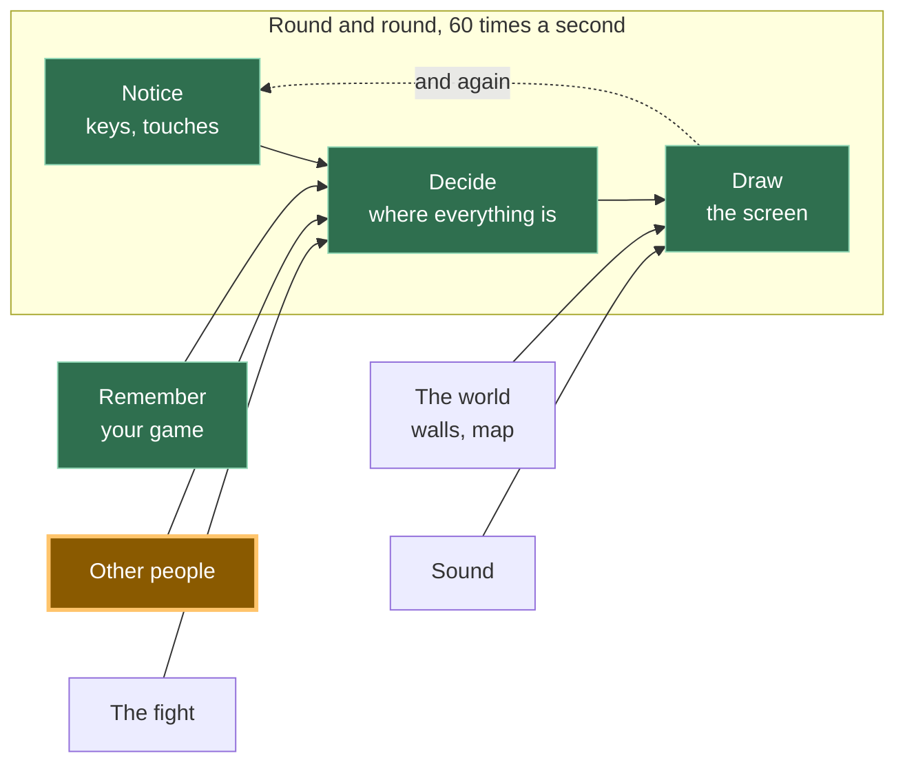
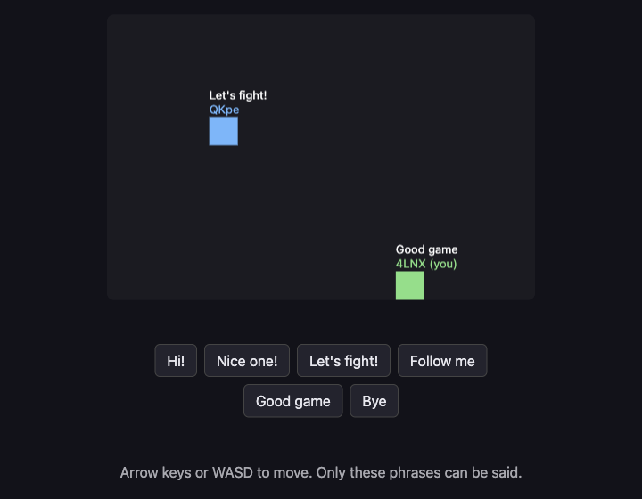

```
---
id: "A13"
phase: 2
title: "安全に話す"
desc: "フレーズをタップすると、それがあなたの四角の上に、他の全員の画面に表示されます。言えることのリストと、それ以外のものを排除するチェック機能付きです。"
---
# A13: 安全に話す

他の人が画面に表示されるようになったので、あなたは彼らに何かを言いたくなるでしょう。残酷な目的では使えない会話方法と、到着する奇妙なものをすべて捨て去るチェック機能を作成します。
{: .lesson-intro }

**必要なもの:** [A12](a12.html)。 **得られるもの:** タップできる6つのフレーズ。あなたの四角の上に、全員の画面に表示されます。

## ゲーム全体と今日の要素



[A12](a12.html)と同じボックスの後半です。他の人はすでにあなたに自分の位置を送っていますが、今度は言葉も送ってきます。

## 意図的にテキストボックスは存在しない

あなたのゲームには6つのボタンがあります。入力する場所はありません。これは決定事項であり、異論を唱えることができるように、その理由をここに示します。

企業が運営するゲームでは、誰かが見張っています。プレイヤーが残酷な行為をした場合、報告、警告、または禁止される可能性があり、担当者が報告書を読みます。あなたのゲームにはサーバーがないため、何を言ったかの記録がなく、責任者もおらず、誰にも報告できません。後で何も確認できません。なぜなら、後というものが存在しないからです。言葉はブラウザからブラウザへ直接送られ、どこにもコピーが残りません。

したがって、選択肢は「残酷になれる方法を構築し、それに対処する方法がない」か、「構築しない」かです。私たちは構築しないことを選びました。 *見ることができないものを調整することはできないため、調整できないものを作成してはなりません。*

6つのフレーズがあれば、一緒に遊ぶのに十分です。「ついてきて」や「戦おう！」が、ゲームの実際の役割を果たします。

### 他の人が見られるもの

これは重要で、短い説明です。あなたのゲームから、他のプレイヤーは見ることができます:

- あなたの四角が表示する名前。あなたが選んだもので、本名である必要はありません
- キャンバス上のあなたの四角の位置
- あなたがタップした6つのフレーズのうちどれか

彼らはあなたの本名、住んでいる場所、学校、顔、あるいはあなたのコンピューター上の何も見ることができません。あなたのゲームはそれらを一切求めないので、渡すものも何もありません。

さらに二つのことをはっきりと述べます。 **ここには誰も責任者はいません。** 報告する相手がいないので、報告ボタンもありません。そして、もし誰かがあなたに不親切な行為をした場合 — たとえ6つの丁寧なフレーズだけでも、人は方法を見つけ出すものです — タブを閉じてください。何も失うものはありません。そして信頼できる大人に話してください。それは些細なことでも恥ずかしいことでもありません。まさに正しい行動であり、効果があります。

## ブロックに分割する

「会話」は3つの要素からなります:

1. **選択** — 存在するフレーズの中から一つを選ぶ
2. **送信** — 選択したものを送信する
3. **表示** — 到着したフレーズを、チェックした後、送信者の四角の上に表示する

**なぜわざわざ分割するのか？** もしそれが一つの塊で、うまくいかなかった場合、どの部分が間違っているのかを特定できないからです。タップしても何も起こらない場合、それは「選択」の問題を意味します。自分のフレーズは表示されるが、相手のフレーズが表示されない場合、それは「送信」の問題を意味します。そして**表示**が最も重要です。これは、他人のコンピューターからのデータを扱う唯一のブロックであり、与えられたものを信用しない唯一のブロックだからです。これを分離しておくことで、意図的にごみを送信し、それが捨てられるのを見ることでテストできます。

## ブロック1: 選択

```
const PHRASES = ["Hi!", "Nice one!", "Let's fight!", "Follow me", "Good game", "Bye"];

for (let i = 0; i < PHRASES.length; i++) {
  const button = document.createElement('button');
  button.textContent = PHRASES[i];
  button.addEventListener('click', () => say(i));
  document.querySelector('#phrases').append(button);
}
```

一つのリストから作られた6つのボタン。リストを変更すると、ボタンもそれに合わせて変更されます。

各ボタンは`i`を記憶しています — これは**インデックス**であり、リスト内でのその位置を意味します。「Hi!」はインデックス0、「Nice one!」はインデックス1といった具合です。1ではなく0から数えるのは、しばらくの間は奇妙に見えるかもしれませんが、やがて慣れるでしょう。

## ブロック2: 送信

```
const sendSay = (i) => room.send('say', i);

function say(i) {
  sendSay(i);
  player.said = PHRASES[i];
  player.until = performance.now() + SHOW_FOR;
}
```

**あなたは数字を送り、決して言葉を送りません。** `2`を送るだけで十分です。なぜなら、他のプレイヤーのゲームも同じリストを持っており、`PHRASES[2]`を自分で探すからです。

これはスペースを節約するためではありません。6つの短いフレーズはごくわずかなデータです。数字は文を含めることができないからです。もし言葉が送られた場合、改造されたゲームはどんな言葉でも送ることができてしまいます。数字はリスト上の6つの項目のうちの1つしか意味せず、もしそうでなければ、ブロック3がそれを破棄します。

`until`は、このフレーズの描画を停止する時間です。`SHOW_FOR`は3000ミリ秒、つまり3秒です。これは読むのに十分な長さであり、画面が古いチャットでいっぱいにならない程度の短さです。

## ブロック3: 表示

```
room.onMessage('say', (i, id) => {
  if (!Number.isInteger(i) || i < 0 || i >= PHRASES.length) {
    window.dropped = (window.dropped || 0) + 1;   // so you can check it worked
    return;
  }
  others[id] = { ...others[id], said: PHRASES[i], until: performance.now() + SHOW_FOR };
});
```

チェックを声に出して読んでください: *到着したものが整数でない場合、またはゼロ未満の場合、またはリストの末尾を超えている場合、停止する — 何も行わない。*

`Number.isInteger`は「これは整数ですか？」と尋ねます。「Hi!」にはノー、`1.5`にはノー、何もなければノーと答えます。その後の2つの比較は「この数字は私たちが実際に持っているフレーズを指していますか？」と尋ねます。

**他のコンピューターが送ってくるものを決して信用してはいけません。** あなたのコードはあなたのマシンで実行されていますが、メッセージは他の誰かのマシンから来たものであり、彼らのゲームのコピーが何をするか全く分かりません。彼らが変更したかもしれません。彼らの接続が何かを混乱させたかもしれません。あるいは彼らが意図的に賢く振る舞っているのかもしれません。チェックがなければ、`PHRASES[99]`は`undefined`となり、あなたのゲームは彼らの四角の上に「undefined」という単語を描画します。他の不正な値はさらに悪いことを引き起こします。チェックがあれば、何も起こりません — それこそがまさに起こるべきことです。

そして、それが属する四角の隣に描画します:

```
if (who.until > performance.now()) {
  ctx.fillStyle = '#fff';
  ctx.fillText(who.said, who.x, who.y - 20);
}
```

メッセージリストなし、スクロール履歴なし。フレーズは四角の上に浮かび、その後消えます。

## なぜこの方法を採用したのか

強制的な制約は、[A12](a12.html)をピアツーピアにしたものと同じです: サーバーがないこと。サーバーがないということは、ログがなく、モデレーターがなく、BANもなく、何も元に戻す方法がないことを意味します。他のあらゆる安全対策 — 乱暴な言葉のフィルタリング、報告、ミュート — は誰かが見張っていることを必要としますが、誰も見ていません。それに耐えうるアプローチは一つだけです: まず不親切なことを表現できないようにすること。6つのフレーズは私たちが後悔するような制限ではありません。このゲームがあなたを何から守れるかについて正直な唯一のデザインです。

## 代わりにできたこと

| これの代わりに | 費用 (リスク) |
|---|---|
| 汚い言葉フィルター付きテキストボックス | フィルターは簡単に回避でき、無害な言葉もブロックしてしまいます。さらに悪いことに、フィルターは保護されているかのように見え、人々は油断します — そして依然として報告する相手がいません |
| 報告ボタン付きテキストボックス | そのボタンは何も機能しません。報告を受け取るサーバーも、それを読む人もいません。嘘をつくボタンは、ボタンがないよりも悪いものです |
| 数字ではなく言葉を送信する | 変更されたゲームのコピーは、あなたの画面にどんなものでも送信でき、あなたの側でのチェックでは違いを区別できません |
| チェックせずに数字を信用する | 最初の奇妙なメッセージまでは完璧に機能しますが、その後誰かの頭の上に「undefined」を描画したり、全員の描画ループを破壊したりします |

## プロンプト

A12はすでにネットワークライブラリを選択しています。チャットが新しい機能のように聞こえるからといって、アシスタントにそれを置き換えさせないでください。

```
My canvas game already has multiplayer through KakkoiDev/p2p-core
v0.1.0. There is ONE existing room object from A12, with 'move'
registered and an `others` object of peer positions.

Keep that same p2p-core room. Do not create a second room and do not
switch to Trystero, WebRTC, PeerJS, Socket.IO, Firebase, or a server.

Add preset-phrase chat in three blocks with a comment above each:
PICK (make one button per entry in a PHRASES array of 6 strings),
SEND (register/use the message kind 'say' and send the array INDEX,
not the text, with room.send('say', i)),
SHOW (use room.onMessage('say', ...) and reject the value unless it is
a whole number inside the array, then display the phrase above that
peer's square for 3 seconds).

No text input anywhere. Plain JavaScript. Keep the existing multiplayer
connection from A12 unchanged.
```

**出力の確認:** A12から引き継いだ唯一のp2p-coreルームを維持しているか？別のネットワークAPIを発明する代わりに`room.send('say', i)`と`room.onMessage('say', ...)`を使用しているか？テキスト入力が追加されていないか？インデックスを送っているか、それとも文字列を送っているか？そして、チェックには`Number.isInteger`を使用しているか、それとも`-1`や`2.5`も許容する`i < PHRASES.length`のみを使用しているか？

## 動作を確認する



ページを2つのタブで開き、もう一つの四角が表示されるのを待ちます:

1. 最初のタブで**「戦おう！」**をタップします。そのフレーズはあなたの緑の四角の上に、そしてもう一方のタブでは青い四角の上に表示されます。3秒後には両方から消えます。
2. 両方のタブでフレーズをタップします。それぞれのフレーズは、それを送った四角の上に表示され、隅の方ではありません。
3. 今度は意図的に壊してみましょう。最初のタブのコンソールで、手動でごみデータを送信します:`sendSay(99)`, `sendSay("Hi!")`, `sendSay(1.5)`, `sendSay(-1)`. 一つはリストの末尾を超えており、一つは数字ではなく言葉であり、一つは整数ではなく、一つは開始点より下です。
4. 2番目のタブを見てください。何も描画されませんでした。何も変わりませんでした — 他のプレイヤーのエントリは以前と全く同じです。そのコンソールで`dropped`と入力すると`4`が返されます。これは、4つすべてが到着し、4つすべてが破棄されたことを意味します。次に、自分の四角を動かし、フレーズをタップします。メッセージを拒否することはクラッシュすることと同じではないため、すべてはまだ機能しています。

ステップ4がこのステップの本当のテストです。何も拒否するのを見たことがないチェックは、テストされていないチェックです。

## ゲームに組み込む

[A12](a12.html)のゲームに3つのブロックと、キャンバスの下に空の`<div id="phrases">`を追加します。`others`オブジェクトはすでに存在しており、各エントリに`said`と`until`という2つの追加フィールドが加わります。動きに関する変更はありません。

<div class="takeaways">
<h2>主なポイント</h2>
<ul>
<li>誰も見ていない状況では、有害なことを言えないようにすることが唯一機能する安全策です</li>
<li>言葉そのものではなく、双方が持っているリストを指す数字を送信してください</li>
<li>他のコンピューターが送ってくるものを決して信用してはいけません — 常に使用する前にチェックしてください</li>
<li>他のプレイヤーは、あなたが選んだ名前、あなたの四角、そしてあなたのフレーズを見ます。あなた自身やあなたのコンピューターに関する情報は何も見ません</li>
<li>もし誰かが不親切な行為をした場合: 立ち去り、信頼できる大人に話してください。ここに報告する相手はいません</li>
</ul>
</div>

## あなたの番

与えられたプロンプトにはないルールを追加してください: 誰も1秒に1つ以上のフレーズを送ることはできません。「さようなら」を40回連続でタップする人は何も言っておらず、それは6つの丁寧なフレーズがまだ許してしまう唯一の不親切な行為です。最後に送信したフレーズの時刻を覚えておき、`say`関数内で、それが1秒以内であった場合は早期にリターンしてください。次に、より難しい半分を決定します: *到着する*フレーズも速すぎる場合は無視すべきか、それとも自分自身の送信のみを制限すべきか？ *大人のプログラマーはこれをレートリミッティングと呼ぶので、あなたもそのフレーズを知ったことになります。*
```