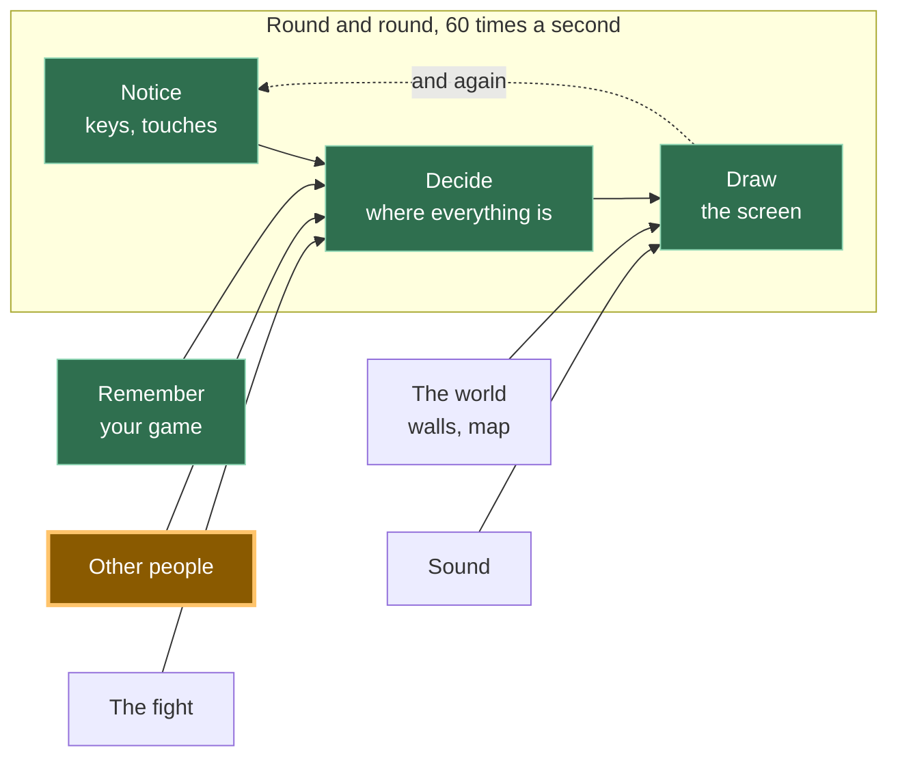

# A13: 安全な会話

他の人があなたの画面に表示されている今、あなたは彼らに何かを言いたいでしょう。残酷な目的で使えない会話方法と、到着した奇妙なものをすべて破棄するチェック機能を作成します。
{: .lesson-intro }

**必要:** [A12](a12.html)。**得られるもの:** タップできる6つのフレーズが、全員の画面上のあなたの四角の上に表示されます。

## ゲーム全体と今日の部分



[A12](a12.html)と同じボックスの後半です。他の人は既にあなたの位置を送ってきていますが、今度は言葉も送ってきます。

## 意図的にテキストボックスはありません

あなたのゲームには6つのボタンがあります。入力する場所はありません。これは意図的な決定であり、その背後にある理由がここにあります。あなたはこれに異議を唱えることができるはずだからです。

会社が運営するゲームでは、誰かが見張っています。プレイヤーが残酷な行為をした場合、報告、警告、または禁止され、担当者が報告書を読みます。あなたのゲームにはサーバーがないため、発言内容の記録もなく、担当者もいないため、誰かに報告することもできません。言葉はブラウザからブラウザへ直接送られるため、どこにもコピーが残らず、後で何も確認することはできません。

したがって、選択肢は「残酷な行為を可能にする方法を構築し、それに対処する方法がないか」または「それを構築しないか」です。私たちは構築しないことを選択しました。*見えないものを管理することはできないため、管理できないものを作成してはいけません。*

6つのフレーズで一緒に遊ぶには十分です。「ついてきて」や「戦おう！」がゲームの実際の役割を果たします。

### 他の人が見ることができるもの

これは重要であり、短い内容です。あなたのゲームから、他のプレイヤーが見ることができるのは以下の通りです。

- あなたの四角が表示する名前（あなたが選択したもので、本名である必要はありません）
- あなたの四角がキャンバス上のどこにあるか
- あなたがタップした6つのフレーズのうちどれか

彼らはあなたの本名、住んでいる場所、学校、顔、あるいはあなたのコンピュータ上の何も見ることができません。あなたのゲームはそれらの情報を一切求めないため、渡すものも何もありません。

さらに二つ、はっきりと言っておきます。**ここには誰も責任者がいません。** 報告ボタンはありません。報告する相手がいないからです。もし誰かがあなたに不親切な態度をとった場合 — 丁寧な6つのフレーズであっても、人は方法を見つけます — そのタブを閉じてください。何も失うものはありません。そして信頼できる大人に話してください。それは取るに足らないことでも恥ずかしいことでもありません。まさに正しい行動であり、効果的です。

## ブロックに分割する

「会話」は3つの要素です。

1. **選択** — 既存のフレーズの1つを選ぶ
2. **送信** — 選択したフレーズを送る
3. **表示** — 到着したフレーズを送信者の四角の上に、チェックした後に表示する

**なぜ分割するのか？** もしそれが一つの塊で、何かが間違っていたとしても、どの部分が間違っていたのか判断できないからです。タップしても何も起こらない場合、それは「選択」の問題を意味します。自分のフレーズは表示されるが相手のフレーズは表示されない場合、それは「送信」の問題を意味します。そして、**表示**が最も重要です。これは他のコンピュータからのデータを扱う唯一のブロックであり、そのため与えられたものを信用しない唯一のブロックだからです。これを分離しておくことで、意図的にゴミデータを送信して、それが破棄されるのを見ることでテストできます。

## ブロック1：選択

```
const PHRASES = ["Hi!", "Nice one!", "Let's fight!", "Follow me", "Good game", "Bye"];

for (let i = 0; i < PHRASES.length; i++) {
  const button = document.createElement('button');
  button.textContent = PHRASES[i];
  button.addEventListener('click', () => say(i));
  document.querySelector('#phrases').append(button);
}
```

1つのリストから6つのボタンが作られます。リストを変更するとボタンもそれに合わせて変わります。

各ボタンは `i` —つまりリスト内での位置を示す**インデックス** — を記憶しています。「Hi!」はインデックス0、「Nice one!」はインデックス1といった具合です。1からではなく0から数える習慣は、最初は奇妙に見えるかもしれませんが、やがて気にならなくなります。

## ブロック2：送信

```
const sendSay = (i) => room.send('say', i);

function say(i) {
  sendSay(i);
  player.said = PHRASES[i];
  player.until = performance.now() + SHOW_FOR;
}
```

**あなたは数字を送り、決して言葉ではありません。** `2` を送るだけで十分です。なぜなら、他のプレイヤーのゲームも同じリストを持っており、自分で `PHRASES[2]` を検索するからです。

これはスペースを節約するためではありません。6つの短いフレーズはごくわずかです。数字は文を含むことができないからです。もし言葉がそのまま送られた場合、改造されたゲームはどんな言葉でも送ることができてしまいます。数字はリスト上の6つの項目のいずれか一つを意味するだけであり、もしそうでなければブロック3がそれを破棄します。

`until` はこのフレーズの描画を停止する時間です。`SHOW_FOR` は3000ミリ秒、つまり3秒です — 読むのに十分な長さで、古いおしゃべりで画面がいっぱいにならない程度の短さです。

## ブロック3：表示

```
room.onMessage('say', (i, id) => {
  if (!Number.isInteger(i) || i < 0 || i >= PHRASES.length) {
    window.dropped = (window.dropped || 0) + 1;   // so you can check it worked
    return;
  }
  others[id] = { ...others[id], said: PHRASES[i], until: performance.now() + SHOW_FOR };
});
```

チェックを声に出して読んでください。*「もし届いたものが整数でないか、ゼロ未満であるか、リストの末尾を超えている場合、停止 — 何もするな。」*

`Number.isInteger` は「これは整数ですか？」と尋ねます。「Hi!」には「いいえ」、`1.5` には「いいえ」、何も与えられない場合も「いいえ」と答えます。その後の2つの比較は「この数字は私たちが実際に持っているフレーズを指していますか？」と尋ねます。

**他のコンピュータがあなたに送ってくるものを決して信用してはいけません。** あなたのコードはあなたのマシンで実行されていますが、メッセージは他の誰かのマシンから送られてきたものであり、彼らのゲームのコピーが何をするかあなたは知りません。もしかしたら彼らはそれを変更したかもしれません。もしかしたら彼らの接続が何かを混乱させたかもしれません。もしかしたら彼らは意図的に巧妙なことをしているのかもしれません。チェックがなければ、`PHRASES[99]` は `undefined` となり、あなたのゲームは彼らの四角の上に「undefined」という単語を描画します。他の不正な値はさらに悪いことを引き起こします。チェックがあれば、何も起こりません — これがまさに起こるべきことです。

次に、それが属する四角の横に描画します。

```
if (who.until > performance.now()) {
  ctx.fillStyle = '#fff';
  ctx.fillText(who.said, who.x, who.y - 20);
}
```

メッセージリストも、スクロールする履歴もありません。フレーズは四角の上に浮かび、そして消えます。

## このようにした理由

強制的な制約は、[A12](a12.html)をピアツーピアにしたのと同じです。つまり、サーバーがないことです。サーバーがないということは、ログがなく、モデレーターがおらず、禁止もできず、何も元に戻す方法がないことを意味します。失礼な言葉のフィルタリング、報告、ミュートなど、他のあらゆる安全対策は誰かの監視を必要としますが、誰も監視していません。それに耐えうる唯一のアプローチは、そもそも不親切な表現を不可能にすることです。6つのフレーズは私たちが後悔する制限ではありません。それは、このゲームがあなたを何から保護できるかについて正直な唯一の設計です。

## 代わりにできたこと

| これの代わりに | 費用対効果 |
|---|---|
| 罵り言葉フィルター付きのテキストボックス | フィルターは回避が容易であり、無実の言葉もブロックします。さらに悪いことに、フィルターは保護のように見えるため、人々は安心しますが、結局のところ報告する相手は誰もいません |
| 報告ボタン付きのテキストボックス | そのボタンは何もしないでしょう。報告を受け取るサーバーも、それを読む人もいません。嘘をつくボタンは、ボタンがないよりも悪いものです |
| 数字の代わりに言葉を送る | 変更されたゲームのコピーは、どんなものでもあなたの画面に送ることができ、あなたの側ではその違いを判別できません |
| チェックせずに数字を信用する | 最初の奇妙なメッセージが来るまでは完璧に機能しますが、その後誰かの頭の上に「undefined」と描画したり、全員の描画ループを破壊したりします |

## プロンプト

A12では既にネットワークライブラリが選択されています。チャットが新機能のように聞こえるからといって、アシスタントがそれを置き換えないようにしてください。

```
My canvas game already has multiplayer through KakkoiDev/p2p-core
v0.1.0. There is ONE existing room object from A12, with 'move'
registered and an `others` object of peer positions.

Keep that same p2p-core room. Do not create a second room and do not
switch to Trystero, WebRTC, PeerJS, Socket.IO, Firebase, or a server.

Add preset-phrase chat in three blocks with a comment above each:
PICK (make one button per entry in a PHRASES array of 6 strings),
SEND (register/use the message kind 'say' and send the array INDEX,
not the text, with room.send('say', i)),
SHOW (use room.onMessage('say', ...) and reject the value unless it is
a whole number inside the array, then display the phrase above that
peer's square for 3 seconds).

No text input anywhere. Plain JavaScript. Keep the existing multiplayer
connection from A12 unchanged.
```

**出力の確認点:** A12の1つのp2p-coreルームを維持しているか？別のネットワークAPIを考案する代わりに `room.send('say', i)` と `room.onMessage('say', ...)` を使用しているか？テキスト入力が追加されていないか？インデックスを送っているか、それとも文字列を送っているか？そして、チェックは `Number.isInteger` を使用しているか、それとも `-1` や `2.5` を受け入れてしまう `i < PHRASES.length` だけを使用しているか？

## 動作を確認する


ページを2つのタブで開き、もう一方の四角が現れるのを待ちます。

1. 最初のタブで**「戦おう！」**をタップします。フレーズがあなたの緑の四角の上に表示され、もう一方のタブでは青い四角の上に表示されます。3秒後に両方から消えます。
2. 両方のタブでフレーズをタップします。各フレーズは、画面の隅ではなく、それを送信した四角の上に表示されます。
3. 今度は意図的に壊してみましょう。最初のタブのコンソールで、手動でゴミを送信します: `sendSay(99)`、`sendSay("Hi!")`、`sendSay(1.5)`、`sendSay(-1)`。1つはリストの末尾を超え、1つは数字の代わりに言葉、1つは整数ではない、1つは開始位置より下です。
4. 2番目のタブを見てください。何も描画されませんでした。何も変わりません — 他のプレイヤーのエントリーは以前と全く同じ状態です。コンソールで `dropped` と入力すると `4` と表示されます。4つすべてが到着し、4つすべてが破棄されました。その後、自分の四角を動かし、フレーズをタップしてください。メッセージを拒否することはクラッシュとは異なるため、すべてがまだ機能しています。

ステップ4がこのステップの本当のテストです。何も拒否するのを見たことがないチェックは、テストされていないチェックです。

## ゲームに組み込む

[A12](a12.html)のゲームに3つのブロックと、キャンバスの下に空の `<div id="phrases">` を追加します。`others` オブジェクトは既に存在しており、各エントリーには `said` と `until` の2つのフィールドが追加されます。移動に関する変更はありません。

<div class="takeaways">
<h2>主なポイント</h2>
<ul>
<li>誰も監視していない場合、機能する唯一の安全性は、有害なことを言えないようにすることです</li>
<li>両方が持つリスト内の項目を指す数字を送り、決して言葉そのものではない</li>
<li>他のコンピュータがあなたに送るものを決して信用してはいけません — 使う前に、毎回チェックしてください</li>
<li>他のプレイヤーはあなたの選んだ名前、あなたの四角、あなたのフレーズを見ますが、あなたやあなたのコンピュータに関する情報は何も見ません</li>
<li>誰かが不親切な態度をとったら：去り、信頼できる大人に話してください。ここに報告する相手は誰もいません</li>
</ul>
</div>

## あなたの番

与えられたプロンプトでは生成されないルールを追加してください。それは、誰も1秒に1つ以上のフレーズを送信できないようにすることです。「バイバイ」を40回連続でタップする人は何も言っておらず、それは6つの丁寧なフレーズがまだ許している唯一の不親切な行為です。最後に送信したフレーズの時間を覚えておき、`say` 関数内で、1秒未満であれば早期にリターンするようにします。そして、より難しい半分を決定してください。*到着する*フレーズも速すぎる場合は無視すべきか、それとも自分のものだけを制限すべきか？*大人のプログラマーはこれをレートリミティングと呼ぶので、あなたもそのフレーズを知ったことになります。*
