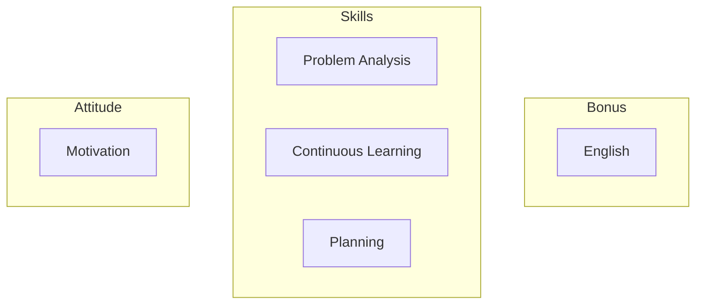

# How To Be Great At Anything

DISCLAIMER: I'm not claiming to be great at anything myself. I'm just sharing my personal experience and outlook on the topic. Hopefully you'll find something useful to your journey.

In my opinion, getting great at anything requires both a good attitude and the right skills:

## Attitude

### Motivation

This can't be taught, you'll have to kindle that fire yourself.

If the fire burns in you and stays hot even during the storm, if you can commit time everyday to practice your craft and still enjoy it even after many years, then you will eventually become great at it.

Greatness comes with great efforts and many tears. Perfection is never achieved. Even Olympic champions keep training. Make sure you don't get consumed by your ambitions. To stay grounded, think about what will really matter to you when you are on your death bed.

## Skills

It is one thing to be passionate, it is another to be efficient in the way we do things and in getting results. It is like using a knife. If the knife is sharp, we can cut things easily. If the knife is blunt, it takes more effort to cut the same things. Wisdom is what will keep your blade sharp. I won't elaborate on this topic in depth here, but instead talk about three skills that will benefit you greatly.

### Problem Analysis

Problems are like walls blocking our way. There are many ways to solve them (jumping over, digging under, going around, piercing through...) but often some solutions are better than others.

#### Understand The Problem

When you are faced with a problem, you have to first understand it:
- What is the issue?
- Who does it affects?
- What is the perimeter of it?
- Is it urgent?
- How complex does it look?
- ...

The goal is to define what the pain point and what are the constraints you have to work with is to then think about a solution that would fix it.

**Example:** A client wants to increase his sales.

Since this is a place to learn how to program, you might be tempted to think: "Let's make an e-commerce plateform!"

But let's slow down a little bit and consider what are the needs of our customer:
- He sells eggs
- In a small town
- He just got started last week

This is a completely made up example, but often times, it feels like people are proposing solutions and thinking in a certain way just because "That's how we do things".
An advertising agency will propose ads. A digital agency a website. Etc...
But in our example, what our client really needed was a scooter to bring his eggs to the market without breaking them. Thus increasing the number of eggs he can sell, thus increasing his sales.

> "When all we have is a hammer, all problems look like nails"

Part of understanding the problem includes understanding the constraints you have to work with. Constraints could be classified in 3 categories:
- Cost (How much money/resources are available?)
- Time (Is it urgent to fix the issue, or can it wait?)
- Quality (Well, you know, how good should the final product be)

<figure>
    <image src="./quality-triangle.jpg" alt="Quality Triangle" style="width:420px">
    <figcaption>Image taken from [PPM Express](https://www.ppm.express/glossary/quality-triangle)</figcaption>
</figure>

You can only pick 2. If you are low on time and budget, then you have to give up on quality. If you want a high quality product delivered quickly, then the cost will go up, etc...

In summary, when encountering a problem, you first have to understand it. You must evaluate its scope (size, complexity). The constraints you have to work with. And always re-check that you understand the problem correctly.

#### Find Potential Solutions

Once you understand the problem, you can start looking for solutions.

If this is a novel problem, you'll have to brainstorm and experiment. Start by making a proof-of-concept (POC), meaning a minimal example of how to fix the issue. If the POC is successful, you can refine it. If not, you can quickly move on to an other idea.

If this is an already solved problem, check out what others have already tried to fix this problem.

Don't be too attached to your ideas. Don't worry if your idea is not the one that was chosen for a particular project. What matters is that the problem got fixed in the best way possible. Rejoice and learn from it!

ALWAYS try to keep your solutions simple. Simple solutions are often cheaper to create and easier to maintain/upgrade. Really smart people find simple solutions to complex problems.

#### Verify That Your Solution Is Reliable

1) If you want to hang a painting on the wall you could use tape. Quick and cheap. But that might not hold your painting on that wall for long.
Another solution could be to fasten it with a nail. Requires more equipment but much more durable.

Make sure your solution won't break down too quickly. In the world of software engineering it could be using well established libraries that you know will keep on being maintained for the foreseeable future.

2) If you give a pen to a child, he might try to write with it, but could also use it as a sword to fence with his friends or put the cap in his mouth... well you remember how you were...

You might build the perfect system, but your user will always find ways to use it in unexpected ways. Be flexible. Test a lot.

3) Have you ever fed pigeons? You throw a few bread crumbs to one and before you know it, there is a crowd of birds rushing in for a quick meal.

What ever you do, make sure it can scale. Your application works great when serving 10 users, but what would happen if a hundred came all at once? Would it slow down? Would it crash? Would you lose data?
Well engineered solutions should be efficient and scalable. Simple so that they can evolve as the product's needs grow.

### Continuous Learning

When we start something, we know nothing about it. We don't even know what we don't know.
As we progress, we understand better what we are dealing with. Start solving problem.
Little by little, we know where we are in the space we are exploring and what we should study next.
Finally we reach the top and... explore new frontiers, pushing our field further and further.

The software engineering world moves fast and if we don't want to be left behind we have to keep updated daily.
I recommend reading news letters, blogs from the top minds in your area of expertise and try to learn new things every now and then.

### Planning

Once you have a solution to the problem you are trying to fix, you need to implement it.

That's the part that makes or breaks all projects. And it is notoriously difficult to evaluate time in software engineering, because often we are discovering new issues as we explore and implement the solution.

I recommend going by small increments. And make sure that you have a stable product at the end of each phases. Also validate your plans with other people if you are working in a team, they might see things you missed.

Finally, make sure that you can rollback to a previous state of the product in case things go wrong! Back up your database's data, use `git` to revert to a previous commit, etc...

## Bonus

### English

I added English because it is the language that most learning material and people use to work across the world. Being business fluent is greatly advised.

Good luck on your path to greatness!
