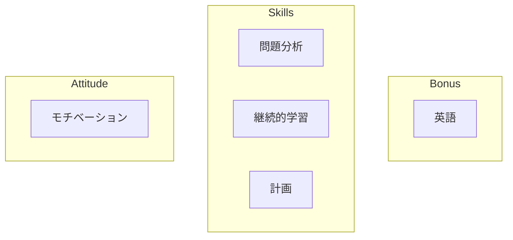
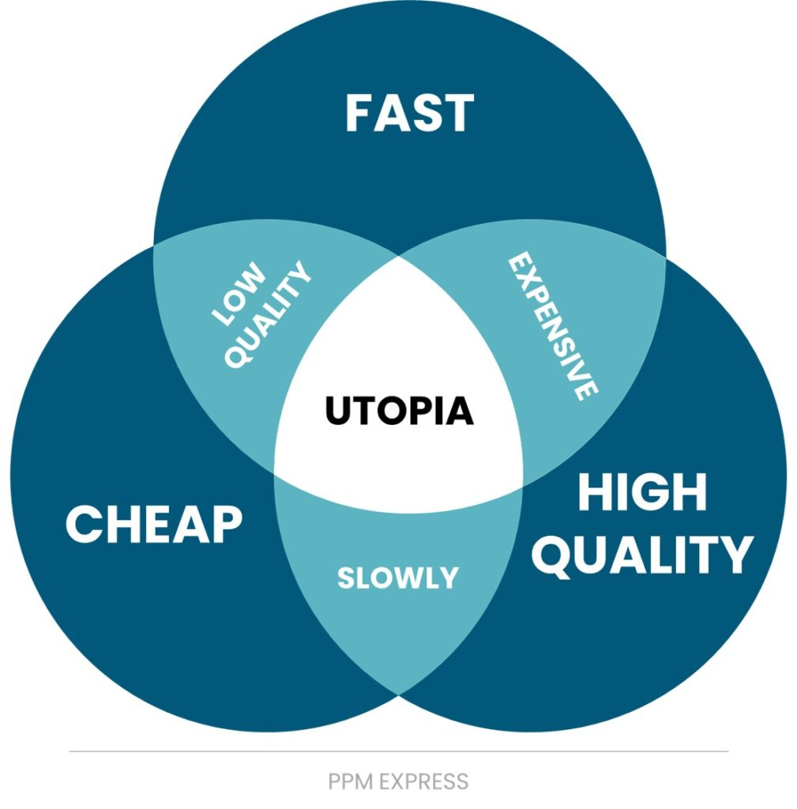

# 何事においても偉大になる方法

免責事項：私自身が何かにおいて偉大であると主張しているわけではありません。これは私の個人的な経験と見解を共有しているだけです。あなたの旅路に役立つものが見つかれば幸いです。

私の考えでは、何事においても偉大になるには、適切な態度と正しいスキルの両方が必要です：

## 態度

### モチベーション

これは教えられるものではなく、自分自身でその火を灯す必要があります。

もしあなたの中で火が燃え、嵐の中でも熱く燃え続け、毎日時間を割いて技術を磨き、何年経っても楽しみ続けることができるなら、いずれはそれにおいて偉大になれるでしょう。

偉大さには大きな努力と多くの涙が伴います。完璧は決して達成されません。オリンピックのチャンピオンでさえトレーニングを続けています。野心に飲み込まれないようにしてください。地に足をつけるため、死の床にいるときに本当に大切だと思うことは何かを考えてみてください。

## スキル

情熱を持つことと、物事を効率的に行い結果を出すことは別物です。ナイフを使うようなものです。ナイフが鋭ければ、簡単に物を切ることができます。ナイフが鈍ければ、同じものを切るのにより多くの労力が必要です。知恵こそが刃を鋭く保つものです。ここでこのトピックを深く掘り下げることはしませんが、代わりに大きな利益をもたらす3つのスキルについて話します。

### 問題分析

問題は私たちの道を塞ぐ壁のようなものです。それらを解決する方法はたくさんあります（飛び越える、下を掘る、回り込む、突き抜ける...）が、多くの場合、いくつかの解決策は他のものより優れています。

#### 問題を理解する

問題に直面したとき、まずそれを理解する必要があります：
- 問題は何か？
- 誰に影響するか？
- その範囲は？
- 緊急性は？
- どれくらい複雑に見えるか？
- ...

目標は、痛点が何であるか、そしてどのような制約の中で作業しなければならないかを定義し、それを修正する解決策を考えることです。

**例：** クライアントは売上を増やしたいと考えています。

ここはプログラミングを学ぶ場所なので、「eコマースプラットフォームを作ろう！」と考えたくなるかもしれません。

しかし、少し落ち着いて顧客のニーズを考えてみましょう：
- 彼は卵を販売している
- 小さな町で
- 先週始めたばかり

これは完全に作り話の例ですが、多くの場合、人々は「それが私たちのやり方だから」という理由だけで、特定の方法で解決策を提案し、考えているように感じます。
広告代理店は広告を提案します。デジタルエージェンシーはウェブサイトを。など...
しかし、この例では、クライアントが本当に必要としていたのは、卵を壊さずに市場に運ぶためのスクーターでした。それにより、販売できる卵の数が増え、売上が増加します。

> 「私たちが持っているのがハンマーだけなら、すべての問題が釘に見える」

問題を理解することには、作業する制約を理解することも含まれます。制約は3つのカテゴリーに分類できます：
- コスト（どれだけのお金/リソースが利用可能か？）
- 時間（問題を修正することは緊急か、それとも待てるか？）
- 品質（まあ、最終製品はどれくらい良くあるべきか）

<figure>
    
    <figcaption>画像出典：<a href="https://www.ppm.express/glossary/quality-triangle">PPM Express</a></figcaption>
</figure>

2つしか選べません。時間と予算が少ない場合は、品質を諦める必要があります。高品質の製品を迅速に提供したい場合は、コストが上がります、など...

要約すると、問題に遭遇したとき、まずそれを理解する必要があります。その範囲（サイズ、複雑さ）を評価し、作業する制約を確認し、問題を正しく理解しているか常に再確認してください。

#### 潜在的な解決策を見つける

問題を理解したら、解決策を探し始めることができます。

これが新しい問題である場合、ブレインストーミングと実験が必要です。問題を修正する方法の最小限の例である概念実証（POC）を作成することから始めましょう。POCが成功すれば、それを洗練させることができます。そうでなければ、すぐに別のアイデアに移ることができます。

これが既に解決された問題である場合は、他の人がこの問題を修正するために既に試したことを確認してください。

自分のアイデアに固執しすぎないでください。特定のプロジェクトで選ばれたのが自分のアイデアでなくても心配しないでください。重要なのは、問題が最善の方法で修正されたことです。喜んでそこから学びましょう！

常に解決策をシンプルに保つようにしてください。シンプルな解決策は、作成が安価で、保守/アップグレードが容易であることが多いです。

> 本当に賢い人は、複雑な問題に対するシンプルな解決策を見つけます。

#### 解決策が信頼できることを確認する

1) 壁に絵を掛けたい場合、テープを使うことができます。速くて安い。しかし、それは長い間壁に絵を保持しないかもしれません。
別の解決策は、釘で固定することです。より多くの機器が必要ですが、はるかに耐久性があります。

解決策がすぐに壊れないようにしてください。ソフトウェアエンジニアリングの世界では、予見可能な将来にわたって維持され続けることが分かっている、確立されたライブラリを使用することが考えられます。

2) 子供にペンを渡すと、それで書こうとするかもしれませんが、友達と剣として遊んだり、キャップを口に入れたりすることもあります...あなたも覚えていますよね...

完璧なシステムを構築しても、ユーザーは常に予期しない方法でそれを使用する方法を見つけます。柔軟に。たくさんテストしてください。

3) 鳩に餌をやったことはありますか？1羽にパンくずを少し投げると、気づいたときには、すぐに食事を求めて鳥の群れが押し寄せてきます。

何をするにしても、スケールできることを確認してください。アプリケーションは10人のユーザーにサービスを提供するときは素晴らしく動作しますが、100人が一度に来たらどうなりますか？遅くなりますか？クラッシュしますか？データが失われますか？
よく設計されたソリューションは、効率的でスケーラブルでなければなりません。製品のニーズが成長するにつれて進化できるようにシンプルでなければなりません。

### 継続的学習

何かを始めるとき、私たちはそれについて何も知りません。自分が何を知らないかさえ分かりません。
進歩するにつれて、私たちは扱っているものをよりよく理解します。問題を解決し始めます。
少しずつ、私たちは探索している空間のどこにいるのか、次に何を学ぶべきかを知るようになります。
最後にトップに到達し...新しいフロンティアを探索し、私たちの分野をさらに押し進めます。

ソフトウェアエンジニアリングの世界は急速に動いており、取り残されたくなければ、毎日更新し続ける必要があります。
ニュースレター、あなたの専門分野のトップマインドからのブログを読み、時々新しいことを学ぶことをお勧めします。

### 計画

修正しようとしている問題の解決策ができたら、それを実装する必要があります。

それがすべてのプロジェクトを成功させるか失敗させる部分です。ソフトウェアエンジニアリングで時間を評価することは非常に難しいことで知られています。なぜなら、解決策を探索し実装する際に、新しい問題を発見することが多いからです。

小さな増分で進めることをお勧めします。そして、各フェーズの終わりに安定した製品があることを確認してください。また、チームで作業している場合は、計画を他の人と検証してください。彼らはあなたが見逃したものを見つけるかもしれません。

最後に、問題が発生した場合に製品の以前の状態にロールバックできることを確認してください！データベースのデータをバックアップし、`git`を使用して以前のコミットに戻すなど...

## ボーナス

### 英語

世界中で作業するために、ほとんどの学習資料と人々が使用する言語であるため、英語を追加しました。ビジネス流暢であることを強くお勧めします。

偉大さへの道で幸運を祈ります！
