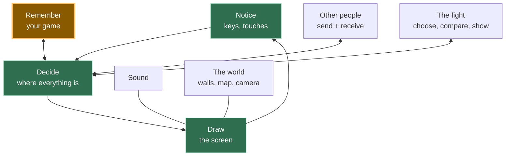

# Kakkoi Online — lesson series specification

Third document in the set:

- `kakkoi-online-design.md` — design rationale + decision log (*why*)
- `kakkoi-online-trd.md` — technical requirements (*what to build*)
- `kakkoi-online-sources.md` — every asset pack, library, blog, and game referenced, with licences
- `HANDOFF.md` — pick-up-cold briefing: repo locations, state, environment gotchas, settled decisions
- **this file** — the lesson series (*how it gets taught*)

Nothing is implemented, by design: **we write code only once the game exists in these documents.**
See §10 for the build/iterate process that follows.

---

## 1. What this track is

The **second half of the AI track** on school.kakkoi.dev (A09 onwards): having learned to use an AI
assistant in A01–A08, the student now builds one real thing with it — a multiplayer, serverless game
they can send to a friend — understanding each computer-science idea underneath it.

**The skill being taught is decomposition.** Not JavaScript, not networking, not game design. The
student should finish this track able to look at any feature and cut it into small blocks they can
build and check one at a time. Everything else is the vehicle. This sentence outranks every other
goal in this document; when a lesson has to choose between teaching more computer science and
demonstrating the cut more clearly, it demonstrates the cut.

**Delivery — DECIDED: two levels, parts and steps.**

- A **part** is a chapter of the game — "create the player", "other people". There are seven.
- A **step** is one lesson: one visible result, one sitting. There are fifteen.

A part takes as long as it takes. A quick group does a whole part in an evening; a slower one spends
three weeks on the same part. Neither is behind — they are at a different step. **Nothing in the
lesson text ever names a unit of time.** No "this week", no "last week", no "by next lesson". Steps
refer to each other by id, and each one opens with what it needs before you start it.

Everything is published at once and nothing is gated. The class meeting is a place to get unstuck and
to play together, not a release schedule.

**Audience — DECIDED: a 12-year-old must be able to read and follow it.** Trilingual (EN/JA/PT),
light workload (~3–5 hrs/week). This is the strictest constraint in the whole project and it outranks
completeness: if a sentence can't be understood by a bright 12-year-old, it gets rewritten or cut. See
§3.5 for the writing standard, and §3.6 for the safety consequences — which are not optional.

**Prerequisites.** A01–A08 (the agent is installed and they can drive it), plus T10–T14 (JS, DOM,
persistence). Stated at the top of A09, not enforced. **A09 re-checks the tooling** and adds an editor
and a local server, so a student arriving cold has one clear place to start.

**No GitHub account until part 5.** Git, an account and publishing arrive only when there is something
worth sending to someone. Consequences, all deliberate:

- Nothing gates starting on being 13 years old. A student opens the editor and has a moving square in
  the first sitting.
- Parts 1–4 have **no version control**. The mitigation is stated once, plainly, in A09: *before you
  let the agent make a big change, copy the whole project folder and put the date on the copy.* Crude,
  correct at this level, and it means git arrives in part 5 as the answer to a problem they have
  already felt rather than a chore they were told to do in week one.

**[OPEN] The 12-year-old tension.** T10–T14 is a real prerequisite for *understanding*, and a 12-year-old
probably hasn't done it. Two ways out, and I lean hard on the first:
- **Explain in place, briefly, every time.** When a lesson uses an array or a function, one plain
  sentence reminds them what it is. Costs a few lines per lesson; makes the track self-contained.
- Gate the track behind T10–T14. Cleaner for us, and it turns away exactly the reader you asked for.

**A practical note:** the assistant is `agy` (Antigravity CLI, free with a Google login), installed in
A01/A02 — not Claude Code, which requires a paid subscription and an 18+ account. See §5.

**The promise:** "you will ship a real multiplayer game and be able to explain how every part works."
**Not promised:** a job, a portfolio guarantee, or that AI wrote it all for you. Under-promise, per
your existing philosophy.

**Why this project is a good teaching vehicle** — it's not an arbitrary choice:

- Multiplayer forces **distributed-systems reality** (latency, trust, consistency) which single-player
  CRUD apps never surface.
- No server means **no black box**: every mechanism is visible in the student's own code.
- The constraints are honest and *felt*, not asserted — the student personally experiences NAT
  failure, desync, and hostile input.
- It's **fun to show people**, which is what makes a student finish an 18-lesson track.

---

## 2. How it differs from the existing tracks

| Track | Shape |
|---|---|
| T (tech) | one concept per lesson, small isolated examples |
| R (theory) | essays, no code |
| A01–A08 (AI) | how to use AI tooling |
| **A09+ (this one)** | **a small standalone demo per step**, each one a whole feature you can look at, then folded into one growing game |

### 2.1 Demos, then the game — the shape of every step

**DECIDED, and it is the structural decision of the whole track.** Each step is built twice:

1. **The demo.** A tiny standalone page — its own folder, its own `index.html`, nothing else in it —
   that does exactly one visible thing. It runs on its own from a blank slate. This is what the lesson
   teaches and what the screenshot shows.
2. **Put it in the game.** The last section of every lesson: the smallest change that folds the demo
   into the game the student is growing, with its own prompt.

Why this and not one accreting codebase:

- **A broken game does not end the course.** In an accreting track, a student whose code breaks at
  step 6 is stuck for the remaining nine steps, because every later lesson assumes working code they
  do not have. With demos, every step starts from zero and always works. For a self-serve track this
  is the difference between finishing and quitting.
- **A demo is small enough to read entirely.** One screen of code. That is the only enforceable
  definition of "a 12-year-old can understand it".
- **The integration is the lesson the demo cannot teach** — that existing code constrains new code —
  so it gets its own named section rather than being assumed.

Each demo is labelled **keep** or **scaffold**. A *scaffold* demo teaches an idea and is then
superseded and thrown away. Saying so in the lesson stops a student feeling they wasted an evening.
**As of the current list, every demo is `keep`** — where a step looked like it needed a throwaway, it
turned out to be better merged into the step that superseded it (see A14 in §6).

Demos live in the game repo under `demos/NN-name/`, so they are also all publishable and none of the
work is lost.

---

## 3. Pedagogical principles

1. **One lesson = one feature you can see, cut into 2–4 named blocks.** Not one lesson per block. A
   block on its own is not something a student can look at, and a lesson that ends with nothing
   visible is a bad lesson. The cutting happens *inside* the lesson, which is where they can watch it
   happen. "A square you can move" is one lesson with three blocks: **notice** what is being pressed,
   **decide** where it should now be, **draw** it.
1b. **The reason for every cut is the same, and it is stated every time.** If all the blocks are one
   lump of code and it goes wrong, you cannot tell which part is wrong. Split it, and you can check
   each piece on its own — is it noticing the key? is it changing the number? is it drawing in the
   right place? That sentence is the transferable skill; the computer science is the excuse to
   practise it.
2. **The idea comes with a physical analogy**, matching how `content/phases.yaml` already works
   (workbench, time machine, kitchen).
3. **Every lesson ships something runnable.** No lesson ends with "we'll wire this up next time."
4. **Alternatives are mandatory content.** Every lesson names 2–3 rejected approaches and what each
   would have cost. This is the section that separates an engineer from a prompt typist, and it is
   the reason a student can later make decisions we never taught them.
5. **The prompt is a specimen, not a script.** We give a full example prompt *and* what to verify in
   the output. Students who paste blindly will hit the verification step and fail it.
6. **AI failure is curriculum, and only real failures qualify.** Every third lesson includes a "here's
   what the agent produced that was subtly wrong, and how I caught it" — this is
   `build-verify-track.md`'s ethos applied. These must be **real** failures collected while building
   the demos (§10), taken from `FAILURES.md`, never invented.
6b. **No manufactured bugs.** A tempting lesson shape is *write it the naive way, feel it break, fix
   it*. It is only allowed when the naive way is what a student would genuinely have written and the
   break genuinely happened to us. Inventing a plausible-sounding bug to justify a lesson boundary is
   the single fastest way to lose a class's trust, because a student who tries the "broken" version
   and finds it works fine now distrusts everything else in the track.
7. **Verification is observable.** Every lesson ends with a two-tab test whose result you can see,
   not "it should work now."
8. **Honesty about limits is content, not a caveat.** The NAT lesson, the "no moderation is possible"
   lesson, and the closing "what a server would have bought us" are among the most valuable in the
   track.

---

## 3.5 Writing standard: a 12-year-old must understand it

Rules, applied to every sentence of every lesson. These also make the Japanese and Portuguese
translations dramatically better, because simple direct sentences survive translation and idioms do not.

1. **Short sentences.** One idea each. If there's an "and" joining two thoughts, make two sentences.
2. **Every new word gets defined the first time, in plain language, in the same sentence.** Not in a
   glossary the reader won't open.
3. **Concrete before abstract, always.** Show the thing happening, then name it. Never open a lesson
   with a definition.
4. **No idioms, no sarcasm, no cultural references.** "Yak-shaving," "the elephant in the room," sports
   metaphors — all out. They confuse 12-year-olds and they break translation.
5. **Active voice, second person.** "You send your position ten times a second," not "positions are
   broadcast at 10 Hz."
6. **Numbers with meaning attached.** "10 times a second — about as often as you blink," not "10 Hz."
7. **Pictures beat paragraphs.** A mermaid diagram or the lesson's screenshot instead of a description
   of what the screen looks like.
8. **Name the feeling.** "This part is confusing for everyone the first time" keeps a 12-year-old from
   concluding they're stupid and quitting. This matters more than any technical accuracy.
9. **Keep the deep idea; drop the vocabulary.** We do not water down the computer science. We stop using
   the words that gatekeep it — and then, at the end of the lesson, we name it: *"grown-up programmers
   call this X, so now you know that word too."* That last move is what makes a kid feel let in.

**The translation table.** Same ideas, different words. The right column is what goes in the lesson; the
left column appears once, at the end, as "the real name for this."

| The real name | How the lesson says it |
|---|---|
| Sprite atlas / texture atlas | "All the pictures live in one big image. You tell the computer which little square to copy out" |
| Fixed timestep game loop | "The game does its thinking a set number of times a second, so it works the same on a fast or slow computer" |
| O(n²) full mesh | "Everybody has a phone line to everybody else. Add one person, and *everyone* needs a new line. That gets out of hand fast" |
| NAT / STUN / TURN | "Your home router hides your computer from the internet, like a flat with no letterbox. STUN is asking a friend 'what's my address?' TURN is paying someone to carry your post" |
| Interpolation / dead reckoning | "You show other players a tiny bit in the past — about a blink — so their movement looks smooth instead of jumpy" |
| Commit–reveal hashing | "You both write your move on paper, fold it, put it down, *then* unfold. Nobody can peek and change their mind" |
| Mixed strategy equilibrium | "If you always pick the same move, people learn it and beat you. So the good players mix it up on purpose" |
| Schema versioning / migration | "Your save file has a version number, so when we change the game, old save files still work" |
| Polymorphism | "The fight code doesn't know or care whether it's fighting a person or the computer. Both answer the same questions" |
| Untrusted input validation | "Never believe what another computer tells you. Check it first, every single time" |
| Deterministic result from a seed | "The same starting number always gives the same answer — like a recipe" |

**Length target:** 800–1,200 words per lesson, one screenshot, one diagram where it helps. A lesson that
runs long is a lesson that should be two lessons.

## 3.6 Safety, because the readers are children

A 12-year-old audience changes the riskiest part of this project, and the change is not optional.

**Free-text chat with strangers, in a game with no server and therefore no moderation, no bans, no
logs, and no reports, aimed at 12-year-olds, is not something we should ship as the default.** I
recommended local mute and a notice earlier; that was calibrated for an older audience.

**Recommendation: preset-phrase chat by default.** The same trick as the ghost notes (design §2.4): you
pick from a fixed list of phrases ("hello!", "good duel", "want to fight?", "follow me", "bye"). This is
what Nintendo and Roblox do for young players, and it gives us three things at once:

- **Abuse becomes structurally impossible** rather than moderated after the fact. There is nothing to
  moderate, because there is nothing arbitrary to say.
- **It translates itself.** A phrase index renders in EN/JA/PT, so a Japanese kid and a Brazilian kid
  can actually talk to each other. Free text would never give them that.
- **It's a smaller lesson.** No text sanitisation, no length caps, no profanity questions — the
  networking idea (send a message, validate it, show it) stays intact with less code.

Free text becomes a **setting the player turns on**, with the honest warning attached. The validation
lesson (A23) is unchanged and still teaches "never trust what another computer sends you" — that lesson
is about hostile *data*, not rude words.

**DECIDED, both:**
- **v1 is preset-only. There is no free-text chat at all** — not even as a setting. Less code, nothing
  to sanitise, no length caps, no profanity question, and no way for an adult stranger to say anything
  arbitrary to a child. Free text, if it ever arrives, is a v2 decision made with fresh eyes.
- **The safety page is a lesson: A19 "Playing with strangers"**, placed deliberately *before* A20, the
  lesson where the student first connects to another human. It's also the in-game safety card shown on
  first join, so the same words reach players who never read the lessons.

---

## 4. The lesson template

Every lesson, same beats, same order. Frontmatter uses **`id` / `phase` / `title` / `desc`** — `phase`
is the part number, added for this track and read by `content/ai-phases.yaml`.

```markdown
---
id: "A12"
phase: 2
title: "Create the Player"
desc: "A square you can move — cut into noticing, deciding, and drawing."
---
# A12: Create the Player

[Intro: what you will be looking at by the end. One or two sentences.]
{: .lesson-intro }

**Needs:** A09. **Gives you:** a square you can drive with the keyboard or your finger.

## The whole game, and today's piece

[THE SAME DIAGRAM IN EVERY LESSON. Blocks already built are filled in, today's block is
highlighted, the rest are outlined. Mermaid, which the site already renders.]

## Cutting it into blocks

Three pieces:

1. **Notice** — which keys are held down, where the finger is
2. **Decide** — where the square should now be
3. **Draw** — put it on the screen

[Then the reason, every time: if this were one lump and the square moved wrong, you could not tell
which piece was wrong.]

## Block 1: Notice
## Block 2: Decide
## Block 3: Draw
[One short section each. Code fits on one screen in total.]

## Why we did it this way
[The constraint that forced it, in one paragraph.]

## What we could have done instead
| Instead of this | What it would cost |
|---|---|
| Writing all three as one block | ... |
| ... | ... |

## The prompt
[A full example prompt to the assistant.]
**Check the output for:** [3 specific things — the failure modes we actually hit.]

## See it work
[Observable check. Screenshot. Two windows where relevant.]

## Put it in the game
[The smallest change that folds this demo into the growing game, with its own prompt.
Or, for a scaffold demo: "This one does not go in the game — it was here to show you X,
and A22 replaces it."]

<div class="takeaways">
<h2>Key Takeaways</h2>
<ul><li>...</li></ul>
</div>

## Your turn
[One small extension the prompt above does NOT produce.]
```

### 4.1 The canonical diagram

**One picture, fifteen lessons.** Copy it verbatim into every step and change only the `class`
assignments: `done` for blocks already built, `now` for today's, nothing for the rest. Never redraw it,
never reorder it — the value is entirely in it being the same picture every time.

````markdown

````

The loop in the middle — **notice, decide, draw, and round again** — is the spine, and it is the first
thing a student builds (A10). Everything else in the track hangs off "decide" or off "draw". By A23 the
whole picture is green, and the closing lesson can point at it and say: *you built each of these one at
a time, and none of them was big.*

Introduce it in A10 with one sentence and no ceremony: *"this is the whole game. Today we build the
three boxes in the middle."*

**The diagram is the same picture in all fifteen lessons**, filling in as the track goes. The student
sees the cut before reading a line of code, and by the end has watched a big thing get built entirely
out of small ones. That is the track's actual curriculum made visible.

**"Your turn" is deliberate.** If a student only runs our prompt, they've watched a video. The
extension must be something the given prompt does *not* produce.

**Banned from every lesson:** "this week", "last week", "next week", "by next lesson", and any other
unit of time (§1). Steps are referred to by id.

---

## 5. Track integration — it's the AI track, continued (A09+)

**DECIDED: this is not a new track.** It continues the existing AI lessons as **A09 onwards**, framed
as "use an AI chatbot to build an online multiplayer game." Verified against the codebase, this costs
**zero build work**:

- `content/ai/*.md` is a **flat list with no `phase` field**, sorted by id number
  (`content_loader.py:172`). Dropping `a09.md` in makes it appear. No loader change, no `build.py`
  change, no `phases.yaml` entry, no new nav item, no new page.
- `scripts/translate_content.py` already covers `content/ai/`.
- Only real edit: a line in `content/ui.yaml` describing the AI track's new second half, ×3
  languages, plus a **"Play the game"** link to `online.kakkoi.dev`.

Two happy consequences of living inside the AI track:

- **We don't rewrite the install.** A01/A02 already cover installing the assistant and the risk rules,
  translated and shipped. **A09 links to them** and adds only what's new and specific to shipping a
  game: a **GitHub account**, `gh` signed in, and an empty repo ready for A10 to deploy from.
- **CORRECTION — the assistant is `agy` (Antigravity CLI), not Claude Code.** A01/A02 install `agy`,
  free with a Google login, and the track continues on it. Consequences, all good:
  - **The only account rule left is GitHub's 13+.** Claude requires 18+, which would have forced a
    parent's account for the youngest student; `agy`'s free tier removes that from the critical path.
  - **No subscription, no card.** A student can do the entire project for free.
  - Lessons say "**ask your assistant**" and every prompt is plain English, so Claude Code or Copilot
    work equally well for anyone who prefers them. Stated once in A09, not repeated.
- The framing is honest: this *is* an AI-lessons capstone. A08 is currently "Capstone: your AI
  toolkit"; A09+ becomes "now build something real with it."

**Screenshots — DECIDED, no videos.** One screenshot per lesson, captured from the running reference
build during §10's loop, stored in `website/static/img/game/aNN.png`. Captured in **English only** (§9)
so translations reuse the same images. No screencasts, no per-language image work.

---

## 6. The definitive list — 7 parts, 15 steps, A09–A23

**This replaces the earlier 21-lesson list.** That list had one lesson per computer-science idea, which
produced lessons ending in nothing you could look at, and a mandatory weekly cadence baked into the
prose. The rule now is §3.1: **one step = one feature you can see, cut into 2–4 named blocks.**

A **part** is a chapter and takes as long as it takes. A **step** is one sitting.

**Parts are a planning device, not a website heading.** The site has two phases only —
part 1 "Talking to the Machine" (A01–A08) and **part 2 "Let's Make an Online Multiplayer Video
Game" (A09–A23)** — so every step in this track carries `phase: 2`. We tried one site heading per
part; six of the seven were empty, and a page of empty headings makes a track look abandoned rather
than planned. The parts below are for grouping and pacing here in the doc.

| Part | Name | Steps | The question it answers |
|---|---|---|---|
| 1 | Set up | A09 | What do I need before I can start? |
| 2 | Create the player | A10 | How does something move on a screen? |
| 3 | Save the game | A11 | How does a computer remember me? |
| 4 | Other people | A12–A13 | How do two computers talk with nothing in between? |
| 5 | Make it a real game | A14–A18 | How do I make it look, sound and feel like a game — and put it online? |
| 6 | The fight | A19–A22 | How do you settle a contest when nobody is in charge? |
| 7 | Look back | A23 | What did we choose not to build, and what did that buy us? |

### The steps

| # | Step | What you can see at the end | The blocks | Needs |
|---|---|---|---|---|
| **A09** | Get your tools | A page saying your name, in your browser, reloading when you save | install the assistant; install the editor; run Live Server | A01–A08 |
| **A10** | Create the player | A square you can drive with the arrow keys or your finger | **notice** what is pressed · **decide** where it goes · **draw** it | A09 |
| **A11** | Save the game | Close the tab, reopen it, and your square is where you left it | **write** it down · **read** it back · **cope** when the saved thing is old or broken | A10 |
| **A12** | Other people | A second square, driven by someone else, moving on your screen | **connect** to the room · **send** where you are · **draw** everyone else | A11 |
| **A13** | Talking, safely | Tap a phrase, and it appears above your head on their screen too | **pick** a phrase · **send** it · **show** it, and drop anything that isn't on the list | A12 |
| **A14** | Your monster | The square becomes a monster, and its legs move when it walks | **cut** one picture out of a big image · **change** which picture, over time | A10 |
| **A15** | Walls | Walk into a rock and stop | **describe** where the solid things are · **check** before moving · **stop** | A10 |
| **A16** | The map | A world bigger than the screen, that scrolls as you walk | **store** the map as data, not code · **draw** the tiles · **follow** the player with a camera | A15 |
| **A17** | Sound | A footstep when you walk, music when you press play | **load** the files · **play** on an event · **let the player turn it off** | A10 |
| **A18** | Put it online | A link you can send to anyone, that opens your game | **save your history** with git · **make an account** · **switch on the free hosting** | A14 |
| **A19** | Challenge someone | Walk up to another player, press a button, and a fight screen opens for both of you | **ask** · **agree** · **change what screen you are on** | A12 |
| **A20** | Three moves | Pick fire, water or earth; see who won and why | **choose** · **compare** the two choices · **show** the result | A19 |
| **A21** | Someone to fight | A computer opponent, when nobody else is online | **give it a way to choose** · **make the fight code not care who it is fighting** | A20 |
| **A22** | No peeking | Neither player can wait to see the other's move first | **hide** your move · **both show at once** · **check** nobody swapped theirs | A20 |
| **A23** | What we didn't build | — | — | all |

Fifteen steps, every one of them ending in something you can look at.

### Notes on the ordering

**Publishing is A18, not A09.** Two reasons, both discovered in discussion and both reversals of what
this document said before:

- **Peer-to-peer works fine on `localhost`.** Trystero's signalling goes out over public relays, so two
  students each running their own Live Server find each other and connect directly. Nothing has to be
  published for A12 to work. The earlier claim that A12 required a live URL was wrong.
- So publishing lands where it is honestly motivated: you put it online when it looks good enough to
  send to someone — after the monster, the map and the sound. A18 is the biggest single step in the
  track (git, an account, and Pages) and may well take several sittings. That is fine and the lesson
  says so.

**A14 needs A10, not A13.** The steps in part 5 are deliberately near-independent of part 4, so a
student who cannot get peer-to-peer working on their network is not blocked from the entire rest of
the course. They can do the monster, walls, the map and sound, publish, and come back to A12.

**The NPC (A21) sits inside the fight (part 6), not in the cosmetics part.** A computer opponent is only
interesting once there is something to fight about, and it is the lesson where the fight code stops
caring whether it is facing a human — which is the payoff of A19's cut and cannot be shown earlier.

**A22 could be cut.** If the class is running out of energy, "no peeking" is the one step whose feature
is invisible when it works. It is also the single most beautiful idea in the track, so it stays unless
something forces the issue.

### Scrapped from the earlier list, and why

| Was | Why it is gone |
|---|---|
| A separate "game loop" lesson | It is one of the three blocks of A10. A loop with nothing to move is not a feature you can see. The frame-rate point (a square moves faster on a 144 Hz screen) survives as a sidebar in A10 with its one-line fix, not as a lesson |
| "Types that never run" | No TypeScript in the track at all — see §6.3 |
| A separate "who are you?" lesson | Your name is part of what A11 saves |
| A separate safety lesson before the networking one | Merged into A13, which is where strangers actually appear. Same words, better timing |
| A "move the square badly, then fix it" pair | The bug was invented; `keydown`/`keyup` into a set of held keys does not stutter. See §3.6b |
| A coloured-rectangle animation scaffold before sprites | Merged into A14. Sprite plus walk cycle is one feature — "a monster that walks" — and nothing is thrown away |

### 6.3 No build step, anywhere — DECIDED

**No TypeScript, no npm, no Bun, no bundler.** The student installs an editor and the Live Server
extension, and that is the entire toolchain. Plain JavaScript, plain HTML, opened in a browser.

- It matches the original requirement for "a way to use it without a compile step".
- It removes an entire category of student confusion at the exact age where confusion means quitting.
- Nothing in a game this small is made safer by types.
- Live Server is one click in the editor and needs no terminal, which is meaningfully fewer moving
  parts for a 12-year-old than `npm install`.

**This reverses the TRD**, which specified `.ts` sources, a `tsc --noEmit` gate and `bun test`, and it
means the game repo scaffold gets converted to plain JavaScript. Recorded in the design decision log.

### Appendices (English only, written if wanted)

| # | Title |
|---|---|
| X1 | Keypair identity — signatures, so nobody can impersonate you |
| X2 | When P2P won't connect — TURN and the ~10% |
| X3 | Phones — touch controls |
| X4 | If 500 people showed up — sharding we chose not to build |

| X6 | Balance as a test — the 1,000-duel simulator |
| X7 | **Port it to Phaser** — rebuild what you wrote using a real game framework, and measure what you gained and lost |

## 6.2 Game theory: sidebars inside the lessons, not an R essay

**REVERSED (was: a standalone R22 essay).** The R track is *your* voice — life lessons you actually
hold. Borrowed game theory dressed as one of those would be pretending, and a reader who knows the rest
of the R track would feel the difference. So the material goes where it's earned: **short sidebars inside
the lessons that use it.**

This is also better for a 12-year-old. The idea arrives attached to a thing they just built, in 80 words,
rather than as an essay they must hold in their head and apply later.

**Mechanism — no new CSS needed.** `.lesson blockquote` already exists in `website/static/style.css:648`
(accent left border, muted italic), so a markdown `>` block renders as a sidebar today. **[OPEN]** if you
want a titled box instead, adding a `.sidebar` rule mirroring `.takeaways` (`style.css:656`) is about five
lines of CSS — worth it only if we end up with many sidebars.

### Where each piece lands

**A26 "Three buttons" — the main sidebar (~90 words).** Placed right after the three actions are
explained:

> **Why three buttons and not one?**
> Play rock-paper-scissors with a friend. After ten rounds they win almost every time — not because they
> are lucky, but because they noticed you keep picking rock. Having a favourite makes you predictable,
> and being predictable is the only way to lose a fair game. So the best players have no pattern at all.
> That is hard: people are bad at being random. It is also why our Block does not just save you, it
> *earns* you a charge — three options that all did the same thing would give you nothing to think about.
> Grown-ups call this a **mixed strategy**.

**A27 "Someone to fight" — a second sidebar (~70 words),** where the NPC prediction tiers are introduced:

> **The computer is watching your habits**
> The tougher trainers keep a list of what you have done and bet on your favourite. Programs like this
> once won a famous rock-paper-scissors competition, because computers spot patterns far better than
> people hide them. And if it can guess you, you can guess its guess — Japanese has a word for
> reading-the-other-person: **yomi**. We deliberately made the toughest trainer play randomly a quarter
> of the time, so it stays beatable. You can choose to make your program weaker than you know how.

**A11 "Plan before you prompt"** already carries the design half of this — the Block-pays-nothing reversal
is one of its worked examples of changing your mind for a reason.

**Cut entirely:** penalty kicks, poker, negotiation, Nash equilibrium, imperfect information. Those were
the essay's reason to exist, and without the essay they are padding. The two sidebars keep everything
that changes how the student understands *their own game*, which is the only claim the lessons need.

## 6.1 What v1 does NOT include (and why that's the point)

Cut, per "as small as possible." Each is a fine v2 or appendix, and each removal makes every lesson
shorter:

| Cut | Why it's safe to cut |
|---|---|
| **Levels & XP** | Also removes the level term from the damage formula and the stat-clamping logic. A local win/loss counter is enough |
| **Dual types / evolution** | v1 is one element per creature. The type triangle still works completely |
| **Cosmetics & per-player tints** | The name tag already tells people apart |
| **Procedural creature generation** | Reversed on purpose: a set of ~6 CC0 monsters is smaller, matches the tiles, and the name carries identity |

| **Wild encounters** | The NPC trainer already gives you something to fight |
| **Ghost notes** | → v2. NPCs already make the world feel inhabited |
| **Whisper/DM, low-bandwidth mode** | Broadcast chat is enough at 5 players |
| **Zones, sharding** | One room, one map → X4 |
| **Keypair identity** | → X1 |
| **Balance simulator** | → X6. Ship the mechanics, fix them from play |

**Consequence for the damage formula** (TRD §3): with levels gone it becomes
`base × element × charge × action × roll`, clamped to 50% of max HP. Fewer moving parts, same triangle.

**And explicitly accepted:** we are not gating on "is it still fun after 20 duels." Per your call —
**the game existing and working is the success.** Mechanics are data in `tuning.json`; they get fixed
from real play later, and that fixing is itself lesson material.

## 7. Per-lesson detail: what "written down" means

> **The detail sheets below are from the 21-lesson version and are superseded by §6.** They are kept
> because the *content* in them (the alternatives tables, the safety wording, the prompt specimens) is
> still good and gets reused; the ids, tags and orderings in them are not. Where a sheet contradicts
> §6, §6 wins.

Each step gets a detail sheet before it is written. Template, then specimens; the rest get filled
during §10's build loop, because the real AI failure modes and the real verification steps can only be
collected by actually building it.

```
ID / title / what it needs
Goal (one sentence, student-facing)
The feature you can see at the end
The 2–4 blocks it cuts into
Why this solution (the forcing constraint)
Alternatives + cost (2–3)
Example prompt (full text)
See it work (observable steps)
Put it in the game (the smallest fold-in)
Real AI failure to catch (from FAILURES.md, never invented)
Takeaways (3–5)
Your turn (extension)
```

### A09 — Get your tools

- **Goal:** the assistant works, you have a GitHub account, and you have an empty repo. Nothing else.
- **Idea:** **a programmer needs two things — something that helps you write, and somewhere to keep your
  work.** The second one is what lets other people see it. (Analogy: a workshop and a shop window.)
- **Builds:** Claude Code installed and signed in (linking to A01/A02, not repeating them), a GitHub
  account, `gh auth login`, `git config` name and email, and an empty `kakkoi-online` repo — public,
  with Pages ready to switch on next lesson.
- **Why an empty repo now:** so A10 can deploy in the same sitting it starts. The student sees their own
  URL in week two, which is the thing that makes them come back for week three.
- **Alternatives:** deploy at the end (the usual course shape — and the reason so many students never
  see their work live); zip files by email (no history, no URL); a paid host (money, and unnecessary).
- **Verify:** `claude` runs and answers; `gh repo view` shows your repo; the repo page loads in a browser.
- **Your turn:** write one sentence in your repo's README saying what you're about to build.

#### ⚠️ Age limits — this must be stated plainly, not buried

I checked the terms rather than guessing, and they matter for a 12-year-old audience:

- **GitHub requires you to be 13 or older.** ToS §B.3: *"You must be age 13 or older."*
- **Claude requires 18 or older** (or your local minimum consent age, whichever is higher) per
  Anthropic's consumer terms.

So a 12-year-old **cannot** hold either account themselves. Pretending otherwise would be teaching kids
to lie about their age in lesson one, which is not a thing this course should do. The honest structure:

- **The adult owns the accounts.** In class, that's your Claude subscription on the machines the students
  use, with you present. At home, it's a parent's account with the parent involved.
- **For under-13s, the work lives in an adult's repo.** Practical options: a **class organisation** you
  own with one repo per student, or [GitHub Classroom](https://classroom.github.com/), which exists for
  exactly this. Their site still goes live at a real URL — it's just hosted under the class account.
- **Everything else is unaffected.** Local development, the whole game, and the two-tab multiplayer test
  need no account at all. Only *publishing* does.
- **13–17:** own GitHub account is fine; the Claude account still needs an adult.

#### Can a free organisation host one repo per student? **Yes — cost is not the problem**

Verified against the docs, not assumed:

| Thing | Free plan reality |
|---|---|
| Repos in a free org | **"unlimited collaborators on unlimited public repositories with a full feature set"** — so one repo per student is fine |
| Org members | Unlimited on GitHub Free |
| **GitHub Pages** | *"available in public repositories with GitHub Free and GitHub Free for organizations, and in public and private repositories with GitHub Pro, GitHub Team…"* → **free for us, because our repos are public anyway** |
| GitHub Actions (our deploy) | **Free and unlimited for public repos on standard runners**, on every plan. A private repo would eat the org's 2,000 min/month; public doesn't |
| Pages limits | Documented soft limits are roughly 1 GB per site, ~100 GB bandwidth/month, ~10 builds/hour. **[unverified this session — treat as approximate]** Our game is 1–2 MB, so irrelevant either way |

So: a free `kakkoi-school` org, one public repo per student, each with its own Pages URL, each deploying
via Actions. **Zero cost, no plan upgrade, no card.**

**The catch is the age floor, not the price.** Pages being free doesn't create accounts. Every student who
wants to push needs their own GitHub account, and that still means 13+. Two further wrinkles:

- **GitHub Classroom does not solve this** — it manages student repos, but students still need accounts.
  It's genuinely good for a 13+ class and useless for a 12-year-old one.
- **Sharing one login is against the ToS** (*"Your login may only be used by one person"*), so a single
  class account for everyone isn't a legitimate workaround.

**So, by age:**

| Students | Setup |
|---|---|
| **13+** | Free org, one public repo each, students are members and push themselves. Or GitHub Classroom. Everything works as written |
| **Under 13** | Free org, one public repo each — **an adult publishes.** The student writes all the code locally (needs no account at all), and you push. They still get their own live URL, which is the part that motivates them |

**SETTLED for this class: everyone is 13+** (one 13-year-old, the rest adults). That resolves it:

- **Every student owns their own GitHub account and pushes their own work.** No adult-publishes step, no
  per-student repo admin for you.
- **The org already exists: `KakkoiSchool`** (free plan, created 2026-05-06, members `KakkoiDev`,
  `davidrobel`, `roversi`). Nothing to create.
- **Split of ownership:** the **canonical game lives in the org** at `KakkoiSchool/kakkoi-online` with the
  `online.kakkoi.dev` CNAME. **Students fork it to their own accounts** and deploy to
  `their-name.github.io/kakkoi-online/`. They own their work, it survives the course, and it sits on their
  own profile.
- **CORRECTION — students do NOT fork. They start from an empty repo:**
  `gh repo create kakkoi-online --public --clone`. Forking would hand them the finished game in one
  command, and a student who owns code they can't explain has gained nothing.
- **CORRECTION 2 — no `reference` remote either.** An earlier draft had students add our repo as a second
  remote and fetch tags, so they could `git diff a14-end`. That was too much machinery for lesson one and
  it taught nothing the lesson was about. **They just read our repo in a browser.** Per-lesson tags still
  exist on our side and give a browsable URL
  (`github.com/KakkoiSchool/kakkoi-online/tree/a14-end`), which is all a stuck student actually needs:
  open our file, compare with theirs. Look *after* trying, not before.
- **Claude is the only account with an adult in the loop** — 18+ means the 13-year-old works under a
  parent's or your subscription, with you present. The adults use their own.
- **Optional and cheap: a class gallery.** A markdown list of everyone's live URLs (in `izumo-io`, or a
  page on school.kakkoi.dev). Costs nothing, and seeing five classmates' games side by side does more for
  motivation than any lesson text. It's also how you find out whose deploy broke.

The lesson text still states the general age rules, because the published lessons are read by strangers
and some will be under 13 — but no part of *our* class needs the adult-publishes path.

**One privacy point worth deciding now:** free Pages requires **public** repos, so a student's code and
repo name are world-visible. Use handles, not real names — and mention it in A09, since a 12-year-old
won't think of it. (This also matches the fork-and-play property we want: public is a feature here, not
just a constraint.)

**Mixed-age class, one useful consequence.** Writing for a 13-year-old keeps the main path readable for
everyone — adults are not insulted by clarity, only by padding, and the writing standard (§3.5) forbids
padding. Depth for the adults goes in the **appendices** (X1 keypair identity, X6 the balance simulator,
X7 the Phaser port), which they can take at their own pace without slowing the class. That's the mixed-age
answer: one clear main line, optional depth beside it.

**Tone note:** frame this as *"here are the rules these companies have, and here's how we work with
them"* — matter-of-fact, one short box. Not a warning, not an apology.

### A10 — Put it on the internet *(written)*

**Two design choices made while writing it:**

- **No custom domains.** Students stay on `their-name.github.io/kakkoi-online/`. DNS is a separate topic,
  the inert-`CNAME` trap would derail a first deploy, and nobody needs a domain to send someone a link.
  The lesson notes in one line that ours uses one and that it doesn't matter.
- **Branch-based Pages, not the Actions workflow.** There is nothing to *build* yet, so a dropdown beats
  20 lines of YAML. The workflow arrives in A12 with TypeScript, which is also where the "a robot that
  never runs looks exactly like one that works" failure belongs. **Our reference repo is workflow-based
  from the start** because it already builds TS — the lesson says so rather than pretending otherwise.
- **The `file://` demo needed a module to be truthful.** A plain HTML page opens fine from disk; the
  origin-`null` block only bites an ES module. So A10 ships `index.html` + `main.js` as a module, and the
  blank canvas plus console error are real rather than asserted.

### A10 — original sketch

- **Goal:** a dev server, a repo, and a **live public URL** — on day one.
- **Idea:** why `file://` fails and `http://` works: origins and **secure contexts** (`crypto.subtle`
  needs one, which A25 will need).
- **Builds:** Bun install, `bun ./index.html`, blank canvas, git repo, Pages + CI deploy.
- **Why deploy now:** it answers "does it work outside my laptop" while the code is 20 lines instead of
  2,000, and the student has something to show from lesson two. Deployment stops being a scary finale.
- **Alternatives:** double-clicking the file (breaks modules, crypto, fetch); `python3 -m http.server`
  (fine, but no TS); a bundler + config (a day of yak-shaving).
- **Verify:** loads at `localhost`; **loads at the public URL**; `file://` visibly fails — make them
  *see* the error rather than be told about it.
- **Your turn:** explain in one sentence why the browser refuses `file://`.

### A11 — Plan before you prompt

- **Goal:** produce a design doc for the game *before* any code.
- **Idea:** requirements vs implementation. **A spec is what makes an agent useful** — vague prompts get
  plausible nonsense, and the fix is upstream of the prompt. Analogy: you don't hand a builder a mood
  board and expect a house.
- **Builds:** the student's own `DESIGN.md` from a template (scope, non-goals, constraints, open
  questions).
- **Why:** an agent will build the wrong thing faster than you can review it. The spec is the brake.
- **Alternatives:** start coding and refactor (fine solo, collapses when the agent generates 500 lines
  an hour); design everything up front (guesses what only play can teach you).
- **Teaching material we already have:** this project's own three planning documents, **including the
  reversals** — decks → three actions, Block-pays-nothing → Block-banks-a-charge, free text → templated
  notes, and the whole §6.1 cut list. Showing a student a decision we *changed*, with the reason, is
  worth more than showing them a clean plan.
- **Verify:** their doc names its non-goals and at least one thing they chose not to build.
- **Your turn:** write one requirement that differs from ours, and its consequence.

### A12 — Types that never run

- **Goal:** typed code, checked in CI, no build step in dev.
- **Idea:** types are a **development-time tool that never runs**. Bun strips them and throws them away,
  errors included — so `tsc --noEmit` is the only thing that actually checks anything.
- **Builds:** strict `tsconfig.json`, one typed module, CI typecheck job.
- **Alternatives:** JSDoc + `tsc` (zero build, wordier, unusual syntax); no types (fast until the agent
  hands you 800 lines); in-browser transpiling (slow, fragile).
- **Verify:** introduce a deliberate type error — **the page still runs, CI goes red.** That contrast is
  the entire lesson.
- **Your turn:** find a type error the agent introduced in earlier code.

### A19 — Playing with strangers (the safety lesson)

Written out in full here rather than left to the build loop, because it is the one lesson where getting
the tone wrong does real harm. It must not read like a warning label a child skips.

- **Goal:** before you connect to another person, know exactly what they can see, what they can't, and
  what to do if someone is unkind.
- **Idea:** **nobody is in charge here.** In most games a company can ban people. In this one there is
  no company and no server — which is why the game only lets people say fixed phrases, and why the
  controls that protect you live on your own computer.
- **Tone rules:** plain, calm, specific. No scare stories. No "the internet is dangerous." Assume the
  reader is sensible and tell them the mechanics, the same way we explain collision detection.
- **What it actually says:**
  - **What others can see:** the name you chose, your creature, where you are standing, and the phrases
    you send. That's the whole list.
  - **What others cannot see:** your real name, where you live, your IP-as-identity, your files, or
    anything else on your computer. (Honest footnote for an older reader: a direct connection does
    reveal a network address, which is how the internet works; it is not your home address and it isn't
    shown in the game.)
  - **Why you can only pick from a list of phrases:** so that nobody can say something cruel or ask you
    for anything. It's a design decision, not a limitation of our skills. **This is the lesson's real
    computer-science idea:** you can prevent a whole class of problem by making it impossible instead of
    forbidding it. Grown-up programmers call that *designing out* the problem.
  - **What to do if someone is unkind or follows you around:** mute them (one tap, it's permanent and
    it's yours), leave and come back, and tell an adult you trust. Add: **you never owe anyone a duel.**
  - **A name is not proof.** Anyone can type any name, including your friend's, including the teacher's.
    Callback to A18.
  - **Nothing you type is stored anywhere.** No history, no logs, no accounts. Good for privacy, and it
    means nobody can check later what was said — which is exactly why muting is the tool that works.
- **Builds:** the in-game safety card (Basecoat dialog) shown once on first join, with a permanent link
  in settings, and the mute button it describes.
- **Verify:** open two tabs, mute one from the other, confirm the phrases stop arriving. **They must see
  the tool work**, not just read that it exists.
- **Your turn:** write one sentence explaining to a friend what other players can see about them.
- **[OPEN]** Should this page also exist outside the track as a plain page parents can read? It costs a
  `website/pages/` entry and one nav line. My lean: yes, eventually, low priority.

---

## 8. Reference implementation & the student's repo

- One canonical repo, `kakkoi-online`, tagged **`a09-end` … `a29-end`**. Every lesson header says
  "start from `aNN-end`", so a student can join mid-track or recover from a mess with
  `git diff a15-end`.
- **[OPEN]** Tags on `master` vs a branch per lesson. Tags are simpler; branches let you fix an early
  lesson without rewriting history. Leaning tags plus a `lesson-fixes` process where a correction
  moves the tag and bumps a `CHANGELOG` line.
- Students create their **own empty repo** and deploy to `their-name.github.io/kakkoi-online/`.
  Their fork **still plays with everyone else's** — peers meet on the relay, not on a domain. This is
  the single best demo in the track (A10 sets it up; A20–A21 make it visible).
- Submissions flow through the existing `/submissions/<handle>/` PR mechanism in `izumo-io`: per
  lesson, the student's repo URL, their live URL, plus the `build-verify` three-post (solution,
  write-up including one thing the AI got wrong, and a review of a partner's).

---

## 9. Trilingual production

- 15 steps × 3 languages = 45 files, plus phases/UI strings. `scripts/translate_content.py` exists
  and the pipeline is proven on T/R/A.
- **In-game strings are separate** and live in the game repo's `i18n.js` (en/ja/pt), including NPC
  barks and ghost-note phrases. Budget ~8 NPCs × 3 lines + ~20 note phrases + UI.
- **Screenshots: English only, one per lesson, reused across all three languages** (decided). Keeping
  in-game text out of the framing where possible makes them language-neutral; where UI text is visible,
  English is acceptable and avoids 3× the image work.
- **[HONEST] Sizing:** fifteen steps including their demos is a smaller commitment than the earlier
  21-lesson plan, and the demo model makes each one cheaper to produce because a demo is one screen of
  code that can be verified automatically (§10). Write EN first; the translate workflow fills JA and PT
  and rebuilds the site.

---

## 10. The build process (your loop, written down)

Explicitly: **no code until the game exists in these documents.** Then per step:

```
1. Docs are current for the step            (design + TRD updated, decisions recorded)
2. Build the demo in demos/NN-name/         (standalone, one screen of code, plain JS)
3. Open it in a real browser and drive it   <- the step that generates truth
   - console and network must be CLEAN; a demo that throws still screenshots nicely
   - interact: press the keys, open a second window for the peer demos
4. Fix what's actually wrong
5. Screenshot -> website/static/img/game/aNN.png
6. Append anything that went wrong to FAILURES.md
7. Fold the demo into the game (the "Put it in the game" section)
8. Update the TRD + design doc to match     (docs follow reality, never diverge)
9. NOW write the lesson, using the real failures from step 6. Repeat.
```

**Step 3 is automated, and that is the point.** It runs through `ego-browser` driven by a subagent:
open the demo, `drainEvents()` for console errors and failed requests, act on the page, verify, then
`captureScreenshot()`. Previously "play it" was aspirational and got skipped; now a demo cannot
produce a screenshot without having actually run clean. There is no `--debug` flag on the
`ego-browser` CLI — "debug mode" here means the agent reads the console rather than only looking at
the picture.

Rules that make this work:

- **The lesson is written last**, from a working implementation. A lesson written before the code
  contains invented verification steps and invented AI failures, and students find out immediately.
- **Docs are the source of truth, and they get corrected, not appended.** If play shows HP 30 is
  wrong, the TRD changes. A design doc that disagrees with the code is worse than no design doc.
- **Every reversal gets recorded with its reason** in the decision log. Those entries are literally
  A11's teaching material — this document set already contains three (decks → three actions,
  Block paying nothing → Block banks a charge, free-text notes → templated notes).
- **Collect AI failures as you go**, in a running `FAILURES.md` in the game repo. They are curriculum
  and they are impossible to reconstruct later.
- **Balance changes must move numbers in `tuning.json`**, never edit rules code ad hoc.
- **A demo with a dirty console is not done**, even if it looks right. Most of the bugs worth putting
  in `FAILURES.md` announce themselves there and nowhere else.

---

## 13. Delivery: self-serve, and the class is the play window

**Self-serve** — every step is public, nothing is gated, no start date, no waiting. The class meeting
is where people get unstuck and where the multiplayer actually comes alive. It is not a release
schedule, and the lesson text never implies one (§1).

Three consequences worth designing for:

- **The class *is* the play window.** This quietly solves the empty-world problem (design §2.4) with no
  scheduling machinery: once the class reaches A12, the world has a room of people in it at a known
  time. Worth saying to students plainly: *"the world is busiest during class."*
- **Every step must survive being done alone**, because students are explicitly invited to run ahead.
  That is most of the reason for the demo model (§2.1): a standalone demo always works, so a student
  with no teacher can tell for certain whether they succeeded. The two-window test matters for the
  same reason — a solo student must be able to test multiplayer without another person.
- **Students will be at different steps, and that is fine.** Someone who ran ahead to A20 is already
  duelling while others are on A12, which is *good* — they populate the world and demo what is coming.
  It works because a demo has no dependency on anyone else's progress.

**Pace:** fifteen steps. A fast group does two or three in a sitting; a slow one takes several sittings
on A18 alone. Both are correct. The only hard rule is that a step ends in something visible, so nobody
finishes an evening unsure whether it worked.

**Between sittings:** a student who does nothing is not behind, because the next step starts from its
own demo rather than from their code. A student who wants more has the "your turn" extension, the
appendices, and the option of running ahead.

---

## 11. Open questions

1. ~~Lesson count?~~ **Settled: 21 (A09–A29).** Shortened by cutting game features (§6.1), not by
   merging lessons — small lessons *and* a small game.
2. ~~Videos?~~ **Settled: screenshots only**, one per lesson, English, reused across languages.
3. ~~Track phases?~~ **Settled: none needed** — AI lessons have no `phase` field. The five groupings in
   §6 are editorial headings only.
4. **Tags vs branches** for the reference repo (§8).
5. ~~Cohort or self-serve?~~ **Settled: self-serve, with one taught lesson per week** (§13).
6. ~~Screenshots in English only?~~ **Settled: yes.**
7. **Do we publish the reference game as the canonical one at `online.kakkoi.dev`, or is the live URL a
   student's build?** Recommend ours is canonical, forks are equals — but only ours is in the lessons.
8. **Prerequisite enforcement:** state T10–T14/T19 and let people through, or gate the track?
9. ~~Where does the balance research live?~~ **Settled: two short sidebars in A26/A27, no R essay** —
   the R track is your voice and this isn't (§6.2).
10. **What happens when Bun, trystero, or a Nostr relay breaks in 18 months?** A CI smoke test tells
    us; the lessons still need an owner. Worth deciding now who that is.

---

## 12. Still-unclear gameplay areas (research continues)

Recorded here because they affect lesson content, not just the game:

- **Does the duel actually stay interesting for 20 fights?** Unknown until played. The CI depth test
  (`history` AI must beat `random`) is a proxy, not proof. **This is the biggest untested assumption in
  the whole project** and the reason M3 exists before any lesson in Phase D is written.
- **Is one map enough content?** At 5 players, probably — but "walk around" needs a reason. Wild
  encounters and trainer NPCs are the current answer; whether that sustains a week of play is unknown.
- **Progression pacing.** Level 1→20 over how many duels? Untested. Needs the simulator plus a real
  session.
- **How long is a session?** If a duel is 60 s and there's nobody online, the honest answer might be
  "5 minutes," which is fine for a teaching artefact and should be *designed for* rather than
  discovered.
- **Ghost-note vocabulary.** Which ~20 phrases? Dark Souls' vocabulary took iteration; ours should
  start tiny and grow from what players actually want to say.
